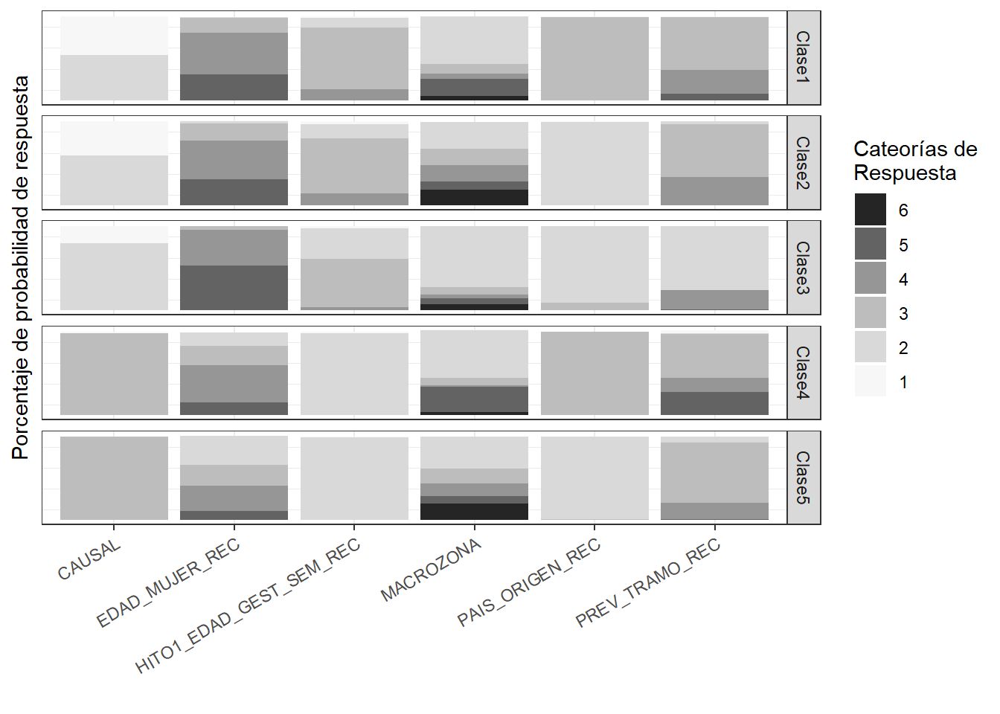

::: {.cell}
<style type="text/css">
script src = "https://ajax.googleapis.com/ajax/libs/jquery/3.4.1/jquery.min.js"

</style>
:::

::: {.cell}
<script>
$(document).ready(function() {

$('body').prepend('<div class=\"zoomDiv\"></div>');

// onClick function for all plots (img's)

$('img:not(.zoomImg)').click(function() {
$('.zoomImg').attr('src', $(this).attr('src')).css({width: '100%'});
$('.zoomDiv').css({opacity: '1', width: 'auto', border: '1px solid white', borderRadius: '5px', position: 'fixed', top: '50%', left: '50%', marginRight: '-50%', transform: 'translate(-50%, -50%)', boxShadow: '0px 0px 50px #888888', zIndex: '50', overflow: 'auto', maxHeight: '100%'});
});

// onClick function for zoomImg

$('img.zoomImg').click(function() {
$('.zoomDiv').css({opacity: '0', width: '0%'});
});
});
</script>
:::

::: {.cell}
<style type="text/css">
<script src="hideOutput.js"></script>
</style>
:::

::: {.cell}
<script>
$(document).ready(function() {

\$chunks = \$('.fold');

\$chunks.each(function () { // add button to source code chunks
if ( \$(this).hasClass('s') ) {
    \$('pre.r', this).prepend("\<div class=\\"showopt\\"\>Show Source\</div\>\<br style=\\"line-height:22px;\\"/\>");
    \$('pre.r', this).children('code').attr('class', 'folded');
    } // add button to output chunks

    if ( \$(this).hasClass('o') ) {
        \$('pre:not(.r)', this).has('code').prepend("\<div class=\\"showopt\\"\>Show Output\</div\>\<br style=\\"line-height:22px;\\"/\>");
        \$('pre:not(.r)', this).children('code:not(r)').addClass('folded'); // add button to plots
        \$(this).find('img').wrap('\<pre class=\\"plot\\"\>\</pre\>');
        \$('pre.plot', this).prepend("\<div class=\\"showopt\\"\>Show Plot\</div\>\<br style=\\"line-height:22px;\\"/\>");
        \$('pre.plot', this).children('img').addClass('folded');
        }
}); // hide all chunks when document is loaded

\$('.folded').css('display', 'none') // function to toggle the visibility
\$('.showopt').click(function() {
        var label = \$(this).html();
        if (label.indexOf("Show") \>= 0) {
            \$(this).html(label.replace("Show", "Hide"));
        } else {
        \$(this).html(label.replace("Hide", "Show"));
        }

\$(this).siblings('code, img').slideToggle('fast', 'swing');
});
});
</script>
:::

```{=html}
<style type="text/css">

.showopt {

background-color: #004c93; color: #FFFFFF; width: 100px; height: 20px; text-align: center; vertical-align: middle !important; float: right; font-family: sans-serif; border-radius: 8px;

}

.showopt:hover {
background-color: #dfe4f2;
color: #004c93;

}

pre.plot {
background-color: white !important;
}

.tablelines table, .tablelines td, .tablelines th {
border: 1px solid black;
}

.centrado {
text-align: center;
}

.table.center {
margin-left:auto;
margin-right:auto;
}

/* https://vivekjaiskumar.medium.com/css-is-and-not-selector-17c942ec83f :is()*/

/* Applies to outputs that are not code other than R*/

pre {
overflow-x: auto !important;
}

pre code {
word-wrap: normal !important;
white-space: pre !important;
}

/*
pre:not(.sourceCode) {
white-space: nowrap !important;
}
*/
.sourceCode { /* Important gives precedence */
font-size: 10px !important;
line-height: 50% !important;
}
body{ /* Normal */
text-align: justify;
}
.superbigimage{
overflow-y:scroll;
height:350px;
white-space: nowrap;
overflow-x: auto;
width:100%;
}
.superbigimage img{
overflow-y: scroll;
overflow-x: hidden;
}
.message { color:#446C6E; font-family: monospace;font-size: 10px; line-height: 110%; font-weight: bold;}
div.blue { background-color:#e6f0ff; border-radius: 5px; padding: 5px; text-align: justify;}
div.red { background-color:#e6bab1; border-radius: 5px; padding: 5px; text-align: justify;}
.pandoc-table { /* Should add !important; but it seems no necessary */
margin-left:auto; /* To center */
margin-right:auto;
border-collapse: collapse;
table-layout: auto;
font-size: 11px;
overflow-y: auto;
max-height:450px !important;
white-space: nowrap;
overflow-x: auto;
width:450px;
}
.pandoc-table th {/* header */
text-align: center !important;
font-size: 10px;
padding: 0px;
}
.pandoc-table td {
text-align: left !important;
font-size: 9px;
padding: 0px;
}
.pandoc-table caption {
text-align: left !important;
font-size: 11px !important;
}

.center-table {
text-align: left !important;
font-size: 9px;
padding: 0px;
overflow-y:scroll;
height:400px;
overflow-x: scroll;
}

.controlly{
overflow-y:scroll;
height:350px;
overflow-x: scroll;

}
</style>
```

```{=html}
<!-- We gotta do each function to hide code and outputs per section, by every ID, we gotta create a different function -->

<script>
function myFunction1() {
var x = document.getElementById("myDIV");
if (x.style.display === "none") {
x.style.display = "block";
} else {
x.style.display = "none";
}
}
</script>

<script>
function myFunction2() {
var x = document.getElementById("myDIV2");
if (x.style.display === "none") {
x.style.display = "block";
} else {
x.style.display = "none";
}
}
</script>
```

# Cargar paquetes

Cargar bases de datos


::: {.cell layout-align="center" paged.print='true'}

```{.r .cell-code}
library(DiagrammeR) #⋉
gr_lca2<-
DiagrammeR::grViz("
digraph flowchart {
    fontname='Comic Sans MS'

  # Nodes
  subgraph samelevel {
    CAUSAL [label = 'Causal',fontsize=10,shape = box]
    EDAD_MUJER_REC [label = 'Edad\npersona\ngestante',fontsize=10,shape = box]
    HITO1_EDAD_GEST_SEM_REC [label = 'Edad\nGestacional\nHito 1',fontsize=10,shape = box]
    MACROZONA [label = 'Macrozona',fontsize=10,shape = box]
    PAIS_ORIGEN_REC [label = 'País de\norigen',fontsize=10,shape = box]
    PREV_TRAMO_REC [label = 'Previsión y\ntramo',fontsize=10,shape = box]
    
  {rank=same; rankdir= 'TB'; CAUSAL EDAD_MUJER_REC HITO1_EDAD_GEST_SEM_REC MACROZONA PAIS_ORIGEN_REC PREV_TRAMO_REC }
  }
  LCA [label= 'Clases\nlatentes', shape= circle, style=filled, color=lightgrey, fontsize=10]
  
  inter [label = 'Interupción\nembarazo',fontsize=10,shape = box, height=.00002] # set the position of the inter node pos='15,100'

  # Nodes
  subgraph {
   LCA ->  {CAUSAL EDAD_MUJER_REC HITO1_EDAD_GEST_SEM_REC MACROZONA PAIS_ORIGEN_REC PREV_TRAMO_REC } [rank=same; rankdir= 'TB'] 
}
  subgraph {
   LCA -> inter [minlen=14] #minlen es necesario para correr arrowhead = none; 
  {rank=same; LCA inter [rankdir='LR']}; #; 
}
}")#, width = 1200, height = 900
#https://www.ncbi.nlm.nih.gov/pmc/articles/PMC3733703/
#Cohort matching on a variable associated with both outcome and censoring
#Cohort matching on a confounder. We let A denote an exposure, Y denote an outcome, and C denote a confounder and matching variable. The variable S indicates whether an individual in the source population is selected for the matched study (1: selected, 0: not selected). See Section 2-7 for details.
#https://www.ncbi.nlm.nih.gov/pmc/articles/PMC7064555/

gr_lca2 
```

::: {.cell-output-display}
```{=html}
<div class="grViz html-widget html-fill-item-overflow-hidden html-fill-item" id="htmlwidget-51e8d186b241ccc5d040" style="width:100%;height:464px;"></div>
<script type="application/json" data-for="htmlwidget-51e8d186b241ccc5d040">{"x":{"diagram":"\ndigraph flowchart {\n    fontname=\"Comic Sans MS\"\n\n  # Nodes\n  subgraph samelevel {\n    CAUSAL [label = \"Causal\",fontsize=10,shape = box]\n    EDAD_MUJER_REC [label = \"Edad\npersona\ngestante\",fontsize=10,shape = box]\n    HITO1_EDAD_GEST_SEM_REC [label = \"Edad\nGestacional\nHito 1\",fontsize=10,shape = box]\n    MACROZONA [label = \"Macrozona\",fontsize=10,shape = box]\n    PAIS_ORIGEN_REC [label = \"País de\norigen\",fontsize=10,shape = box]\n    PREV_TRAMO_REC [label = \"Previsión y\ntramo\",fontsize=10,shape = box]\n    \n  {rank=same; rankdir= \"TB\"; CAUSAL EDAD_MUJER_REC HITO1_EDAD_GEST_SEM_REC MACROZONA PAIS_ORIGEN_REC PREV_TRAMO_REC }\n  }\n  LCA [label= \"Clases\nlatentes\", shape= circle, style=filled, color=lightgrey, fontsize=10]\n  \n  inter [label = \"Interupción\nembarazo\",fontsize=10,shape = box, height=.00002] # set the position of the inter node pos=\"15,100\"\n\n  # Nodes\n  subgraph {\n   LCA ->  {CAUSAL EDAD_MUJER_REC HITO1_EDAD_GEST_SEM_REC MACROZONA PAIS_ORIGEN_REC PREV_TRAMO_REC } [rank=same; rankdir= \"TB\"] \n}\n  subgraph {\n   LCA -> inter [minlen=14] #minlen es necesario para correr arrowhead = none; \n  {rank=same; LCA inter [rankdir=\"LR\"]}; #; \n}\n}","config":{"engine":"dot","options":null}},"evals":[],"jsHooks":[]}</script>
```


Gráfico esquemático
:::

```{.r .cell-code}
DPI = 1200
WidthCM = 21
HeightCM = 8

gr_lca2 %>%
  export_svg %>% charToRaw %>% rsvg::rsvg_pdf("_flowchart_lca_adj_sin_po_ano.pdf")

gr_lca2 %>% export_svg()%>%charToRaw %>% rsvg(width = WidthCM *(DPI/2.54), height = HeightCM *(DPI/2.54)) %>% png::writePNG("_flowchart_lca0_adj_sin_po.png")

htmlwidgets::saveWidget(gr_lca2, "_flowchart_lca_adj_sin_po_ano.html")
#webshot::webshot("_flowchart_lca_adj_ano.html", "_flowchart_lca_adj_sin_po_ano.png",vwidth = 1200, vheight = 900, zoom = 2)
```
:::


# Análisis de clases latentes, modelos definitivos, sin pueblo originario y año


::: {.cell}

```{.r .cell-code}
rm(list = ls());gc()
```

::: {.cell-output .cell-output-stdout}
```
          used  (Mb) gc trigger   (Mb)  max used   (Mb)
Ncells 3566589 190.5    7295902  389.7   4323396  230.9
Vcells 6228699  47.6  295576002 2255.1 325207017 2481.2
```
:::

```{.r .cell-code}
load("data2_lca3_sin_po_ano_2023_05_14.RData") #Paso 213 y 214
#variables_probabilities_in_category_sin_po_ano.xlsx
#variables_probabilities_in_category_glca_adj_sin_po.xlsxbootlrt
require(sjPlot)
require(tidyverse)
require(tableone)

manualcolors<- c(paste0("gray",seq(20,80, by=20)))
fig_lca_fit<- tab_ppio %>%
  dplyr::mutate_if(is.character, as.numeric) %>%  # convert character columns to numeric
  tidyr::pivot_longer(cols = -ModelIndex, #"evryone but index"
                      names_to = "indices", values_to = "value", values_drop_na = F) %>%
  dplyr::mutate(indices = factor(indices, levels = levels, labels = labels)) %>%
  dplyr::filter(grepl("(BIC)",indices, ignore.case=T))%>%
  dplyr::mutate(ModelIndex= factor(ModelIndex, levels=2:n_class_max)) %>% 
  ggplot(aes(x = ModelIndex, y = value, group = indices, color = indices, linetype = indices)) +
  geom_line(size = 1.5) +
  scale_color_manual(values = manualcolors) +
  #scale_linetype_manual(values = c("solid", "dashed", "dotted")) +
  labs(x = "Número de clases", y="Valor", color="Medida", linetype="Medida")+
  #facet_wrap(.~indices, scales = "free_y", nrow = 4, ncol = 1) +
  sjPlot::theme_sjplot()
```

::: {.cell-output .cell-output-stderr}
```
Warning: Using `size` aesthetic for lines was deprecated in ggplot2 3.4.0.
ℹ Please use `linewidth` instead.
```
:::

```{.r .cell-code}
fig_lca_fit
```

::: {.cell-output-display}
{width=672}
:::

```{.r .cell-code}
ggsave("__fig2_medidas_de_ajuste_polca_sin_ano_pueb_orig.pdf",fig_lca_fit)
```

::: {.cell-output .cell-output-stderr}
```
Saving 7 x 5 in image
```
:::
:::

::: {.cell}

```{.r .cell-code}
manualcolors2<- c(paste0("gray",seq(20,80, by=20)))
fig_lca_fit2<- tab_ppio2 %>%
  dplyr::mutate_if(is.character, as.numeric) %>%  # convert character columns to numeric
  tidyr::pivot_longer(cols = -ModelIndex, #"evryone but index"
                       names_to = "indices", values_to = "value", values_drop_na = F) %>%
  dplyr::mutate(indices = factor(indices, levels = levels2, labels = labels2)) %>%
  dplyr::filter(grepl("BIC",indices, ignore.case=T))%>%
  dplyr::mutate(ModelIndex= factor(ModelIndex, levels=2:n_class_max)) %>% 
  ggplot(aes(x = ModelIndex, y = value, group = indices, color = indices, linetype = indices)) +
  geom_line(size = 1.5) +
  scale_color_manual(values = manualcolors2) +
  #scale_linetype_manual(values = c("solid", "dashed", "dotted")) +
  labs(x = "Número de clases", y="Valor", color="Medida",linetype="Medida")+
  #facet_wrap(.~indices, scales = "free_y", nrow = 4, ncol = 1) +
  sjPlot::theme_sjplot()

fig_lca_fit2
```

::: {.cell-output-display}
{width=672}
:::

```{.r .cell-code}
ggsave("__fig3_medidas_de_ajuste_polca_sin_ano_pueb_orig_adj.pdf",fig_lca_fit2)
```

::: {.cell-output .cell-output-stderr}
```
Saving 7 x 5 in image
```
:::
:::


::: controlly

::: {.cell}

```{.r .cell-code}
table_homolog<-
cbind.data.frame(
Name = c("n", "CAUSAL", "CAUSAL", "CAUSAL", "EDAD_MUJER_REC", 
                        "EDAD_MUJER_REC", "EDAD_MUJER_REC", "EDAD_MUJER_REC", "EDAD_MUJER_REC", 
                        "PAIS_ORIGEN_REC", "PAIS_ORIGEN_REC", "PAIS_ORIGEN_REC", "HITO1_EDAD_GEST_SEM_REC", 
                        "HITO1_EDAD_GEST_SEM_REC", "HITO1_EDAD_GEST_SEM_REC", "HITO1_EDAD_GEST_SEM_REC", 
                        "MACROZONA", "MACROZONA", "MACROZONA", "MACROZONA", "MACROZONA", 
                        "MACROZONA", "AÑO", "AÑO", "AÑO", "AÑO", "AÑO", "PREV_TRAMO_REC", 
                        "PREV_TRAMO_REC", "PREV_TRAMO_REC", "PREV_TRAMO_REC", "PREV_TRAMO_REC", 
                        "HITO2_DECISION_MUJER_IVE", "HITO2_DECISION_MUJER_IVE", "HITO2_DECISION_MUJER_IVE","HITO4_MUJER_ACEPTA_ACOM","HITO4_MUJER_ACEPTA_ACOM","HITO4_MUJER_ACEPTA_ACOM"),
level = c("", "2", "3", "4", "1", "2", "3", "4", "5", "1", 
          "2", "3", "1", "2", "3", "4", "1", "2", "3", "4", "5", "6", "2", 
          "3", "4", "5", "6", "1", "2", "3", "4", "5", "CONTINUAR EL EMBARAZO", 
          "INTERRUMPIR EL EMBARAZO", "NO APLICA, INSCONSCIENTE","NO", "SI", "NA"),
cat = c("", "Causal 1", "Causal 2", "Causal 3", "[Perdidos]", "1. <18", "2. 18-24", "3. 25-35", "4. >=35", 
          "[Perdidos]", "Chile", "Otros", "[Perdidos]", "1. 0-13 semanas", "2. 14-27 semanas", "3. >=28 semanas", 
          "[Perdidos]", "Centro", "Centro Norte", "Centro Sur", "Norte", "Sur", "2018", "2019", "2020", "2021", "2022", 
          "[Perdidos]", "ISAPRE o FFAA", "FONASA A/B", "FONASA C/D", "NINGUNA", "CONTINUAR EL EMBARAZO", "INTERRUMPIR EL EMBARAZO", "NO APLICA, INSCONSCIENTE", "NO", "SI", "[Perdidos]")
)
run_tableone(listVars =c("CAUSAL", "EDAD_MUJER_REC", "PAIS_ORIGEN_REC", 
                         "HITO1_EDAD_GEST_SEM_REC","MACROZONA", "AÑO", "PREV_TRAMO_REC",
                         "HITO2_DECISION_MUJER_IVE","HITO4_MUJER_ACEPTA_ACOM"), df= cbind.data.frame(mydata_preds3,HITO4_MUJER_ACEPTA_ACOM=mydata_preds$HITO4_MUJER_ACEPTA_ACOM), 
             catVars= c("CAUSAL", "EDAD_MUJER_REC", "PAIS_ORIGEN_REC", 
                        "HITO1_EDAD_GEST_SEM_REC","MACROZONA", "AÑO", "PREV_TRAMO_REC", "HITO4_MUJER_ACEPTA_ACOM"),
             strata= "outcome") %>%  
  dplyr::left_join(table_homolog, by= c("Name"="Name","level"="level")) %>% 
  dplyr::select(Name, cat, everything()) %>% 
  dplyr::select(-level) %>% 
  knitr::kable("markdown", caption="Descriptivos (acotado)")
```

::: {.cell-output .cell-output-stderr}
```
Warning: `add_rownames()` was deprecated in dplyr 1.0.0.
ℹ Please use `tibble::rownames_to_column()` instead.
```
:::

::: {.cell-output-display}
Table: Descriptivos (acotado)

|Name                     |cat                      |Overall     |0          |1            |p      |test |
|:------------------------|:------------------------|:-----------|:----------|:------------|:------|:----|
|n                        |                         |3789        |606        |3183         |       |     |
|CAUSAL                   |Causal 1                 |1171 (30.9) |203 (33.5) |968 ( 30.4)  |<0.001 |     |
|CAUSAL                   |Causal 2                 |1887 (49.8) |346 (57.1) |1541 ( 48.4) |       |     |
|CAUSAL                   |Causal 3                 |731 (19.3)  |57 ( 9.4)  |674 ( 21.2)  |       |     |
|EDAD_MUJER_REC           |[Perdidos]               |18 ( 0.5)   |2 ( 0.3)   |16 (  0.5)   |0.024  |     |
|EDAD_MUJER_REC           |1. <18                   |269 ( 7.1)  |55 ( 9.1)  |214 (  6.7)  |       |     |
|EDAD_MUJER_REC           |2. 18-24                 |720 (19.0)  |102 (16.8) |618 ( 19.4)  |       |     |
|EDAD_MUJER_REC           |3. 25-35                 |1646 (43.4) |243 (40.1) |1403 ( 44.1) |       |     |
|EDAD_MUJER_REC           |4. >=35                  |1136 (30.0) |204 (33.7) |932 ( 29.3)  |       |     |
|PAIS_ORIGEN_REC          |[Perdidos]               |18 ( 0.5)   |5 ( 0.8)   |13 (  0.4)   |0.005  |     |
|PAIS_ORIGEN_REC          |Chile                    |3091 (81.6) |518 (85.5) |2573 ( 80.8) |       |     |
|PAIS_ORIGEN_REC          |Otros                    |680 (17.9)  |83 (13.7)  |597 ( 18.8)  |       |     |
|HITO1_EDAD_GEST_SEM_REC  |[Perdidos]               |87 ( 2.3)   |12 ( 2.0)  |75 (  2.4)   |<0.001 |     |
|HITO1_EDAD_GEST_SEM_REC  |1. 0-13 semanas          |1328 (35.0) |128 (21.1) |1200 ( 37.7) |       |     |
|HITO1_EDAD_GEST_SEM_REC  |2. 14-27 semanas         |2008 (53.0) |343 (56.6) |1665 ( 52.3) |       |     |
|HITO1_EDAD_GEST_SEM_REC  |3. >=28 semanas          |366 ( 9.7)  |123 (20.3) |243 (  7.6)  |       |     |
|MACROZONA                |[Perdidos]               |11 ( 0.3)   |3 ( 0.5)   |8 (  0.3)    |<0.001 |     |
|MACROZONA                |Centro                   |1608 (42.4) |198 (32.7) |1410 ( 44.3) |       |     |
|MACROZONA                |Centro Norte             |610 (16.1)  |74 (12.2)  |536 ( 16.8)  |       |     |
|MACROZONA                |Centro Sur               |555 (14.6)  |154 (25.4) |401 ( 12.6)  |       |     |
|MACROZONA                |Norte                    |431 (11.4)  |70 (11.6)  |361 ( 11.3)  |       |     |
|MACROZONA                |Sur                      |574 (15.1)  |107 (17.7) |467 ( 14.7)  |       |     |
|AÑO                      |2018                     |732 (19.3)  |115 (19.0) |617 ( 19.4)  |0.306  |     |
|AÑO                      |2019                     |818 (21.6)  |149 (24.6) |669 ( 21.0)  |       |     |
|AÑO                      |2020                     |662 (17.5)  |103 (17.0) |559 ( 17.6)  |       |     |
|AÑO                      |2021                     |820 (21.6)  |131 (21.6) |689 ( 21.6)  |       |     |
|AÑO                      |2022                     |757 (20.0)  |108 (17.8) |649 ( 20.4)  |       |     |
|PREV_TRAMO_REC           |[Perdidos]               |14 ( 0.4)   |4 ( 0.7)   |10 (  0.3)   |<0.001 |     |
|PREV_TRAMO_REC           |ISAPRE o FFAA            |488 (12.9)  |37 ( 6.1)  |451 ( 14.2)  |       |     |
|PREV_TRAMO_REC           |FONASA A/B               |2096 (55.3) |382 (63.0) |1714 ( 53.8) |       |     |
|PREV_TRAMO_REC           |FONASA C/D               |1092 (28.8) |179 (29.5) |913 ( 28.7)  |       |     |
|PREV_TRAMO_REC           |NINGUNA                  |99 ( 2.6)   |4 ( 0.7)   |95 (  3.0)   |       |     |
|HITO2_DECISION_MUJER_IVE |CONTINUAR EL EMBARAZO    |593 (15.7)  |593 (97.9) |0 (  0.0)    |<0.001 |     |
|HITO2_DECISION_MUJER_IVE |INTERRUMPIR EL EMBARAZO  |3183 (84.0) |0 ( 0.0)   |3183 (100.0) |       |     |
|HITO2_DECISION_MUJER_IVE |NO APLICA, INSCONSCIENTE |13 ( 0.3)   |13 ( 2.1)  |0 (  0.0)    |       |     |
|HITO4_MUJER_ACEPTA_ACOM  |NO                       |463 (12.2)  |93 (15.3)  |370 ( 11.6)  |0.017  |     |
|HITO4_MUJER_ACEPTA_ACOM  |SI                       |3225 (85.1) |502 (82.8) |2723 ( 85.5) |       |     |
|HITO4_MUJER_ACEPTA_ACOM  |NA                       |101 ( 2.7)  |11 ( 1.8)  |90 (  2.8)   |       |     |
:::

```{.r .cell-code}
  #knitr::kable("html", caption="Descriptivos (acotado)") %>% kableExtra::kable_classic()

no_mostrar=1
#_#_#_#_#_#_#_#_#_#_#_#_#_#_#_#_#_#_#_#_#_#_#_#_#_#_#_#_#_#_#_#_#_#_#_#_#_#_#_#_#_#_#_
#_#_#_#_#_#_#_#_#_#_#_#_#_#_#_#_#_#_#_#_#_#_#_#_#_#_#_#_#_#_#_#_#_#_#_#_#_#_#_#_#_#_#_
#_#_#_#_#_#_#_#_#_#_#_#_#_#_#_#_#_#_#_#_#_#_#_#_#_#_#_#_#_#_#_#_#_#_#_#_#_#_#_#_#_#_#_
#if(no_mostrar==0){
  #    dplyr::select(HITO2_DECISION_MUJER_IVE, c("CAUSAL", "EDAD_MUJER_REC", "PAIS_ORIGEN_REC", "HITO1_EDAD_GEST_SEM_REC","MACROZONA", "AÑO", "PREV_TRAMO_REC")) %>% 
  chisquare_test<-
  mydata_preds3%>% 
    dplyr::select( 
      c("CAUSAL", "EDAD_MUJER_REC", "PAIS_ORIGEN_REC", 
        "HITO1_EDAD_GEST_SEM_REC","MACROZONA", "PREV_TRAMO_REC", "outcome")) %>% 
    tidyr::gather(variable,measure, -outcome) %>% 
    dplyr::group_by(variable) %>%
    dplyr::do(cbind.data.frame(broom::tidy(chisq.test(.$outcome, .$measure)),
                               broom::tidy(sum(table(.$outcome, .$measure))))) %>% 
    #casos completos
    #chisq.test(table(Base_fiscalia_v14_filt$motivodeegreso_mod_imp_rec, Base_fiscalia_v14_filt$sus_principal_mod, exclude=NULL))
    dplyr::mutate(p.value=ifelse(p.value<.001,"<0.001",sprintf("%1.3f",p.value))) %>% 
    dplyr::mutate(statistic=sprintf("%2.0f",statistic)) %>% 
    dplyr::mutate(report=paste0("X²(",parameter,", ",x,")=",statistic,"; p", ifelse(p.value=="<0.001",p.value, paste0("=",p.value)))) %>%
    dplyr::mutate(report=sub("0\\.","0,",sub("\\.",",",report)))
```

::: {.cell-output .cell-output-stderr}
```
Warning: 'tidy.numeric' is deprecated.
See help("Deprecated")
```
:::

::: {.cell-output .cell-output-stderr}
```
Warning in chisq.test(.$outcome, .$measure): Chi-squared approximation may be
incorrect
```
:::

::: {.cell-output .cell-output-stderr}
```
Warning: 'tidy.numeric' is deprecated.
See help("Deprecated")

Warning: 'tidy.numeric' is deprecated.
See help("Deprecated")
```
:::

::: {.cell-output .cell-output-stderr}
```
Warning in chisq.test(.$outcome, .$measure): Chi-squared approximation may be
incorrect
```
:::

::: {.cell-output .cell-output-stderr}
```
Warning: 'tidy.numeric' is deprecated.
See help("Deprecated")
```
:::

::: {.cell-output .cell-output-stderr}
```
Warning in chisq.test(.$outcome, .$measure): Chi-squared approximation may be
incorrect
```
:::

::: {.cell-output .cell-output-stderr}
```
Warning: 'tidy.numeric' is deprecated.
See help("Deprecated")
```
:::

::: {.cell-output .cell-output-stderr}
```
Warning in chisq.test(.$outcome, .$measure): Chi-squared approximation may be
incorrect
```
:::

::: {.cell-output .cell-output-stderr}
```
Warning: 'tidy.numeric' is deprecated.
See help("Deprecated")
```
:::

```{.r .cell-code}
  # chisq.test(Base_fiscalia_v14_filt$motivodeegreso_mod_imp_rec, is.na(Base_fiscalia_v14_filt$offender_d)) 
  # chisq.test(Base_fiscalia_v14_filt$motivodeegreso_mod_imp_rec, is.na(Base_fiscalia_v14_filt$offender_d)) 
  # 
  fisher_test<-
  mydata_preds3 %>% 
    dplyr::select( 
    c("CAUSAL", "EDAD_MUJER_REC", "PREV_TRAMO_REC", "MACROZONA", "outcome"))%>% 
    tidyr::gather(variable,measure, -outcome) %>% 
    dplyr::group_by(variable) %>%
    dplyr::do(fisher.test(table(.$outcome, .$measure, exclude=NULL), 
                          workspace = 2e10, simulate.p.value = T, B=1e5) %>% 
                broom::tidy()) 

  #EDAD_MUJER  HITO1_EDAD_GESTACIONAL_SEMANAS  
  med_iqr <-
rbind.data.frame(medicion=
paste0(
  "Edad persona gestante: ",
  quantile(data2$EDAD_MUJER,.5, na.rm=T), "[",
  quantile(data2$EDAD_MUJER,.25, na.rm=T),", ",
  quantile(data2$EDAD_MUJER,.75, na.rm=T),"]"
  ), medicion=
paste0(
  "Edad persona gestante (IVE): ",
  quantile(data2$EDAD_MUJER[mydata_preds3$outcome==1],.5, na.rm=T), "[",
  quantile(data2$EDAD_MUJER[mydata_preds3$outcome==1],.25, na.rm=T),", ",
  quantile(data2$EDAD_MUJER[mydata_preds3$outcome==1],.75, na.rm=T),"]"
  ),
medicion=paste0(
  "Edad persona gestante (no IVE): ",
  quantile(data2$EDAD_MUJER[mydata_preds3$outcome==0],.5, na.rm=T), "[",
  quantile(data2$EDAD_MUJER[mydata_preds3$outcome==0],.25, na.rm=T),", ",
  quantile(data2$EDAD_MUJER[mydata_preds3$outcome==0],.75, na.rm=T),"]"
  ),
medicion=paste0(
  "Edad gestacional en semanas: ",
  quantile(data2$HITO1_EDAD_GESTACIONAL_SEMANAS,.5, na.rm=T), "[", quantile(data2$HITO1_EDAD_GESTACIONAL_SEMANAS,.25, na.rm=T),", ", quantile(data2$HITO1_EDAD_GESTACIONAL_SEMANAS,.75, na.rm=T),"]"),
medicion=paste0(
  "Edad gestacional en semanas (IVE): ",
  quantile(data2$HITO1_EDAD_GESTACIONAL_SEMANAS[mydata_preds3$outcome==1],.5, na.rm=T), "[", quantile(data2$HITO1_EDAD_GESTACIONAL_SEMANAS[mydata_preds3$outcome==1],.25, na.rm=T),", ", quantile(data2$HITO1_EDAD_GESTACIONAL_SEMANAS[mydata_preds3$outcome==1],.75, na.rm=T),"]"),
medicion=paste0(
  "Edad gestacional en semanas (no IVE): ",
  quantile(data2$HITO1_EDAD_GESTACIONAL_SEMANAS[mydata_preds3$outcome==0],.5, na.rm=T), "[", quantile(data2$HITO1_EDAD_GESTACIONAL_SEMANAS[mydata_preds3$outcome==0],.25, na.rm=T),", ", quantile(data2$HITO1_EDAD_GESTACIONAL_SEMANAS[mydata_preds3$outcome==0],.75, na.rm=T),"]" )
)
  colnames(med_iqr)<-"medicion"
  
  # Kurksal Wallis
  kruskal<-
  rbind.data.frame(
  name=paste0("Edad persona gestante (continua): H(",kruskal.test(data2$EDAD_MUJER ~ mydata_preds3$outcome)$parameter,")=",
         round(kruskal.test(data2$EDAD_MUJER ~ mydata_preds3$outcome)$statistic,1), ", p=",
         round(kruskal.test(data2$EDAD_MUJER ~ mydata_preds3$outcome)$p.value,3)),
  name=paste0("Edad gestacional (continua): H(",kruskal.test(data2$HITO1_EDAD_GESTACIONAL_SEMANAS ~ mydata_preds3$outcome)$parameter,")=",
         round(kruskal.test(data2$HITO1_EDAD_GESTACIONAL_SEMANAS ~ mydata_preds3$outcome)$statistic,1), ", p=",
         round(kruskal.test(data2$HITO1_EDAD_GESTACIONAL_SEMANAS ~ mydata_preds3$outcome)$p.value,3))
  )
    colnames(kruskal)<-"names"
#_#_#_#_#_#_#_#_#_#_#_#_#_#_#_#_#_#_#_#_#_#_#_#_#_#_#_#_#_#_
#_#_#_#_#_#_#_#_#_#_#_#_#_#_#_#_#_#_#_#_#_#_#_#_#_#_#_#_#_#_
  rio::export(list(chisquare_test = chisquare_test, 
                   fisher_test = fisher_test, 
                   kruskal= kruskal,
                   iqr= med_iqr), "tableone_extension.xlsx", overwrite = T)
   
#, error= T}
```
:::

:::

## Figuras (poLCA)


::: {.cell}

```{.r .cell-code}
#https://agscl.github.io/IVE/Paso35.html
require(plotly)
#https://github.com/slowkow/ggrepel
lcmodel_wo_na<-
lcmodel %>% 
                 dplyr::filter(!is.na(CATEGORIA)) %>% 
                 dplyr::mutate(Var1=str_replace(Var1,"class","Clase"),
                 L2= dplyr::case_when(L2=="CAUSAL"~ "Causal",
                                      L2=="EDAD_MUJER_REC"~ "Edad persona\ngestante",
                                      L2=="MACROZONA"~ "Macrozona",
                                      L2=="HITO1_EDAD_GEST_SEM_REC"~ "Edad Gestacional\n(EG) Hito 1",
                                      L2=="PREV_TRAMO_REC"~ "Previsión y\ntramo",
                                    L2=="PAIS_ORIGEN_REC"~ "País de origen")) %>%
  dplyr::mutate(CATEGORIA= gsub("1.0-13 semanas","1. <=13 semanas",CATEGORIA)) %>% 
  dplyr::mutate(CATEGORIA= gsub("CENTRO","Centro",CATEGORIA)) %>% 
  dplyr::mutate(CATEGORIA= gsub("CENTRO NORTE","Centro norte",CATEGORIA)) %>%
  dplyr::mutate(CATEGORIA= gsub("CENTRO SUR","Centro sur",CATEGORIA)) %>%
  dplyr::mutate(CATEGORIA= gsub("NORTE","Norte",CATEGORIA)) %>% 
  dplyr::mutate(CATEGORIA= gsub("SUR","Sur",CATEGORIA)) %>% 
  dplyr::mutate(CATEGORIA= gsub("25-35","25-34",CATEGORIA)) %>% 
  #
  dplyr::mutate(CATEGORIA= gsub("25-35","25-34",CATEGORIA)) %>% 
  dplyr::mutate(CATEGORIA= gsub("25-35","25-34",CATEGORIA)) %>% 
  dplyr::mutate(CATEGORIA= gsub("25-35","25-34",CATEGORIA)) %>% 
  dplyr::mutate(CATEGORIA= gsub("25-35","25-34",CATEGORIA)) %>% 
  dplyr::mutate(lab2=glue::glue("{stringr::str_replace(CATEGORIA,' ','\n')}\n({scales::percent(value)})"))

#_#_#_#_#_#_#_#_#_#_#_#_#_#_#_#_#_#_#_#_#_#_#_#_#_#_#_
#_#_#_#_#_#_#_#_#_#_#_#_#_#_#_#_#_#_
#2023-09-24
lcmodel_wo_na$text_label_pre<-paste0("Categoria:",lcmodel_wo_na$CATEGORIA,"<br>%: ",scales::percent(lcmodel_wo_na$value))

zp1a <- ggplot(lcmodel_wo_na,aes(x = L2, y = value, fill = Var2, label=text_label_pre))
zp1a <- zp1a + geom_bar(stat = "identity", position = "stack")
zp1a <- zp1a + facet_grid(Var1 ~ .) 
zp1a <- zp1a + scale_fill_brewer(type="seq", palette="Greys", na.value = "white") +theme_bw()
zp1a <- zp1a + labs(y = "Porcentaje de probabilidad de respuesta", 
                  x = "",
                  fill ="Cateorías de\nRespuesta")
zp1a <- zp1a + theme( axis.text.y=element_blank(),
                    axis.ticks.y=element_blank(),                    
                    panel.grid.major.y=element_blank())
zp1a <- zp1a + guides(fill = guide_legend(reverse=TRUE))
zp1a <- zp1a + theme(axis.text.x = element_text(angle = 30, hjust = 1))

#_#_#_#_#_#_#_#_#_#_#_#_#_#_#_#_#_#_
#_#_#_#_#_#_#_#_#_#_#_#_#_#_#_#_#_#_#_#_#_#_#_#_#_#_#_

zp1b <- ggplot(data= lcmodel_wo_na, aes(x = L2, y = value, fill = Var2, label=lab2))
zp1b <- zp1b + geom_bar(stat = "identity", position = "stack")
#zp1b <- zp1b + geom_text(position = position_stack(vjust = 0.5), size=3)  # add labels
zp1b <- zp1b + facet_grid(Var1 ~ .) 
zp1b <- zp1b + scale_fill_manual(values=paste0("grey",seq(20,80, by=60/6))) +theme_bw()
zp1b <- zp1b + labs(y = "Probabilidad de respuesta", 
                  x = "",
                  fill ="Cateorías de\nRespuesta")
zp1b <- zp1b + theme( axis.text.y=element_blank(),
                    axis.ticks.y=element_blank(),                    
                    panel.grid.major.y=element_blank())
zp1b <- zp1b + guides(fill = guide_legend(reverse=TRUE))
zp1b <- zp1b + theme(axis.text.x = element_text(angle = 30, hjust = 1))

ggsave("zp1.png", zp1b+ggrepel::geom_label_repel(data= dplyr::filter(lcmodel_wo_na,!CATEGORIA=="Perdidos"),#aes(#y=half, label=lab),
      #position = position_dodge(width = .5),    # move to center of bars
              #vjust = 0,    # nudge above top of bar
  #position = position_stack(vjust = 0.5),
            #position = position_dodge(width = .8),
            #vjust = .1,
            position = position_stack(vjust = 0.5),
              size = 3,
            max.iter = 1e6,
            #direction = "y",
            #force=1,
            #seed=123,
            colour = "white", fontface = "bold")+theme(legend.position= "none"), height=13)#, fill = "white" --> dentro de label repel
```

::: {.cell-output .cell-output-stderr}
```
Saving 7 x 13 in image
```
:::

```{.r .cell-code}
 #ggplotly(zp1a, tooltip = c("text_label"))%>% layout(xaxis= list(showticklabels = T),height=600, width=800) 
ggplotly(zp1a,height=600, width=800)%>% layout(xaxis= list(showticklabel=T))
```

::: {.cell-output-display}
```{=html}
<div id="htmlwidget-2e77e2b31f74983096b8" style="width:100%;height:487px;" class="plotly html-widget "></div>
<script type="application/json" data-for="htmlwidget-2e77e2b31f74983096b8">{"x":{"data":[{"orientation":"v","width":[0.90000000000000036,0.90000000000000036,0.90000000000000013,0.90000000000000036,0.90000000000000036],"base":[1,1.0000000000000002,0.98091566727447155,0.99379112019636606,0.97467191487865512],"x":[3,5,2,4,6],"y":[0,0,0.019084332725528008,0.0062088798036339377,0.025328085121345101],"text":["L2: Edad persona<br />gestante<br />value:  0.000000e+00<br />Var2: Pr(1)<br />text_label_pre: Categoria:Perdidos<br>%: 0%","L2: País de origen<br />value:  0.000000e+00<br />Var2: Pr(1)<br />text_label_pre: Categoria:Perdidos<br>%: 0%","L2: Edad Gestacional<br />(EG) Hito 1<br />value:  1.908433e-02<br />Var2: Pr(1)<br />text_label_pre: Categoria:Perdidos<br>%: 2%","L2: Macrozona<br />value:  6.208880e-03<br />Var2: Pr(1)<br />text_label_pre: Categoria:Perdidos<br>%: 1%","L2: Previsión y<br />tramo<br />value:  2.532809e-02<br />Var2: Pr(1)<br />text_label_pre: Categoria:Perdidos<br>%: 3%"],"type":"bar","textposition":"none","marker":{"autocolorscale":false,"color":"rgba(247,247,247,1)","line":{"width":1.8897637795275593,"color":"transparent"}},"name":"Pr(1)","legendgroup":"Pr(1)","showlegend":true,"xaxis":"x","yaxis":"y","hoverinfo":"text","frame":null},{"orientation":"v","width":[0.90000000000000036,0.90000000000000036,0.90000000000000013,0.90000000000000036,0.90000000000000036],"base":[0.99999999999999822,1.0000000000000024,0.98495080024362902,1.0000000000000013,0.99999999999999756],"x":[3,5,2,4,6],"y":[0,0,0.015049199756370979,0,0],"text":["L2: Edad persona<br />gestante<br />value:  0.000000e+00<br />Var2: Pr(1)<br />text_label_pre: Categoria:Perdidos<br>%: 0%","L2: País de origen<br />value:  0.000000e+00<br />Var2: Pr(1)<br />text_label_pre: Categoria:Perdidos<br>%: 0%","L2: Edad Gestacional<br />(EG) Hito 1<br />value:  1.504920e-02<br />Var2: Pr(1)<br />text_label_pre: Categoria:Perdidos<br>%: 2%","L2: Macrozona<br />value:  0.000000e+00<br />Var2: Pr(1)<br />text_label_pre: Categoria:Perdidos<br>%: 0%","L2: Previsión y<br />tramo<br />value:  0.000000e+00<br />Var2: Pr(1)<br />text_label_pre: Categoria:Perdidos<br>%: 0%"],"type":"bar","textposition":"none","marker":{"autocolorscale":false,"color":"rgba(247,247,247,1)","line":{"width":1.8897637795275593,"color":"transparent"}},"name":"Pr(1)","legendgroup":"Pr(1)","showlegend":false,"xaxis":"x","yaxis":"y2","hoverinfo":"text","frame":null},{"orientation":"v","width":[0.90000000000000036,0.90000000000000036,0.90000000000000013,0.90000000000000036,0.90000000000000036],"base":[0.99574442574927147,0.96611880999383959,0.97696450360644782,0.99407025118492598,0.98768556975208521],"x":[3,5,2,4,6],"y":[0.0042555742507287553,0.033881190006159523,0.023035496393547183,0.0059297488150722444,0.012314430247912678],"text":["L2: Edad persona<br />gestante<br />value:  4.255574e-03<br />Var2: Pr(1)<br />text_label_pre: Categoria:Perdidos<br>%: 0%","L2: País de origen<br />value:  3.388119e-02<br />Var2: Pr(1)<br />text_label_pre: Categoria:Perdidos<br>%: 3%","L2: Edad Gestacional<br />(EG) Hito 1<br />value:  2.303550e-02<br />Var2: Pr(1)<br />text_label_pre: Categoria:Perdidos<br>%: 2%","L2: Macrozona<br />value:  5.929749e-03<br />Var2: Pr(1)<br />text_label_pre: Categoria:Perdidos<br>%: 1%","L2: Previsión y<br />tramo<br />value:  1.231443e-02<br />Var2: Pr(1)<br />text_label_pre: Categoria:Perdidos<br>%: 1%"],"type":"bar","textposition":"none","marker":{"autocolorscale":false,"color":"rgba(247,247,247,1)","line":{"width":1.8897637795275593,"color":"transparent"}},"name":"Pr(1)","legendgroup":"Pr(1)","showlegend":false,"xaxis":"x","yaxis":"y3","hoverinfo":"text","frame":null},{"orientation":"v","width":[0.90000000000000036,0.90000000000000036,0.90000000000000013,0.90000000000000036,0.90000000000000036],"base":[0.99278514492907377,0.99980214865490669,0.9709203704961471,0.99781781550483006,0.99877352753493231],"x":[3,5,2,4,6],"y":[0.0072148550709266734,0.00019785134509819891,0.029079629503854676,0.0021821844951710467,0.0012264724650699055],"text":["L2: Edad persona<br />gestante<br />value:  7.214855e-03<br />Var2: Pr(1)<br />text_label_pre: Categoria:Perdidos<br>%: 1%","L2: País de origen<br />value:  1.978513e-04<br />Var2: Pr(1)<br />text_label_pre: Categoria:Perdidos<br>%: 0%","L2: Edad Gestacional<br />(EG) Hito 1<br />value:  2.907963e-02<br />Var2: Pr(1)<br />text_label_pre: Categoria:Perdidos<br>%: 3%","L2: Macrozona<br />value:  2.182184e-03<br />Var2: Pr(1)<br />text_label_pre: Categoria:Perdidos<br>%: 0%","L2: Previsión y<br />tramo<br />value:  1.226472e-03<br />Var2: Pr(1)<br />text_label_pre: Categoria:Perdidos<br>%: 0%"],"type":"bar","textposition":"none","marker":{"autocolorscale":false,"color":"rgba(247,247,247,1)","line":{"width":1.8897637795275593,"color":"transparent"}},"name":"Pr(1)","legendgroup":"Pr(1)","showlegend":false,"xaxis":"x","yaxis":"y4","hoverinfo":"text","frame":null},{"orientation":"v","width":[0.90000000000000036,0.90000000000000036,0.90000000000000013,0.90000000000000036,0.90000000000000036],"base":[0.99827395921857731,1.0000000000000016,0.99113002628551183,0.99577567906945286,0.99825297294858018],"x":[3,5,2,4,6],"y":[0.0017260407814226886,0,0.0088699737144901647,0.0042243209305478091,0.0017470270514204911],"text":["L2: Edad persona<br />gestante<br />value:  1.726041e-03<br />Var2: Pr(1)<br />text_label_pre: Categoria:Perdidos<br>%: 0%","L2: País de origen<br />value:  0.000000e+00<br />Var2: Pr(1)<br />text_label_pre: Categoria:Perdidos<br>%: 0%","L2: Edad Gestacional<br />(EG) Hito 1<br />value:  8.869974e-03<br />Var2: Pr(1)<br />text_label_pre: Categoria:Perdidos<br>%: 1%","L2: Macrozona<br />value:  4.224321e-03<br />Var2: Pr(1)<br />text_label_pre: Categoria:Perdidos<br>%: 0%","L2: Previsión y<br />tramo<br />value:  1.747027e-03<br />Var2: Pr(1)<br />text_label_pre: Categoria:Perdidos<br>%: 0%"],"type":"bar","textposition":"none","marker":{"autocolorscale":false,"color":"rgba(247,247,247,1)","line":{"width":1.8897637795275593,"color":"transparent"}},"name":"Pr(1)","legendgroup":"Pr(1)","showlegend":false,"xaxis":"x","yaxis":"y5","hoverinfo":"text","frame":null},{"orientation":"v","width":[0.89999999999999991,0.90000000000000036,0.90000000000000036,0.90000000000000013,0.90000000000000036,0.90000000000000036],"base":[0.97668487322917863,0.83505506889979064,0.99986641790618247,0,0.4375493779845237,0.96850082138211935],"x":[1,3,5,2,4,6],"y":[0.023315126770820926,0.16494493110020936,0.00013358209381775232,0.98091566727447155,0.55624174221184242,0.0061710934965357733],"text":["L2: Causal<br />value:  2.331513e-02<br />Var2: Pr(2)<br />text_label_pre: Categoria:Causal 1<br>%: 2%","L2: Edad persona<br />gestante<br />value:  1.649449e-01<br />Var2: Pr(2)<br />text_label_pre: Categoria:1.<18<br>%: 16%","L2: País de origen<br />value:  1.335821e-04<br />Var2: Pr(2)<br />text_label_pre: Categoria:Chileno<br>%: 0%","L2: Edad Gestacional<br />(EG) Hito 1<br />value:  9.809157e-01<br />Var2: Pr(2)<br />text_label_pre: Categoria:1. <=13 semanas<br>%: 98%","L2: Macrozona<br />value:  5.562417e-01<br />Var2: Pr(2)<br />text_label_pre: Categoria:Centro<br>%: 56%","L2: Previsión y<br />tramo<br />value:  6.171093e-03<br />Var2: Pr(2)<br />text_label_pre: Categoria:ISAPRE y FFAA<br>%: 1%"],"type":"bar","textposition":"none","marker":{"autocolorscale":false,"color":"rgba(217,217,217,1)","line":{"width":1.8897637795275593,"color":"transparent"}},"name":"Pr(2)","legendgroup":"Pr(2)","showlegend":true,"xaxis":"x","yaxis":"y","hoverinfo":"text","frame":null},{"orientation":"v","width":[0.89999999999999991,0.90000000000000036,0.90000000000000036,0.90000000000000013,0.90000000000000036,0.90000000000000036],"base":[0.80721865787977243,0.99999999999999822,0.074845398779808378,0.6196343122146305,0.28527901413394757,0.190386560181002],"x":[1,3,5,2,4,6],"y":[0.19278134212022979,0,0.92515460122019411,0.36531648802899852,0.7147209858660537,0.80961343981899558],"text":["L2: Causal<br />value:  1.927813e-01<br />Var2: Pr(2)<br />text_label_pre: Categoria:Causal 1<br>%: 19%","L2: Edad persona<br />gestante<br />value:  0.000000e+00<br />Var2: Pr(2)<br />text_label_pre: Categoria:1.<18<br>%: 0%","L2: País de origen<br />value:  9.251546e-01<br />Var2: Pr(2)<br />text_label_pre: Categoria:Chileno<br>%: 93%","L2: Edad Gestacional<br />(EG) Hito 1<br />value:  3.653165e-01<br />Var2: Pr(2)<br />text_label_pre: Categoria:1. <=13 semanas<br>%: 37%","L2: Macrozona<br />value:  7.147210e-01<br />Var2: Pr(2)<br />text_label_pre: Categoria:Centro<br>%: 71%","L2: Previsión y<br />tramo<br />value:  8.096134e-01<br />Var2: Pr(2)<br />text_label_pre: Categoria:ISAPRE y FFAA<br>%: 81%"],"type":"bar","textposition":"none","marker":{"autocolorscale":false,"color":"rgba(217,217,217,1)","line":{"width":1.8897637795275593,"color":"transparent"}},"name":"Pr(2)","legendgroup":"Pr(2)","showlegend":false,"xaxis":"x","yaxis":"y2","hoverinfo":"text","frame":null},{"orientation":"v","width":[0.89999999999999991,0.90000000000000036,0.90000000000000036,0.90000000000000013,0.90000000000000036,0.90000000000000036],"base":[0.5352874114136924,0.98729291509935879,0.92304496267980018,0.86064933938570742,0.42576883403333632,0.97374029051348909],"x":[1,3,5,2,4,6],"y":[0.46471258858630726,0.0084515106499126746,0.043073847314039404,0.1163151642207404,0.56830141715158966,0.01394527923859612],"text":["L2: Causal<br />value:  4.647126e-01<br />Var2: Pr(2)<br />text_label_pre: Categoria:Causal 1<br>%: 46%","L2: Edad persona<br />gestante<br />value:  8.451511e-03<br />Var2: Pr(2)<br />text_label_pre: Categoria:1.<18<br>%: 1%","L2: País de origen<br />value:  4.307385e-02<br />Var2: Pr(2)<br />text_label_pre: Categoria:Chileno<br>%: 4%","L2: Edad Gestacional<br />(EG) Hito 1<br />value:  1.163152e-01<br />Var2: Pr(2)<br />text_label_pre: Categoria:1. <=13 semanas<br>%: 12%","L2: Macrozona<br />value:  5.683014e-01<br />Var2: Pr(2)<br />text_label_pre: Categoria:Centro<br>%: 57%","L2: Previsión y<br />tramo<br />value:  1.394528e-02<br />Var2: Pr(2)<br />text_label_pre: Categoria:ISAPRE y FFAA<br>%: 1%"],"type":"bar","textposition":"none","marker":{"autocolorscale":false,"color":"rgba(217,217,217,1)","line":{"width":1.8897637795275593,"color":"transparent"}},"name":"Pr(2)","legendgroup":"Pr(2)","showlegend":false,"xaxis":"x","yaxis":"y3","hoverinfo":"text","frame":null},{"orientation":"v","width":[0.89999999999999991,0.90000000000000036,0.90000000000000036,0.90000000000000013,0.90000000000000036,0.90000000000000036],"base":[0.59615858254765719,0.97480369545062051,3.498150029042367e-08,0.79418410109136661,0.67697235980301329,0.9736996292123925],"x":[1,3,5,2,4,6],"y":[0.40384141745234325,0.01798144947845326,0.99980211367340643,0.17673626940478049,0.32084545570181677,0.025073898322539812],"text":["L2: Causal<br />value:  4.038414e-01<br />Var2: Pr(2)<br />text_label_pre: Categoria:Causal 1<br>%: 40%","L2: Edad persona<br />gestante<br />value:  1.798145e-02<br />Var2: Pr(2)<br />text_label_pre: Categoria:1.<18<br>%: 2%","L2: País de origen<br />value:  9.998021e-01<br />Var2: Pr(2)<br />text_label_pre: Categoria:Chileno<br>%: 100%","L2: Edad Gestacional<br />(EG) Hito 1<br />value:  1.767363e-01<br />Var2: Pr(2)<br />text_label_pre: Categoria:1. <=13 semanas<br>%: 18%","L2: Macrozona<br />value:  3.208455e-01<br />Var2: Pr(2)<br />text_label_pre: Categoria:Centro<br>%: 32%","L2: Previsión y<br />tramo<br />value:  2.507390e-02<br />Var2: Pr(2)<br />text_label_pre: Categoria:ISAPRE y FFAA<br>%: 3%"],"type":"bar","textposition":"none","marker":{"autocolorscale":false,"color":"rgba(217,217,217,1)","line":{"width":1.8897637795275593,"color":"transparent"}},"name":"Pr(2)","legendgroup":"Pr(2)","showlegend":false,"xaxis":"x","yaxis":"y4","hoverinfo":"text","frame":null},{"orientation":"v","width":[0.89999999999999991,0.90000000000000036,0.90000000000000036,0.90000000000000013,0.90000000000000036,0.90000000000000036],"base":[0.99023065532766463,0.65102571010365862,0.0065122757078537432,0.0034793987725053226,0.61088788095004543,0.92872568878059125],"x":[1,3,5,2,4,6],"y":[0.0097693446723369215,0.34724824911491869,0.99348772429214782,0.98765062751300647,0.38488779811940743,0.069527284167988923],"text":["L2: Causal<br />value:  9.769345e-03<br />Var2: Pr(2)<br />text_label_pre: Categoria:Causal 1<br>%: 1%","L2: Edad persona<br />gestante<br />value:  3.472482e-01<br />Var2: Pr(2)<br />text_label_pre: Categoria:1.<18<br>%: 35%","L2: País de origen<br />value:  9.934877e-01<br />Var2: Pr(2)<br />text_label_pre: Categoria:Chileno<br>%: 99%","L2: Edad Gestacional<br />(EG) Hito 1<br />value:  9.876506e-01<br />Var2: Pr(2)<br />text_label_pre: Categoria:1. <=13 semanas<br>%: 99%","L2: Macrozona<br />value:  3.848878e-01<br />Var2: Pr(2)<br />text_label_pre: Categoria:Centro<br>%: 38%","L2: Previsión y<br />tramo<br />value:  6.952728e-02<br />Var2: Pr(2)<br />text_label_pre: Categoria:ISAPRE y FFAA<br>%: 7%"],"type":"bar","textposition":"none","marker":{"autocolorscale":false,"color":"rgba(217,217,217,1)","line":{"width":1.8897637795275593,"color":"transparent"}},"name":"Pr(2)","legendgroup":"Pr(2)","showlegend":false,"xaxis":"x","yaxis":"y5","hoverinfo":"text","frame":null},{"orientation":"v","width":[0.89999999999999991,0.90000000000000036,0.90000000000000036,0.90000000000000013,0.90000000000000036,0.90000000000000036],"base":[0.97668484201021044,0.60154502675710453,0,0,0.35055321378936954,0.44602192918028138],"x":[1,3,5,2,4,6],"y":[3.1218968188362339e-08,0.23351004214268611,0.99986641790618247,0,0.086996164195154158,0.52247889220183796],"text":["L2: Causal<br />value:  3.121897e-08<br />Var2: Pr(3)<br />text_label_pre: Categoria:Causal 2<br>%: 0%","L2: Edad persona<br />gestante<br />value:  2.335100e-01<br />Var2: Pr(3)<br />text_label_pre: Categoria:2.18-24<br>%: 23%","L2: País de origen<br />value:  9.998664e-01<br />Var2: Pr(3)<br />text_label_pre: Categoria:Otro<br>%: 100%","L2: Edad Gestacional<br />(EG) Hito 1<br />value:  0.000000e+00<br />Var2: Pr(3)<br />text_label_pre: Categoria:2.14-27 semanas<br>%: 0%","L2: Macrozona<br />value:  8.699616e-02<br />Var2: Pr(3)<br />text_label_pre: Categoria:Centro Norte<br>%: 9%","L2: Previsión y<br />tramo<br />value:  5.224789e-01<br />Var2: Pr(3)<br />text_label_pre: Categoria:FONASA A/B<br>%: 52%"],"type":"bar","textposition":"none","marker":{"autocolorscale":false,"color":"rgba(189,189,189,1)","line":{"width":1.8897637795275593,"color":"transparent"}},"name":"Pr(3)","legendgroup":"Pr(3)","showlegend":true,"xaxis":"x","yaxis":"y","hoverinfo":"text","frame":null},{"orientation":"v","width":[0.89999999999999991,0.90000000000000036,0.90000000000000036,0.90000000000000013,0.90000000000000036,0.90000000000000036],"base":[7.5600580421005664e-68,0.95953094337084166,0,0.049856054199839885,0.19309621975954033,0.19038655963376927],"x":[1,3,5,2,4,6],"y":[0.80721865787977243,0.040469056629156563,0.074845398779808378,0.56977825801479065,0.09218279437440724,5.47232731351599e-10],"text":["L2: Causal<br />value:  8.072187e-01<br />Var2: Pr(3)<br />text_label_pre: Categoria:Causal 2<br>%: 81%","L2: Edad persona<br />gestante<br />value:  4.046906e-02<br />Var2: Pr(3)<br />text_label_pre: Categoria:2.18-24<br>%: 4%","L2: País de origen<br />value:  7.484540e-02<br />Var2: Pr(3)<br />text_label_pre: Categoria:Otro<br>%: 7%","L2: Edad Gestacional<br />(EG) Hito 1<br />value:  5.697783e-01<br />Var2: Pr(3)<br />text_label_pre: Categoria:2.14-27 semanas<br>%: 57%","L2: Macrozona<br />value:  9.218279e-02<br />Var2: Pr(3)<br />text_label_pre: Categoria:Centro Norte<br>%: 9%","L2: Previsión y<br />tramo<br />value:  5.472327e-10<br />Var2: Pr(3)<br />text_label_pre: Categoria:FONASA A/B<br>%: 0%"],"type":"bar","textposition":"none","marker":{"autocolorscale":false,"color":"rgba(189,189,189,1)","line":{"width":1.8897637795275593,"color":"transparent"}},"name":"Pr(3)","legendgroup":"Pr(3)","showlegend":false,"xaxis":"x","yaxis":"y2","hoverinfo":"text","frame":null},{"orientation":"v","width":[0.89999999999999991,0.90000000000000036,0.90000000000000036,0.90000000000000013,0.90000000000000036,0.90000000000000036],"base":[0,0.81695615549495559,0,0.12677344633536111,0.32068148641537481,0.36511102257766653],"x":[1,3,5,2,4,6],"y":[0.5352874114136924,0.1703367596044032,0.92304496267980018,0.73387589305034628,0.10508734761796151,0.6086292679358225],"text":["L2: Causal<br />value:  5.352874e-01<br />Var2: Pr(3)<br />text_label_pre: Categoria:Causal 2<br>%: 54%","L2: Edad persona<br />gestante<br />value:  1.703368e-01<br />Var2: Pr(3)<br />text_label_pre: Categoria:2.18-24<br>%: 17%","L2: País de origen<br />value:  9.230450e-01<br />Var2: Pr(3)<br />text_label_pre: Categoria:Otro<br>%: 92%","L2: Edad Gestacional<br />(EG) Hito 1<br />value:  7.338759e-01<br />Var2: Pr(3)<br />text_label_pre: Categoria:2.14-27 semanas<br>%: 73%","L2: Macrozona<br />value:  1.050873e-01<br />Var2: Pr(3)<br />text_label_pre: Categoria:Centro Norte<br>%: 11%","L2: Previsión y<br />tramo<br />value:  6.086293e-01<br />Var2: Pr(3)<br />text_label_pre: Categoria:FONASA A/B<br>%: 61%"],"type":"bar","textposition":"none","marker":{"autocolorscale":false,"color":"rgba(189,189,189,1)","line":{"width":1.8897637795275593,"color":"transparent"}},"name":"Pr(3)","legendgroup":"Pr(3)","showlegend":false,"xaxis":"x","yaxis":"y3","hoverinfo":"text","frame":null},{"orientation":"v","width":[0.89999999999999991,0.90000000000000036,0.90000000000000036,0.90000000000000013,0.90000000000000036,0.90000000000000036],"base":[2.7818776122820994e-253,0.76415570340840788,0,0.13476882010659946,0.48379107086883744,0.35096981434567714],"x":[1,3,5,2,4,6],"y":[0.59615858254765719,0.21064799204221263,3.498150029042367e-08,0.65941528098476709,0.19318128893417585,0.6227298148667153],"text":["L2: Causal<br />value:  5.961586e-01<br />Var2: Pr(3)<br />text_label_pre: Categoria:Causal 2<br>%: 60%","L2: Edad persona<br />gestante<br />value:  2.106480e-01<br />Var2: Pr(3)<br />text_label_pre: Categoria:2.18-24<br>%: 21%","L2: País de origen<br />value:  3.498150e-08<br />Var2: Pr(3)<br />text_label_pre: Categoria:Otro<br>%: 0%","L2: Edad Gestacional<br />(EG) Hito 1<br />value:  6.594153e-01<br />Var2: Pr(3)<br />text_label_pre: Categoria:2.14-27 semanas<br>%: 66%","L2: Macrozona<br />value:  1.931813e-01<br />Var2: Pr(3)<br />text_label_pre: Categoria:Centro Norte<br>%: 19%","L2: Previsión y<br />tramo<br />value:  6.227298e-01<br />Var2: Pr(3)<br />text_label_pre: Categoria:FONASA A/B<br>%: 62%"],"type":"bar","textposition":"none","marker":{"autocolorscale":false,"color":"rgba(189,189,189,1)","line":{"width":1.8897637795275593,"color":"transparent"}},"name":"Pr(3)","legendgroup":"Pr(3)","showlegend":false,"xaxis":"x","yaxis":"y4","hoverinfo":"text","frame":null},{"orientation":"v","width":[0.89999999999999991,0.90000000000000036,0.90000000000000036,0.90000000000000013,0.90000000000000036,0.90000000000000036],"base":[0.99023065532766463,0.40468327753887645,0,0,0.43618225811806505,0.2051224770718296],"x":[1,3,5,2,4,6],"y":[0,0.24634243256478217,0.0065122757078537432,0.0034793987725053226,0.17470562283198038,0.72360321170876163],"text":["L2: Causal<br />value:  0.000000e+00<br />Var2: Pr(3)<br />text_label_pre: Categoria:Causal 2<br>%: 0%","L2: Edad persona<br />gestante<br />value:  2.463424e-01<br />Var2: Pr(3)<br />text_label_pre: Categoria:2.18-24<br>%: 25%","L2: País de origen<br />value:  6.512276e-03<br />Var2: Pr(3)<br />text_label_pre: Categoria:Otro<br>%: 1%","L2: Edad Gestacional<br />(EG) Hito 1<br />value:  3.479399e-03<br />Var2: Pr(3)<br />text_label_pre: Categoria:2.14-27 semanas<br>%: 0%","L2: Macrozona<br />value:  1.747056e-01<br />Var2: Pr(3)<br />text_label_pre: Categoria:Centro Norte<br>%: 17%","L2: Previsión y<br />tramo<br />value:  7.236032e-01<br />Var2: Pr(3)<br />text_label_pre: Categoria:FONASA A/B<br>%: 72%"],"type":"bar","textposition":"none","marker":{"autocolorscale":false,"color":"rgba(189,189,189,1)","line":{"width":1.8897637795275593,"color":"transparent"}},"name":"Pr(3)","legendgroup":"Pr(3)","showlegend":false,"xaxis":"x","yaxis":"y5","hoverinfo":"text","frame":null},{"orientation":"v","width":[0.89999999999999991,0.90000000000000036,0.90000000000000013,0.90000000000000036,0.90000000000000036],"base":[0,0.15007045267982191,0,0.33393108287029927,0.27913918970586116],"x":[1,3,2,4,6],"y":[0.97668484201021044,0.45147457407728264,0,0.016622130919070277,0.16688273947442023],"text":["L2: Causal<br />value:  9.766848e-01<br />Var2: Pr(4)<br />text_label_pre: Categoria:Causal 3<br>%: 98%","L2: Edad persona<br />gestante<br />value:  4.514746e-01<br />Var2: Pr(4)<br />text_label_pre: Categoria:3.25-34<br>%: 45%","L2: Edad Gestacional<br />(EG) Hito 1<br />value:  0.000000e+00<br />Var2: Pr(4)<br />text_label_pre: Categoria:3.>=28 semanas<br>%: 0%","L2: Macrozona<br />value:  1.662213e-02<br />Var2: Pr(4)<br />text_label_pre: Categoria:Centro Sur<br>%: 2%","L2: Previsión y<br />tramo<br />value:  1.668827e-01<br />Var2: Pr(4)<br />text_label_pre: Categoria:FONASA C/D<br>%: 17%"],"type":"bar","textposition":"none","marker":{"autocolorscale":false,"color":"rgba(150,150,150,1)","line":{"width":1.8897637795275593,"color":"transparent"}},"name":"Pr(4)","legendgroup":"Pr(4)","showlegend":true,"xaxis":"x","yaxis":"y","hoverinfo":"text","frame":null},{"orientation":"v","width":[0.89999999999999991,0.90000000000000036,0.90000000000000013,0.90000000000000036,0.90000000000000036],"base":[0,0.53404039334230902,0,0.13754332531386015,0.006513866943437259],"x":[1,3,2,4,6],"y":[7.5600580421005664e-68,0.42549055002853264,0.049856054199839885,0.055552894445680179,0.18387269269033202],"text":["L2: Causal<br />value:  7.560058e-68<br />Var2: Pr(4)<br />text_label_pre: Categoria:Causal 3<br>%: 0%","L2: Edad persona<br />gestante<br />value:  4.254906e-01<br />Var2: Pr(4)<br />text_label_pre: Categoria:3.25-34<br>%: 43%","L2: Edad Gestacional<br />(EG) Hito 1<br />value:  4.985605e-02<br />Var2: Pr(4)<br />text_label_pre: Categoria:3.>=28 semanas<br>%: 5%","L2: Macrozona<br />value:  5.555289e-02<br />Var2: Pr(4)<br />text_label_pre: Categoria:Centro Sur<br>%: 6%","L2: Previsión y<br />tramo<br />value:  1.838727e-01<br />Var2: Pr(4)<br />text_label_pre: Categoria:FONASA C/D<br>%: 18%"],"type":"bar","textposition":"none","marker":{"autocolorscale":false,"color":"rgba(150,150,150,1)","line":{"width":1.8897637795275593,"color":"transparent"}},"name":"Pr(4)","legendgroup":"Pr(4)","showlegend":false,"xaxis":"x","yaxis":"y2","hoverinfo":"text","frame":null},{"orientation":"v","width":[0.89999999999999991,0.90000000000000036,0.90000000000000013,0.90000000000000036,0.90000000000000036],"base":[0,0.31442251138610228,0,0.26129882560589124,0.077968018138981368],"x":[1,3,2,4,6],"y":[0,0.50253364410885326,0.12677344633536111,0.059382660809483567,0.28714300443868518],"text":["L2: Causal<br />value:  0.000000e+00<br />Var2: Pr(4)<br />text_label_pre: Categoria:Causal 3<br>%: 0%","L2: Edad persona<br />gestante<br />value:  5.025336e-01<br />Var2: Pr(4)<br />text_label_pre: Categoria:3.25-34<br>%: 50%","L2: Edad Gestacional<br />(EG) Hito 1<br />value:  1.267734e-01<br />Var2: Pr(4)<br />text_label_pre: Categoria:3.>=28 semanas<br>%: 13%","L2: Macrozona<br />value:  5.938266e-02<br />Var2: Pr(4)<br />text_label_pre: Categoria:Centro Sur<br>%: 6%","L2: Previsión y<br />tramo<br />value:  2.871430e-01<br />Var2: Pr(4)<br />text_label_pre: Categoria:FONASA C/D<br>%: 29%"],"type":"bar","textposition":"none","marker":{"autocolorscale":false,"color":"rgba(150,150,150,1)","line":{"width":1.8897637795275593,"color":"transparent"}},"name":"Pr(4)","legendgroup":"Pr(4)","showlegend":false,"xaxis":"x","yaxis":"y3","hoverinfo":"text","frame":null},{"orientation":"v","width":[0.89999999999999991,0.90000000000000036,0.90000000000000013,0.90000000000000036,0.90000000000000036],"base":[0,0.30706288693862632,0,0.28343553273618222,0.0035938005823469422],"x":[1,3,2,4,6],"y":[2.7818776122820994e-253,0.45709281646978156,0.13476882010659946,0.20035553813265522,0.34737601376333022],"text":["L2: Causal<br />value: 2.781878e-253<br />Var2: Pr(4)<br />text_label_pre: Categoria:Causal 3<br>%: 0%","L2: Edad persona<br />gestante<br />value:  4.570928e-01<br />Var2: Pr(4)<br />text_label_pre: Categoria:3.25-34<br>%: 46%","L2: Edad Gestacional<br />(EG) Hito 1<br />value:  1.347688e-01<br />Var2: Pr(4)<br />text_label_pre: Categoria:3.>=28 semanas<br>%: 13%","L2: Macrozona<br />value:  2.003555e-01<br />Var2: Pr(4)<br />text_label_pre: Categoria:Centro Sur<br>%: 20%","L2: Previsión y<br />tramo<br />value:  3.473760e-01<br />Var2: Pr(4)<br />text_label_pre: Categoria:FONASA C/D<br>%: 35%"],"type":"bar","textposition":"none","marker":{"autocolorscale":false,"color":"rgba(150,150,150,1)","line":{"width":1.8897637795275593,"color":"transparent"}},"name":"Pr(4)","legendgroup":"Pr(4)","showlegend":false,"xaxis":"x","yaxis":"y4","hoverinfo":"text","frame":null},{"orientation":"v","width":[0.89999999999999991,0.90000000000000036,0.90000000000000013,0.90000000000000036,0.90000000000000036],"base":[0,0.10891687905943064,0,0.29095899325591557,0.0052991711353165697],"x":[1,3,2,4,6],"y":[0.99023065532766463,0.2957663984794458,0,0.14522326486214948,0.19982330593651301],"text":["L2: Causal<br />value:  9.902307e-01<br />Var2: Pr(4)<br />text_label_pre: Categoria:Causal 3<br>%: 99%","L2: Edad persona<br />gestante<br />value:  2.957664e-01<br />Var2: Pr(4)<br />text_label_pre: Categoria:3.25-34<br>%: 30%","L2: Edad Gestacional<br />(EG) Hito 1<br />value:  0.000000e+00<br />Var2: Pr(4)<br />text_label_pre: Categoria:3.>=28 semanas<br>%: 0%","L2: Macrozona<br />value:  1.452233e-01<br />Var2: Pr(4)<br />text_label_pre: Categoria:Centro Sur<br>%: 15%","L2: Previsión y<br />tramo<br />value:  1.998233e-01<br />Var2: Pr(4)<br />text_label_pre: Categoria:FONASA C/D<br>%: 20%"],"type":"bar","textposition":"none","marker":{"autocolorscale":false,"color":"rgba(150,150,150,1)","line":{"width":1.8897637795275593,"color":"transparent"}},"name":"Pr(4)","legendgroup":"Pr(4)","showlegend":false,"xaxis":"x","yaxis":"y5","hoverinfo":"text","frame":null},{"orientation":"v","width":[0.90000000000000036,0.90000000000000036,0.90000000000000036],"base":[0,0.03789127725323696,0],"x":[3,4,6],"y":[0.15007045267982191,0.29603980561706233,0.27913918970586116],"text":["L2: Edad persona<br />gestante<br />value:  1.500705e-01<br />Var2: Pr(5)<br />text_label_pre: Categoria:4.>=35<br>%: 15%","L2: Macrozona<br />value:  2.960398e-01<br />Var2: Pr(5)<br />text_label_pre: Categoria:Norte<br>%: 30%","L2: Previsión y<br />tramo<br />value:  2.791392e-01<br />Var2: Pr(5)<br />text_label_pre: Categoria:NINGUNA<br>%: 28%"],"type":"bar","textposition":"none","marker":{"autocolorscale":false,"color":"rgba(99,99,99,1)","line":{"width":1.8897637795275593,"color":"transparent"}},"name":"Pr(5)","legendgroup":"Pr(5)","showlegend":true,"xaxis":"x","yaxis":"y","hoverinfo":"text","frame":null},{"orientation":"v","width":[0.90000000000000036,0.90000000000000036,0.90000000000000036],"base":[0,0.06770916429032442,0],"x":[3,4,6],"y":[0.53404039334230902,0.069834161023535735,0.006513866943437259],"text":["L2: Edad persona<br />gestante<br />value:  5.340404e-01<br />Var2: Pr(5)<br />text_label_pre: Categoria:4.>=35<br>%: 53%","L2: Macrozona<br />value:  6.983416e-02<br />Var2: Pr(5)<br />text_label_pre: Categoria:Norte<br>%: 7%","L2: Previsión y<br />tramo<br />value:  6.513867e-03<br />Var2: Pr(5)<br />text_label_pre: Categoria:NINGUNA<br>%: 1%"],"type":"bar","textposition":"none","marker":{"autocolorscale":false,"color":"rgba(99,99,99,1)","line":{"width":1.8897637795275593,"color":"transparent"}},"name":"Pr(5)","legendgroup":"Pr(5)","showlegend":false,"xaxis":"x","yaxis":"y2","hoverinfo":"text","frame":null},{"orientation":"v","width":[0.90000000000000036,0.90000000000000036,0.90000000000000036],"base":[0,0.052999998151853682,0],"x":[3,4,6],"y":[0.31442251138610228,0.20829882745403755,0.077968018138981368],"text":["L2: Edad persona<br />gestante<br />value:  3.144225e-01<br />Var2: Pr(5)<br />text_label_pre: Categoria:4.>=35<br>%: 31%","L2: Macrozona<br />value:  2.082988e-01<br />Var2: Pr(5)<br />text_label_pre: Categoria:Norte<br>%: 21%","L2: Previsión y<br />tramo<br />value:  7.796802e-02<br />Var2: Pr(5)<br />text_label_pre: Categoria:NINGUNA<br>%: 8%"],"type":"bar","textposition":"none","marker":{"autocolorscale":false,"color":"rgba(99,99,99,1)","line":{"width":1.8897637795275593,"color":"transparent"}},"name":"Pr(5)","legendgroup":"Pr(5)","showlegend":false,"xaxis":"x","yaxis":"y3","hoverinfo":"text","frame":null},{"orientation":"v","width":[0.90000000000000036,0.90000000000000036,0.90000000000000036],"base":[0,0.18988826156827868,0],"x":[3,4,6],"y":[0.30706288693862632,0.09354727116790354,0.0035938005823469422],"text":["L2: Edad persona<br />gestante<br />value:  3.070629e-01<br />Var2: Pr(5)<br />text_label_pre: Categoria:4.>=35<br>%: 31%","L2: Macrozona<br />value:  9.354727e-02<br />Var2: Pr(5)<br />text_label_pre: Categoria:Norte<br>%: 9%","L2: Previsión y<br />tramo<br />value:  3.593801e-03<br />Var2: Pr(5)<br />text_label_pre: Categoria:NINGUNA<br>%: 0%"],"type":"bar","textposition":"none","marker":{"autocolorscale":false,"color":"rgba(99,99,99,1)","line":{"width":1.8897637795275593,"color":"transparent"}},"name":"Pr(5)","legendgroup":"Pr(5)","showlegend":false,"xaxis":"x","yaxis":"y4","hoverinfo":"text","frame":null},{"orientation":"v","width":[0.90000000000000036,0.90000000000000036,0.90000000000000036],"base":[0,0.20480393765365434,0],"x":[3,4,6],"y":[0.10891687905943064,0.086155055602261221,0.0052991711353165697],"text":["L2: Edad persona<br />gestante<br />value:  1.089169e-01<br />Var2: Pr(5)<br />text_label_pre: Categoria:4.>=35<br>%: 11%","L2: Macrozona<br />value:  8.615506e-02<br />Var2: Pr(5)<br />text_label_pre: Categoria:Norte<br>%: 9%","L2: Previsión y<br />tramo<br />value:  5.299171e-03<br />Var2: Pr(5)<br />text_label_pre: Categoria:NINGUNA<br>%: 1%"],"type":"bar","textposition":"none","marker":{"autocolorscale":false,"color":"rgba(99,99,99,1)","line":{"width":1.8897637795275593,"color":"transparent"}},"name":"Pr(5)","legendgroup":"Pr(5)","showlegend":false,"xaxis":"x","yaxis":"y5","hoverinfo":"text","frame":null},{"orientation":"v","width":0.90000000000000036,"base":0,"x":[4],"y":[0.03789127725323696],"text":"L2: Macrozona<br />value:  3.789128e-02<br />Var2: Pr(6)<br />text_label_pre: Categoria:Sur<br>%: 4%","type":"bar","textposition":"none","marker":{"autocolorscale":false,"color":"rgba(37,37,37,1)","line":{"width":1.8897637795275593,"color":"transparent"}},"name":"Pr(6)","legendgroup":"Pr(6)","showlegend":true,"xaxis":"x","yaxis":"y","hoverinfo":"text","frame":null},{"orientation":"v","width":0.90000000000000036,"base":0,"x":[4],"y":[0.06770916429032442],"text":"L2: Macrozona<br />value:  6.770916e-02<br />Var2: Pr(6)<br />text_label_pre: Categoria:Sur<br>%: 7%","type":"bar","textposition":"none","marker":{"autocolorscale":false,"color":"rgba(37,37,37,1)","line":{"width":1.8897637795275593,"color":"transparent"}},"name":"Pr(6)","legendgroup":"Pr(6)","showlegend":false,"xaxis":"x","yaxis":"y2","hoverinfo":"text","frame":null},{"orientation":"v","width":0.90000000000000036,"base":0,"x":[4],"y":[0.052999998151853682],"text":"L2: Macrozona<br />value:  5.300000e-02<br />Var2: Pr(6)<br />text_label_pre: Categoria:Sur<br>%: 5%","type":"bar","textposition":"none","marker":{"autocolorscale":false,"color":"rgba(37,37,37,1)","line":{"width":1.8897637795275593,"color":"transparent"}},"name":"Pr(6)","legendgroup":"Pr(6)","showlegend":false,"xaxis":"x","yaxis":"y3","hoverinfo":"text","frame":null},{"orientation":"v","width":0.90000000000000036,"base":0,"x":[4],"y":[0.18988826156827868],"text":"L2: Macrozona<br />value:  1.898883e-01<br />Var2: Pr(6)<br />text_label_pre: Categoria:Sur<br>%: 19%","type":"bar","textposition":"none","marker":{"autocolorscale":false,"color":"rgba(37,37,37,1)","line":{"width":1.8897637795275593,"color":"transparent"}},"name":"Pr(6)","legendgroup":"Pr(6)","showlegend":false,"xaxis":"x","yaxis":"y4","hoverinfo":"text","frame":null},{"orientation":"v","width":0.90000000000000036,"base":0,"x":[4],"y":[0.20480393765365434],"text":"L2: Macrozona<br />value:  2.048039e-01<br />Var2: Pr(6)<br />text_label_pre: Categoria:Sur<br>%: 20%","type":"bar","textposition":"none","marker":{"autocolorscale":false,"color":"rgba(37,37,37,1)","line":{"width":1.8897637795275593,"color":"transparent"}},"name":"Pr(6)","legendgroup":"Pr(6)","showlegend":false,"xaxis":"x","yaxis":"y5","hoverinfo":"text","frame":null}],"layout":{"margin":{"t":37.430745814307471,"r":18.99543378995434,"b":25.083713850837146,"l":25.570776255707766},"plot_bgcolor":"rgba(255,255,255,1)","paper_bgcolor":"rgba(255,255,255,1)","font":{"color":"rgba(0,0,0,1)","family":"","size":14.611872146118724},"xaxis":{"domain":[0,1],"automargin":true,"type":"linear","autorange":false,"range":[0.40000000000000002,6.5999999999999996],"tickmode":"array","ticktext":["Causal","Edad Gestacional<br />(EG) Hito 1","Edad persona<br />gestante","Macrozona","País de origen","Previsión y<br />tramo"],"tickvals":[1,2,3,3.9999999999999996,5,6],"categoryorder":"array","categoryarray":["Causal","Edad Gestacional<br />(EG) Hito 1","Edad persona<br />gestante","Macrozona","País de origen","Previsión y<br />tramo"],"nticks":null,"ticks":"outside","tickcolor":"rgba(51,51,51,1)","ticklen":3.6529680365296811,"tickwidth":0.66417600664176002,"showticklabels":true,"tickfont":{"color":"rgba(77,77,77,1)","family":"","size":11.68949771689498},"tickangle":-30,"showline":false,"linecolor":null,"linewidth":0,"showgrid":true,"gridcolor":"rgba(235,235,235,1)","gridwidth":0.66417600664176002,"zeroline":false,"anchor":"y5","title":"","hoverformat":".2f","showticklabel":true},"yaxis":{"domain":[0.80913242009132424,1],"automargin":true,"type":"linear","autorange":false,"range":[-0.050000000000000246,1.0500000000000052],"tickmode":"array","ticktext":["0.00","0.25","0.50","0.75","1.00"],"tickvals":[0,0.25000000000000006,0.5,0.75,1],"categoryorder":"array","categoryarray":["0.00","0.25","0.50","0.75","1.00"],"nticks":null,"ticks":"","tickcolor":null,"ticklen":3.6529680365296811,"tickwidth":0,"showticklabels":false,"tickfont":{"color":null,"family":null,"size":0},"tickangle":-0,"showline":false,"linecolor":null,"linewidth":0,"showgrid":false,"gridcolor":null,"gridwidth":0,"zeroline":false,"anchor":"x","title":"","hoverformat":".2f"},"annotations":[{"text":"Porcentaje de probabilidad de respuesta","x":0,"y":0.5,"showarrow":false,"ax":0,"ay":0,"font":{"color":"rgba(0,0,0,1)","family":"","size":14.611872146118724},"xref":"paper","yref":"paper","textangle":-90,"xanchor":"right","yanchor":"center","annotationType":"axis","xshift":-7.3059360730593621},{"text":"Clase 1: ","x":1,"y":0.90456621004566218,"showarrow":false,"ax":0,"ay":0,"font":{"color":"rgba(26,26,26,1)","family":"","size":11.68949771689498},"xref":"paper","yref":"paper","textangle":90,"xanchor":"left","yanchor":"middle"},{"text":"Clase 2: ","x":1,"y":0.69999999999999996,"showarrow":false,"ax":0,"ay":0,"font":{"color":"rgba(26,26,26,1)","family":"","size":11.68949771689498},"xref":"paper","yref":"paper","textangle":90,"xanchor":"left","yanchor":"middle"},{"text":"Clase 3: ","x":1,"y":0.49999999999999994,"showarrow":false,"ax":0,"ay":0,"font":{"color":"rgba(26,26,26,1)","family":"","size":11.68949771689498},"xref":"paper","yref":"paper","textangle":90,"xanchor":"left","yanchor":"middle"},{"text":"Clase 4: ","x":1,"y":0.29999999999999993,"showarrow":false,"ax":0,"ay":0,"font":{"color":"rgba(26,26,26,1)","family":"","size":11.68949771689498},"xref":"paper","yref":"paper","textangle":90,"xanchor":"left","yanchor":"middle"},{"text":"Clase 5: ","x":1,"y":0.095433789954337878,"showarrow":false,"ax":0,"ay":0,"font":{"color":"rgba(26,26,26,1)","family":"","size":11.68949771689498},"xref":"paper","yref":"paper","textangle":90,"xanchor":"left","yanchor":"middle"}],"shapes":[{"type":"rect","fillcolor":"transparent","line":{"color":"rgba(51,51,51,1)","width":0.66417600664176002,"linetype":"solid"},"yref":"paper","xref":"paper","x0":0,"x1":1,"y0":0.80913242009132424,"y1":1},{"type":"rect","fillcolor":"rgba(217,217,217,1)","line":{"color":"rgba(51,51,51,1)","width":0.66417600664176002,"linetype":"solid"},"yref":"paper","xref":"paper","y0":0.80913242009132424,"y1":1,"x0":0,"x1":23.37899543378996,"xanchor":1,"xsizemode":"pixel"},{"type":"rect","fillcolor":"transparent","line":{"color":"rgba(51,51,51,1)","width":0.66417600664176002,"linetype":"solid"},"yref":"paper","xref":"paper","x0":0,"x1":1,"y0":0.60913242009132418,"y1":0.79086757990867584},{"type":"rect","fillcolor":"rgba(217,217,217,1)","line":{"color":"rgba(51,51,51,1)","width":0.66417600664176002,"linetype":"solid"},"yref":"paper","xref":"paper","y0":0.60913242009132418,"y1":0.79086757990867584,"x0":0,"x1":23.37899543378996,"xanchor":1,"xsizemode":"pixel"},{"type":"rect","fillcolor":"transparent","line":{"color":"rgba(51,51,51,1)","width":0.66417600664176002,"linetype":"solid"},"yref":"paper","xref":"paper","x0":0,"x1":1,"y0":0.40913242009132411,"y1":0.59086757990867578},{"type":"rect","fillcolor":"rgba(217,217,217,1)","line":{"color":"rgba(51,51,51,1)","width":0.66417600664176002,"linetype":"solid"},"yref":"paper","xref":"paper","y0":0.40913242009132411,"y1":0.59086757990867578,"x0":0,"x1":23.37899543378996,"xanchor":1,"xsizemode":"pixel"},{"type":"rect","fillcolor":"transparent","line":{"color":"rgba(51,51,51,1)","width":0.66417600664176002,"linetype":"solid"},"yref":"paper","xref":"paper","x0":0,"x1":1,"y0":0.20913242009132416,"y1":0.39086757990867571},{"type":"rect","fillcolor":"rgba(217,217,217,1)","line":{"color":"rgba(51,51,51,1)","width":0.66417600664176002,"linetype":"solid"},"yref":"paper","xref":"paper","y0":0.20913242009132416,"y1":0.39086757990867571,"x0":0,"x1":23.37899543378996,"xanchor":1,"xsizemode":"pixel"},{"type":"rect","fillcolor":"transparent","line":{"color":"rgba(51,51,51,1)","width":0.66417600664176002,"linetype":"solid"},"yref":"paper","xref":"paper","x0":0,"x1":1,"y0":0,"y1":0.19086757990867576},{"type":"rect","fillcolor":"rgba(217,217,217,1)","line":{"color":"rgba(51,51,51,1)","width":0.66417600664176002,"linetype":"solid"},"yref":"paper","xref":"paper","y0":0,"y1":0.19086757990867576,"x0":0,"x1":23.37899543378996,"xanchor":1,"xsizemode":"pixel"}],"yaxis2":{"type":"linear","autorange":false,"range":[-0.050000000000000246,1.0500000000000052],"tickmode":"array","ticktext":["0.00","0.25","0.50","0.75","1.00"],"tickvals":[0,0.25000000000000006,0.5,0.75,1],"categoryorder":"array","categoryarray":["0.00","0.25","0.50","0.75","1.00"],"nticks":null,"ticks":"","tickcolor":null,"ticklen":3.6529680365296811,"tickwidth":0,"showticklabels":false,"tickfont":{"color":null,"family":null,"size":0},"tickangle":-0,"showline":false,"linecolor":null,"linewidth":0,"showgrid":false,"domain":[0.60913242009132418,0.79086757990867584],"gridcolor":null,"gridwidth":0,"zeroline":false,"anchor":"x","title":"","hoverformat":".2f"},"yaxis3":{"type":"linear","autorange":false,"range":[-0.050000000000000246,1.0500000000000052],"tickmode":"array","ticktext":["0.00","0.25","0.50","0.75","1.00"],"tickvals":[0,0.25000000000000006,0.5,0.75,1],"categoryorder":"array","categoryarray":["0.00","0.25","0.50","0.75","1.00"],"nticks":null,"ticks":"","tickcolor":null,"ticklen":3.6529680365296811,"tickwidth":0,"showticklabels":false,"tickfont":{"color":null,"family":null,"size":0},"tickangle":-0,"showline":false,"linecolor":null,"linewidth":0,"showgrid":false,"domain":[0.40913242009132411,0.59086757990867578],"gridcolor":null,"gridwidth":0,"zeroline":false,"anchor":"x","title":"","hoverformat":".2f"},"yaxis4":{"type":"linear","autorange":false,"range":[-0.050000000000000246,1.0500000000000052],"tickmode":"array","ticktext":["0.00","0.25","0.50","0.75","1.00"],"tickvals":[0,0.25000000000000006,0.5,0.75,1],"categoryorder":"array","categoryarray":["0.00","0.25","0.50","0.75","1.00"],"nticks":null,"ticks":"","tickcolor":null,"ticklen":3.6529680365296811,"tickwidth":0,"showticklabels":false,"tickfont":{"color":null,"family":null,"size":0},"tickangle":-0,"showline":false,"linecolor":null,"linewidth":0,"showgrid":false,"domain":[0.20913242009132416,0.39086757990867571],"gridcolor":null,"gridwidth":0,"zeroline":false,"anchor":"x","title":"","hoverformat":".2f"},"yaxis5":{"type":"linear","autorange":false,"range":[-0.050000000000000246,1.0500000000000052],"tickmode":"array","ticktext":["0.00","0.25","0.50","0.75","1.00"],"tickvals":[0,0.25000000000000006,0.5,0.75,1],"categoryorder":"array","categoryarray":["0.00","0.25","0.50","0.75","1.00"],"nticks":null,"ticks":"","tickcolor":null,"ticklen":3.6529680365296811,"tickwidth":0,"showticklabels":false,"tickfont":{"color":null,"family":null,"size":0},"tickangle":-0,"showline":false,"linecolor":null,"linewidth":0,"showgrid":false,"domain":[0,0.19086757990867576],"gridcolor":null,"gridwidth":0,"zeroline":false,"anchor":"x","title":"","hoverformat":".2f"},"showlegend":true,"legend":{"bgcolor":"rgba(255,255,255,1)","bordercolor":"transparent","borderwidth":1.8897637795275593,"font":{"color":"rgba(0,0,0,1)","family":"","size":11.68949771689498},"title":{"text":"Cateorías de<br />Respuesta","font":{"color":"rgba(0,0,0,1)","family":"","size":14.611872146118724}}},"hovermode":"closest","width":800,"height":600,"barmode":"relative"},"config":{"doubleClick":"reset","modeBarButtonsToAdd":["hoverclosest","hovercompare"],"showSendToCloud":false},"source":"A","attrs":{"4bc41254111c":{"x":{},"y":{},"fill":{},"label":{},"type":"bar"}},"cur_data":"4bc41254111c","visdat":{"4bc41254111c":["function (y) ","x"]},"highlight":{"on":"plotly_click","persistent":false,"dynamic":false,"selectize":false,"opacityDim":0.20000000000000001,"selected":{"opacity":1},"debounce":0},"shinyEvents":["plotly_hover","plotly_click","plotly_selected","plotly_relayout","plotly_brushed","plotly_brushing","plotly_clickannotation","plotly_doubleclick","plotly_deselect","plotly_afterplot","plotly_sunburstclick"],"base_url":"https://plot.ly"},"evals":[],"jsHooks":[]}</script>
```


Distribución de categorías del modelo
:::
:::


\


::: {.cell}

```{.r .cell-code}
lcmodel_adj_wo_na<-
lcmodel_adj %>% 
                 dplyr::filter(!is.na(CATEGORIA)) %>% 
                 dplyr::mutate(Var1=str_replace(Var1,"class","Clase"),
                 L2= dplyr::case_when(L2=="CAUSAL"~ "Causal",
                                      L2=="EDAD_MUJER_REC"~ "Edad persona\ngestante",
                                      L2=="MACROZONA"~ "Macrozona",
                                      L2=="HITO1_EDAD_GEST_SEM_REC"~ "Edad Gestacional\n(EG) Hito 1",
                                      L2=="PREV_TRAMO_REC"~ "Previsión y\ntramo",
                                    L2=="PAIS_ORIGEN_REC"~ "País de origen")) %>%
  dplyr::mutate(CATEGORIA= gsub("1.0-13 semanas","1. <=13 semanas",CATEGORIA)) %>% 
  dplyr::mutate(CATEGORIA= gsub("CENTRO","Centro",CATEGORIA)) %>% 
  dplyr::mutate(CATEGORIA= gsub("CENTRO NORTE","Centro norte",CATEGORIA)) %>%
  dplyr::mutate(CATEGORIA= gsub("CENTRO SUR","Centro sur",CATEGORIA)) %>%
  dplyr::mutate(CATEGORIA= gsub("NORTE","Norte",CATEGORIA)) %>% 
  dplyr::mutate(CATEGORIA= gsub("SUR","Sur",CATEGORIA)) %>% 
  dplyr::mutate(CATEGORIA= gsub("25-35","25-34",CATEGORIA)) %>% 
  #
  dplyr::mutate(CATEGORIA= gsub("25-35","25-34",CATEGORIA)) %>% 
  dplyr::mutate(CATEGORIA= gsub("25-35","25-34",CATEGORIA)) %>% 
  dplyr::mutate(CATEGORIA= gsub("25-35","25-34",CATEGORIA)) %>% 
  dplyr::mutate(CATEGORIA= gsub("25-35","25-34",CATEGORIA)) %>% 
  dplyr::mutate(lab2=glue::glue("{stringr::str_replace(CATEGORIA,' ','\n')}\n({scales::percent(value)})"))

#_#_#_#_#_#_#_#_#_#_#_#_#_#_#_#_#_#_#_#_#_#_#_#_#_#_#_
#_#_#_#_#_#_#_#_#_#_#_#_#_#_#_#_#_#_
#2023-09-24

lcmodel_adj_wo_na$text_label_pre<-paste0("Categoria:",lcmodel_adj_wo_na$CATEGORIA,"<br>%: ",scales::percent(lcmodel_adj_wo_na$value))

zp2a <- ggplot(lcmodel_adj_wo_na,aes(x = L2, y = value, fill = Var2, label=text_label))
zp2a <- zp2a + geom_bar(stat = "identity", position = "stack")
zp2a <- zp2a + facet_grid(Var1 ~ .) 
zp2a <- zp2a + scale_fill_brewer(type="seq", palette="Greys", na.value = "white") +theme_bw()
zp2a <- zp2a + labs(y = "Porcentaje de probabilidad de respuesta", 
                  x = "",
                  fill ="Cateorías de\nRespuesta")
zp2a <- zp2a + theme( axis.text.y=element_blank(),
                    axis.ticks.y=element_blank(),                    
                    panel.grid.major.y=element_blank())
zp2a <- zp2a + guides(fill = guide_legend(reverse=TRUE))
zp2a <- zp2a + theme(axis.text.x = element_text(angle = 30, hjust = 1))

zp2a
```

::: {.cell-output-display}
{width=672}
:::
:::

::: {.cell}

```{.r .cell-code}
ggplotly(zp2a, tooltip= c("text_label"),height=600, width=800)%>% layout(xaxis= list(showticklabel=T))
```

::: {.cell-output-display}
```{=html}
<div id="htmlwidget-476d27610c5e15f99749" style="width:100%;height:487px;" class="plotly html-widget "></div>
<script type="application/json" data-for="htmlwidget-476d27610c5e15f99749">{"x":{"data":[{"orientation":"v","width":[0.90000000000000036,0.90000000000000036,0.90000000000000013,0.90000000000000036,0.90000000000000036],"base":[0.99826458991361577,1.0000000000000024,0.99121981100125045,0.99617444518102127,0.99824705730492624],"x":[3,5,2,4,6],"y":[0.0017354100863835598,0,0.0087801889987528803,0.0038255548189782829,0.0017529426950755322],"text":["text_label: Categoria:Perdidos<br>%: 0%","text_label: Categoria:Perdidos<br>%: 0%","text_label: Categoria:Perdidos<br>%: 1%","text_label: Categoria:Perdidos<br>%: 0%","text_label: Categoria:Perdidos<br>%: 0%"],"type":"bar","textposition":"none","marker":{"autocolorscale":false,"color":"rgba(247,247,247,1)","line":{"width":1.8897637795275593,"color":"transparent"}},"name":"Pr(1)","legendgroup":"Pr(1)","showlegend":true,"xaxis":"x","yaxis":"y","hoverinfo":"text","frame":null},{"orientation":"v","width":[0.90000000000000036,0.90000000000000036,0.90000000000000013,0.90000000000000036,0.90000000000000036],"base":[1.0000000000000004,0.98793327567362987,0.97961872121104721,1.0000000000000009,0.99023267859052899],"x":[3,5,2,4,6],"y":[0,0.012066724326369904,0.020381278788950574,0,0.0097673214094710081],"text":["text_label: Categoria:Perdidos<br>%: 0%","text_label: Categoria:Perdidos<br>%: 1%","text_label: Categoria:Perdidos<br>%: 2%","text_label: Categoria:Perdidos<br>%: 0%","text_label: Categoria:Perdidos<br>%: 1%"],"type":"bar","textposition":"none","marker":{"autocolorscale":false,"color":"rgba(247,247,247,1)","line":{"width":1.8897637795275593,"color":"transparent"}},"name":"Pr(1)","legendgroup":"Pr(1)","showlegend":false,"xaxis":"x","yaxis":"y2","hoverinfo":"text","frame":null},{"orientation":"v","width":[0.90000000000000036,0.90000000000000036,0.90000000000000013,0.90000000000000036,0.90000000000000036],"base":[0.99179184849361446,0.99407163228008899,0.97101183690784698,0.99623657290412071,0.99795943999400372],"x":[3,5,2,4,6],"y":[0.0082081515063866517,0.0059283677199132301,0.028988163092154129,0.0037634270958795124,0.0020405600059960616],"text":["text_label: Categoria:Perdidos<br>%: 1%","text_label: Categoria:Perdidos<br>%: 1%","text_label: Categoria:Perdidos<br>%: 3%","text_label: Categoria:Perdidos<br>%: 0%","text_label: Categoria:Perdidos<br>%: 0%"],"type":"bar","textposition":"none","marker":{"autocolorscale":false,"color":"rgba(247,247,247,1)","line":{"width":1.8897637795275593,"color":"transparent"}},"name":"Pr(1)","legendgroup":"Pr(1)","showlegend":false,"xaxis":"x","yaxis":"y3","hoverinfo":"text","frame":null},{"orientation":"v","width":[0.90000000000000036,0.90000000000000036,0.90000000000000013,0.90000000000000036,0.90000000000000036],"base":[0.99999999999999967,1.0000000000000004,0.98080459069148163,0.99380385605084842,0.97442360729544775],"x":[3,5,2,4,6],"y":[0,0,0.01919540930851904,0.0061961439491514669,0.025576392704552253],"text":["text_label: Categoria:Perdidos<br>%: 0%","text_label: Categoria:Perdidos<br>%: 0%","text_label: Categoria:Perdidos<br>%: 2%","text_label: Categoria:Perdidos<br>%: 1%","text_label: Categoria:Perdidos<br>%: 3%"],"type":"bar","textposition":"none","marker":{"autocolorscale":false,"color":"rgba(247,247,247,1)","line":{"width":1.8897637795275593,"color":"transparent"}},"name":"Pr(1)","legendgroup":"Pr(1)","showlegend":false,"xaxis":"x","yaxis":"y4","hoverinfo":"text","frame":null},{"orientation":"v","width":[0.90000000000000036,0.90000000000000036,0.90000000000000013,0.90000000000000036,0.90000000000000036],"base":[0.99999999999999867,1.0000000000000038,0.98193897916623818,0.99999999999999878,0.99999999999999767],"x":[3,5,2,4,6],"y":[0,0,0.018061020833761376,0,0],"text":["text_label: Categoria:Perdidos<br>%: 0%","text_label: Categoria:Perdidos<br>%: 0%","text_label: Categoria:Perdidos<br>%: 2%","text_label: Categoria:Perdidos<br>%: 0%","text_label: Categoria:Perdidos<br>%: 0%"],"type":"bar","textposition":"none","marker":{"autocolorscale":false,"color":"rgba(247,247,247,1)","line":{"width":1.8897637795275593,"color":"transparent"}},"name":"Pr(1)","legendgroup":"Pr(1)","showlegend":false,"xaxis":"x","yaxis":"y5","hoverinfo":"text","frame":null},{"orientation":"v","width":[0.89999999999999991,0.90000000000000036,0.90000000000000036,0.90000000000000013,0.90000000000000036,0.90000000000000036],"base":[0.99511621775022874,0.64993513019298976,0.0067172580193274713,0.0034846251248384875,0.6111975718116569,0.92858628440765589],"x":[1,3,5,2,4,6],"y":[0.004883782249774371,0.34832945972062601,0.99328274198067501,0.98773518587641196,0.38497687336936437,0.069660772897270351],"text":["text_label: Categoria:Causal 1<br>%: 0%","text_label: Categoria:1.<18<br>%: 35%","text_label: Categoria:Chileno<br>%: 99%","text_label: Categoria:1.0-13 semanas<br>%: 99%","text_label: Categoria:CENTRO<br>%: 38%","text_label: Categoria:ISAPRE y FFAA<br>%: 7%"],"type":"bar","textposition":"none","marker":{"autocolorscale":false,"color":"rgba(217,217,217,1)","line":{"width":1.8897637795275593,"color":"transparent"}},"name":"Pr(2)","legendgroup":"Pr(2)","showlegend":true,"xaxis":"x","yaxis":"y","hoverinfo":"text","frame":null},{"orientation":"v","width":[0.89999999999999991,0.90000000000000036,0.90000000000000036,0.90000000000000013,0.90000000000000036,0.90000000000000036],"base":[0.53737969514965045,0.99110961814274601,0.98682034561579057,0.8654775801479635,0.43397831514920665,0.9895790362998601],"x":[1,3,5,2,4,6],"y":[0.46262030485034955,0.0088903818572544369,0.0011129300578393009,0.11414114106308371,0.56602168485079418,0.00065364229066888768],"text":["text_label: Categoria:Causal 1<br>%: 46%","text_label: Categoria:1.<18<br>%: 1%","text_label: Categoria:Chileno<br>%: 0%","text_label: Categoria:1.0-13 semanas<br>%: 11%","text_label: Categoria:CENTRO<br>%: 57%","text_label: Categoria:ISAPRE y FFAA<br>%: 0%"],"type":"bar","textposition":"none","marker":{"autocolorscale":false,"color":"rgba(217,217,217,1)","line":{"width":1.8897637795275593,"color":"transparent"}},"name":"Pr(2)","legendgroup":"Pr(2)","showlegend":false,"xaxis":"x","yaxis":"y2","hoverinfo":"text","frame":null},{"orientation":"v","width":[0.89999999999999991,0.90000000000000036,0.90000000000000036,0.90000000000000013,0.90000000000000036,0.90000000000000036],"base":[0.59317109031127913,0.97371962578864013,1.056816251505501e-16,0.79771831591321885,0.67591644217851321,0.96745852071371963],"x":[1,3,5,2,4,6],"y":[0.40682890968872132,0.018072222704974328,0.99407163228008888,0.17329352099462814,0.3203201307256075,0.030500919280284089],"text":["text_label: Categoria:Causal 1<br>%: 41%","text_label: Categoria:1.<18<br>%: 2%","text_label: Categoria:Chileno<br>%: 99%","text_label: Categoria:1.0-13 semanas<br>%: 17%","text_label: Categoria:CENTRO<br>%: 32%","text_label: Categoria:ISAPRE y FFAA<br>%: 3%"],"type":"bar","textposition":"none","marker":{"autocolorscale":false,"color":"rgba(217,217,217,1)","line":{"width":1.8897637795275593,"color":"transparent"}},"name":"Pr(2)","legendgroup":"Pr(2)","showlegend":false,"xaxis":"x","yaxis":"y3","hoverinfo":"text","frame":null},{"orientation":"v","width":[0.89999999999999991,0.90000000000000036,0.90000000000000036,0.90000000000000013,0.90000000000000036,0.90000000000000036],"base":[0.97532469995557303,0.8351570757002974,0.99724864461715657,0,0.43779172955678214,0.96827449180948],"x":[1,3,5,2,4,6],"y":[0.02467530004442875,0.16484292429970226,0.0027513553828438786,0.98080459069148163,0.55601212649406628,0.0061491154859677488],"text":["text_label: Categoria:Causal 1<br>%: 2%","text_label: Categoria:1.<18<br>%: 16%","text_label: Categoria:Chileno<br>%: 0%","text_label: Categoria:1.0-13 semanas<br>%: 98%","text_label: Categoria:CENTRO<br>%: 56%","text_label: Categoria:ISAPRE y FFAA<br>%: 1%"],"type":"bar","textposition":"none","marker":{"autocolorscale":false,"color":"rgba(217,217,217,1)","line":{"width":1.8897637795275593,"color":"transparent"}},"name":"Pr(2)","legendgroup":"Pr(2)","showlegend":false,"xaxis":"x","yaxis":"y4","hoverinfo":"text","frame":null},{"orientation":"v","width":[0.89999999999999991,0.90000000000000036,0.90000000000000036,0.90000000000000013,0.90000000000000036,0.90000000000000036],"base":[0.79788891938689332,0.99999999999999867,0.09307117692584653,0.61165834513381967,0.27948175262683045,0.24219013548705778],"x":[1,3,5,2,4,6],"y":[0.20211108061310978,0,0.90692882307415723,0.37028063403241851,0.72051824737316839,0.75780986451293986],"text":["text_label: Categoria:Causal 1<br>%: 20%","text_label: Categoria:1.<18<br>%: 0%","text_label: Categoria:Chileno<br>%: 91%","text_label: Categoria:1.0-13 semanas<br>%: 37%","text_label: Categoria:CENTRO<br>%: 72%","text_label: Categoria:ISAPRE y FFAA<br>%: 76%"],"type":"bar","textposition":"none","marker":{"autocolorscale":false,"color":"rgba(217,217,217,1)","line":{"width":1.8897637795275593,"color":"transparent"}},"name":"Pr(2)","legendgroup":"Pr(2)","showlegend":false,"xaxis":"x","yaxis":"y5","hoverinfo":"text","frame":null},{"orientation":"v","width":[0.89999999999999991,0.90000000000000036,0.90000000000000036,0.90000000000000013,0.90000000000000036,0.90000000000000036],"base":[0.99511621775022874,0.4039105436040254,0,0,0.43605537987562659,0.20476298871331047],"x":[1,3,5,2,4,6],"y":[0,0.24602458658896437,0.0067172580193274713,0.0034846251248384875,0.17514219193603031,0.72382329569434545],"text":["text_label: Categoria:Causal 2<br>%: 0%","text_label: Categoria:2.18-24<br>%: 25%","text_label: Categoria:Otro<br>%: 1%","text_label: Categoria:2.14-27 semanas<br>%: 0%","text_label: Categoria:CENTRO NORTE<br>%: 18%","text_label: Categoria:FONASA A/B<br>%: 72%"],"type":"bar","textposition":"none","marker":{"autocolorscale":false,"color":"rgba(189,189,189,1)","line":{"width":1.8897637795275593,"color":"transparent"}},"name":"Pr(3)","legendgroup":"Pr(3)","showlegend":true,"xaxis":"x","yaxis":"y","hoverinfo":"text","frame":null},{"orientation":"v","width":[0.89999999999999991,0.90000000000000036,0.90000000000000036,0.90000000000000013,0.90000000000000036,0.90000000000000036],"base":[0,0.81642406195138484,0,0.12941772727014095,0.32795984212919715,0.36355929008128118],"x":[1,3,5,2,4,6],"y":[0.53737969514965045,0.17468555619136117,0.98682034561579057,0.73605985287782261,0.1060184730200095,0.62601974621857892],"text":["text_label: Categoria:Causal 2<br>%: 54%","text_label: Categoria:2.18-24<br>%: 17%","text_label: Categoria:Otro<br>%: 99%","text_label: Categoria:2.14-27 semanas<br>%: 74%","text_label: Categoria:CENTRO NORTE<br>%: 11%","text_label: Categoria:FONASA A/B<br>%: 63%"],"type":"bar","textposition":"none","marker":{"autocolorscale":false,"color":"rgba(189,189,189,1)","line":{"width":1.8897637795275593,"color":"transparent"}},"name":"Pr(3)","legendgroup":"Pr(3)","showlegend":false,"xaxis":"x","yaxis":"y2","hoverinfo":"text","frame":null},{"orientation":"v","width":[0.89999999999999991,0.90000000000000036,0.90000000000000036,0.90000000000000013,0.90000000000000036,0.90000000000000036],"base":[0,0.76230171952322257,0,0.13741366161132865,0.48406951695105893,0.34203863160849202],"x":[1,3,5,2,4,6],"y":[0.59317109031127913,0.21141790626541757,1.056816251505501e-16,0.66030465430189023,0.19184692522745428,0.62541988910522761],"text":["text_label: Categoria:Causal 2<br>%: 59%","text_label: Categoria:2.18-24<br>%: 21%","text_label: Categoria:Otro<br>%: 0%","text_label: Categoria:2.14-27 semanas<br>%: 66%","text_label: Categoria:CENTRO NORTE<br>%: 19%","text_label: Categoria:FONASA A/B<br>%: 63%"],"type":"bar","textposition":"none","marker":{"autocolorscale":false,"color":"rgba(189,189,189,1)","line":{"width":1.8897637795275593,"color":"transparent"}},"name":"Pr(3)","legendgroup":"Pr(3)","showlegend":false,"xaxis":"x","yaxis":"y3","hoverinfo":"text","frame":null},{"orientation":"v","width":[0.89999999999999991,0.90000000000000036,0.90000000000000036,0.90000000000000013,0.90000000000000036,0.90000000000000036],"base":[0.97528513290630525,0.60201735775396625,0,0,0.35072811145261512,0.44689714778501088],"x":[1,3,5,2,4,6],"y":[3.9567049267774657e-05,0.23313971794633115,0.99724864461715657,0,0.087063618104167018,0.52137734402446911],"text":["text_label: Categoria:Causal 2<br>%: 0%","text_label: Categoria:2.18-24<br>%: 23%","text_label: Categoria:Otro<br>%: 100%","text_label: Categoria:2.14-27 semanas<br>%: 0%","text_label: Categoria:CENTRO NORTE<br>%: 9%","text_label: Categoria:FONASA A/B<br>%: 52%"],"type":"bar","textposition":"none","marker":{"autocolorscale":false,"color":"rgba(189,189,189,1)","line":{"width":1.8897637795275593,"color":"transparent"}},"name":"Pr(3)","legendgroup":"Pr(3)","showlegend":false,"xaxis":"x","yaxis":"y4","hoverinfo":"text","frame":null},{"orientation":"v","width":[0.89999999999999991,0.90000000000000036,0.90000000000000036,0.90000000000000013,0.90000000000000036,0.90000000000000036],"base":[2.4666460433996271e-215,0.96073946319083148,0,0.039601776592232171,0.18578492985037959,0.23722477223585636],"x":[1,3,5,2,4,6],"y":[0.79788891938689332,0.03926053680916719,0.09307117692584653,0.57205656854158748,0.093696822776450861,0.0049653632512014212],"text":["text_label: Categoria:Causal 2<br>%: 80%","text_label: Categoria:2.18-24<br>%: 4%","text_label: Categoria:Otro<br>%: 9%","text_label: Categoria:2.14-27 semanas<br>%: 57%","text_label: Categoria:CENTRO NORTE<br>%: 9%","text_label: Categoria:FONASA A/B<br>%: 0%"],"type":"bar","textposition":"none","marker":{"autocolorscale":false,"color":"rgba(189,189,189,1)","line":{"width":1.8897637795275593,"color":"transparent"}},"name":"Pr(3)","legendgroup":"Pr(3)","showlegend":false,"xaxis":"x","yaxis":"y5","hoverinfo":"text","frame":null},{"orientation":"v","width":[0.89999999999999991,0.90000000000000036,0.90000000000000013,0.90000000000000036,0.90000000000000036],"base":[0,0.10882580037970137,0,0.2908027853594326,0.0051206857954066405],"x":[1,3,2,4,6],"y":[0.99511621775022874,0.29508474322432404,0,0.14525259451619399,0.19964230291790383],"text":["text_label: Categoria:Causal 3<br>%: 100%","text_label: Categoria:3.25-35<br>%: 30%","text_label: Categoria:3.>=28 semanas<br>%: 0%","text_label: Categoria:CENTRO SUR<br>%: 15%","text_label: Categoria:FONASA C/D<br>%: 20%"],"type":"bar","textposition":"none","marker":{"autocolorscale":false,"color":"rgba(150,150,150,1)","line":{"width":1.8897637795275593,"color":"transparent"}},"name":"Pr(4)","legendgroup":"Pr(4)","showlegend":true,"xaxis":"x","yaxis":"y","hoverinfo":"text","frame":null},{"orientation":"v","width":[0.89999999999999991,0.90000000000000036,0.90000000000000013,0.90000000000000036,0.90000000000000036],"base":[0,0.31419038711844893,0,0.26569229843175018,0.081669961190076121],"x":[1,3,2,4,6],"y":[0,0.50223367483293591,0.12941772727014095,0.06226754369744697,0.28188932889120505],"text":["text_label: Categoria:Causal 3<br>%: 0%","text_label: Categoria:3.25-35<br>%: 50%","text_label: Categoria:3.>=28 semanas<br>%: 13%","text_label: Categoria:CENTRO SUR<br>%: 6%","text_label: Categoria:FONASA C/D<br>%: 28%"],"type":"bar","textposition":"none","marker":{"autocolorscale":false,"color":"rgba(150,150,150,1)","line":{"width":1.8897637795275593,"color":"transparent"}},"name":"Pr(4)","legendgroup":"Pr(4)","showlegend":false,"xaxis":"x","yaxis":"y2","hoverinfo":"text","frame":null},{"orientation":"v","width":[0.89999999999999991,0.90000000000000036,0.90000000000000013,0.90000000000000036,0.90000000000000036],"base":[0,0.30599417633199327,0,0.2842064114299242,0.0036569960642227617],"x":[1,3,2,4,6],"y":[0,0.45630754319122929,0.13741366161132865,0.19986310552113473,0.33838163554426925],"text":["text_label: Categoria:Causal 3<br>%: 0%","text_label: Categoria:3.25-35<br>%: 46%","text_label: Categoria:3.>=28 semanas<br>%: 14%","text_label: Categoria:CENTRO SUR<br>%: 20%","text_label: Categoria:FONASA C/D<br>%: 34%"],"type":"bar","textposition":"none","marker":{"autocolorscale":false,"color":"rgba(150,150,150,1)","line":{"width":1.8897637795275593,"color":"transparent"}},"name":"Pr(4)","legendgroup":"Pr(4)","showlegend":false,"xaxis":"x","yaxis":"y3","hoverinfo":"text","frame":null},{"orientation":"v","width":[0.89999999999999991,0.90000000000000036,0.90000000000000013,0.90000000000000036,0.90000000000000036],"base":[0,0.1508745283851301,0,0.33422462411148035,0.27953137519323051],"x":[1,3,2,4,6],"y":[0.97528513290630525,0.45114282936883615,0,0.01650348734113477,0.16736577259178037],"text":["text_label: Categoria:Causal 3<br>%: 98%","text_label: Categoria:3.25-35<br>%: 45%","text_label: Categoria:3.>=28 semanas<br>%: 0%","text_label: Categoria:CENTRO SUR<br>%: 2%","text_label: Categoria:FONASA C/D<br>%: 17%"],"type":"bar","textposition":"none","marker":{"autocolorscale":false,"color":"rgba(150,150,150,1)","line":{"width":1.8897637795275593,"color":"transparent"}},"name":"Pr(4)","legendgroup":"Pr(4)","showlegend":false,"xaxis":"x","yaxis":"y4","hoverinfo":"text","frame":null},{"orientation":"v","width":[0.89999999999999991,0.90000000000000036,0.90000000000000013,0.90000000000000036,0.90000000000000036],"base":[0,0.52615202340954303,0,0.13603498296479838,0.0090666416422376158],"x":[1,3,2,4,6],"y":[2.4666460433996271e-215,0.43458743978128844,0.039601776592232171,0.049749946885581209,0.22815813059361875],"text":["text_label: Categoria:Causal 3<br>%: 0%","text_label: Categoria:3.25-35<br>%: 43%","text_label: Categoria:3.>=28 semanas<br>%: 4%","text_label: Categoria:CENTRO SUR<br>%: 5%","text_label: Categoria:FONASA C/D<br>%: 23%"],"type":"bar","textposition":"none","marker":{"autocolorscale":false,"color":"rgba(150,150,150,1)","line":{"width":1.8897637795275593,"color":"transparent"}},"name":"Pr(4)","legendgroup":"Pr(4)","showlegend":false,"xaxis":"x","yaxis":"y5","hoverinfo":"text","frame":null},{"orientation":"v","width":[0.90000000000000036,0.90000000000000036,0.90000000000000036],"base":[0,0.20480054331352518,0],"x":[3,4,6],"y":[0.10882580037970137,0.086002242045907423,0.0051206857954066405],"text":["text_label: Categoria:4.>=35<br>%: 11%","text_label: Categoria:NORTE<br>%: 9%","text_label: Categoria:NINGUNA<br>%: 1%"],"type":"bar","textposition":"none","marker":{"autocolorscale":false,"color":"rgba(99,99,99,1)","line":{"width":1.8897637795275593,"color":"transparent"}},"name":"Pr(5)","legendgroup":"Pr(5)","showlegend":true,"xaxis":"x","yaxis":"y","hoverinfo":"text","frame":null},{"orientation":"v","width":[0.90000000000000036,0.90000000000000036,0.90000000000000036],"base":[0,0.051006264392568758,0],"x":[3,4,6],"y":[0.31419038711844893,0.21468603403918143,0.081669961190076121],"text":["text_label: Categoria:4.>=35<br>%: 31%","text_label: Categoria:NORTE<br>%: 21%","text_label: Categoria:NINGUNA<br>%: 8%"],"type":"bar","textposition":"none","marker":{"autocolorscale":false,"color":"rgba(99,99,99,1)","line":{"width":1.8897637795275593,"color":"transparent"}},"name":"Pr(5)","legendgroup":"Pr(5)","showlegend":false,"xaxis":"x","yaxis":"y2","hoverinfo":"text","frame":null},{"orientation":"v","width":[0.90000000000000036,0.90000000000000036,0.90000000000000036],"base":[0,0.18936122179061265,0],"x":[3,4,6],"y":[0.30599417633199327,0.094845189639311545,0.0036569960642227617],"text":["text_label: Categoria:4.>=35<br>%: 31%","text_label: Categoria:NORTE<br>%: 9%","text_label: Categoria:NINGUNA<br>%: 0%"],"type":"bar","textposition":"none","marker":{"autocolorscale":false,"color":"rgba(99,99,99,1)","line":{"width":1.8897637795275593,"color":"transparent"}},"name":"Pr(5)","legendgroup":"Pr(5)","showlegend":false,"xaxis":"x","yaxis":"y3","hoverinfo":"text","frame":null},{"orientation":"v","width":[0.90000000000000036,0.90000000000000036,0.90000000000000036],"base":[0,0.038499837268499322,0],"x":[3,4,6],"y":[0.1508745283851301,0.29572478684298104,0.27953137519323051],"text":["text_label: Categoria:4.>=35<br>%: 15%","text_label: Categoria:NORTE<br>%: 30%","text_label: Categoria:NINGUNA<br>%: 28%"],"type":"bar","textposition":"none","marker":{"autocolorscale":false,"color":"rgba(99,99,99,1)","line":{"width":1.8897637795275593,"color":"transparent"}},"name":"Pr(5)","legendgroup":"Pr(5)","showlegend":false,"xaxis":"x","yaxis":"y4","hoverinfo":"text","frame":null},{"orientation":"v","width":[0.90000000000000036,0.90000000000000036,0.90000000000000036],"base":[0,0.066002760396522017,0],"x":[3,4,6],"y":[0.52615202340954303,0.070032222568276362,0.0090666416422376158],"text":["text_label: Categoria:4.>=35<br>%: 53%","text_label: Categoria:NORTE<br>%: 7%","text_label: Categoria:NINGUNA<br>%: 1%"],"type":"bar","textposition":"none","marker":{"autocolorscale":false,"color":"rgba(99,99,99,1)","line":{"width":1.8897637795275593,"color":"transparent"}},"name":"Pr(5)","legendgroup":"Pr(5)","showlegend":false,"xaxis":"x","yaxis":"y5","hoverinfo":"text","frame":null},{"orientation":"v","width":0.90000000000000036,"base":0,"x":[4],"y":[0.20480054331352518],"text":"text_label: Categoria:SUR<br>%: 20%","type":"bar","textposition":"none","marker":{"autocolorscale":false,"color":"rgba(37,37,37,1)","line":{"width":1.8897637795275593,"color":"transparent"}},"name":"Pr(6)","legendgroup":"Pr(6)","showlegend":true,"xaxis":"x","yaxis":"y","hoverinfo":"text","frame":null},{"orientation":"v","width":0.90000000000000036,"base":0,"x":[4],"y":[0.051006264392568758],"text":"text_label: Categoria:SUR<br>%: 5%","type":"bar","textposition":"none","marker":{"autocolorscale":false,"color":"rgba(37,37,37,1)","line":{"width":1.8897637795275593,"color":"transparent"}},"name":"Pr(6)","legendgroup":"Pr(6)","showlegend":false,"xaxis":"x","yaxis":"y2","hoverinfo":"text","frame":null},{"orientation":"v","width":0.90000000000000036,"base":0,"x":[4],"y":[0.18936122179061265],"text":"text_label: Categoria:SUR<br>%: 19%","type":"bar","textposition":"none","marker":{"autocolorscale":false,"color":"rgba(37,37,37,1)","line":{"width":1.8897637795275593,"color":"transparent"}},"name":"Pr(6)","legendgroup":"Pr(6)","showlegend":false,"xaxis":"x","yaxis":"y3","hoverinfo":"text","frame":null},{"orientation":"v","width":0.90000000000000036,"base":0,"x":[4],"y":[0.038499837268499322],"text":"text_label: Categoria:SUR<br>%: 4%","type":"bar","textposition":"none","marker":{"autocolorscale":false,"color":"rgba(37,37,37,1)","line":{"width":1.8897637795275593,"color":"transparent"}},"name":"Pr(6)","legendgroup":"Pr(6)","showlegend":false,"xaxis":"x","yaxis":"y4","hoverinfo":"text","frame":null},{"orientation":"v","width":0.90000000000000036,"base":0,"x":[4],"y":[0.066002760396522017],"text":"text_label: Categoria:SUR<br>%: 7%","type":"bar","textposition":"none","marker":{"autocolorscale":false,"color":"rgba(37,37,37,1)","line":{"width":1.8897637795275593,"color":"transparent"}},"name":"Pr(6)","legendgroup":"Pr(6)","showlegend":false,"xaxis":"x","yaxis":"y5","hoverinfo":"text","frame":null}],"layout":{"margin":{"t":37.430745814307471,"r":18.99543378995434,"b":25.083713850837146,"l":25.570776255707766},"plot_bgcolor":"rgba(255,255,255,1)","paper_bgcolor":"rgba(255,255,255,1)","font":{"color":"rgba(0,0,0,1)","family":"","size":14.611872146118724},"xaxis":{"domain":[0,1],"automargin":true,"type":"linear","autorange":false,"range":[0.40000000000000002,6.5999999999999996],"tickmode":"array","ticktext":["Causal","Edad Gestacional<br />(EG) Hito 1","Edad persona<br />gestante","Macrozona","País de origen","Previsión y<br />tramo"],"tickvals":[1,2,3,3.9999999999999996,5,6],"categoryorder":"array","categoryarray":["Causal","Edad Gestacional<br />(EG) Hito 1","Edad persona<br />gestante","Macrozona","País de origen","Previsión y<br />tramo"],"nticks":null,"ticks":"outside","tickcolor":"rgba(51,51,51,1)","ticklen":3.6529680365296811,"tickwidth":0.66417600664176002,"showticklabels":true,"tickfont":{"color":"rgba(77,77,77,1)","family":"","size":11.68949771689498},"tickangle":-30,"showline":false,"linecolor":null,"linewidth":0,"showgrid":true,"gridcolor":"rgba(235,235,235,1)","gridwidth":0.66417600664176002,"zeroline":false,"anchor":"y5","title":"","hoverformat":".2f","showticklabel":true},"yaxis":{"domain":[0.80913242009132424,1],"automargin":true,"type":"linear","autorange":false,"range":[-0.05000000000000019,1.050000000000004],"tickmode":"array","ticktext":["0.00","0.25","0.50","0.75","1.00"],"tickvals":[0,0.25,0.49999999999999994,0.75,1],"categoryorder":"array","categoryarray":["0.00","0.25","0.50","0.75","1.00"],"nticks":null,"ticks":"","tickcolor":null,"ticklen":3.6529680365296811,"tickwidth":0,"showticklabels":false,"tickfont":{"color":null,"family":null,"size":0},"tickangle":-0,"showline":false,"linecolor":null,"linewidth":0,"showgrid":false,"gridcolor":null,"gridwidth":0,"zeroline":false,"anchor":"x","title":"","hoverformat":".2f"},"annotations":[{"text":"Porcentaje de probabilidad de respuesta","x":0,"y":0.5,"showarrow":false,"ax":0,"ay":0,"font":{"color":"rgba(0,0,0,1)","family":"","size":14.611872146118724},"xref":"paper","yref":"paper","textangle":-90,"xanchor":"right","yanchor":"center","annotationType":"axis","xshift":-7.3059360730593621},{"text":"Clase 1: ","x":1,"y":0.90456621004566218,"showarrow":false,"ax":0,"ay":0,"font":{"color":"rgba(26,26,26,1)","family":"","size":11.68949771689498},"xref":"paper","yref":"paper","textangle":90,"xanchor":"left","yanchor":"middle"},{"text":"Clase 2: ","x":1,"y":0.69999999999999996,"showarrow":false,"ax":0,"ay":0,"font":{"color":"rgba(26,26,26,1)","family":"","size":11.68949771689498},"xref":"paper","yref":"paper","textangle":90,"xanchor":"left","yanchor":"middle"},{"text":"Clase 3: ","x":1,"y":0.49999999999999994,"showarrow":false,"ax":0,"ay":0,"font":{"color":"rgba(26,26,26,1)","family":"","size":11.68949771689498},"xref":"paper","yref":"paper","textangle":90,"xanchor":"left","yanchor":"middle"},{"text":"Clase 4: ","x":1,"y":0.29999999999999993,"showarrow":false,"ax":0,"ay":0,"font":{"color":"rgba(26,26,26,1)","family":"","size":11.68949771689498},"xref":"paper","yref":"paper","textangle":90,"xanchor":"left","yanchor":"middle"},{"text":"Clase 5: ","x":1,"y":0.095433789954337878,"showarrow":false,"ax":0,"ay":0,"font":{"color":"rgba(26,26,26,1)","family":"","size":11.68949771689498},"xref":"paper","yref":"paper","textangle":90,"xanchor":"left","yanchor":"middle"}],"shapes":[{"type":"rect","fillcolor":"transparent","line":{"color":"rgba(51,51,51,1)","width":0.66417600664176002,"linetype":"solid"},"yref":"paper","xref":"paper","x0":0,"x1":1,"y0":0.80913242009132424,"y1":1},{"type":"rect","fillcolor":"rgba(217,217,217,1)","line":{"color":"rgba(51,51,51,1)","width":0.66417600664176002,"linetype":"solid"},"yref":"paper","xref":"paper","y0":0.80913242009132424,"y1":1,"x0":0,"x1":23.37899543378996,"xanchor":1,"xsizemode":"pixel"},{"type":"rect","fillcolor":"transparent","line":{"color":"rgba(51,51,51,1)","width":0.66417600664176002,"linetype":"solid"},"yref":"paper","xref":"paper","x0":0,"x1":1,"y0":0.60913242009132418,"y1":0.79086757990867584},{"type":"rect","fillcolor":"rgba(217,217,217,1)","line":{"color":"rgba(51,51,51,1)","width":0.66417600664176002,"linetype":"solid"},"yref":"paper","xref":"paper","y0":0.60913242009132418,"y1":0.79086757990867584,"x0":0,"x1":23.37899543378996,"xanchor":1,"xsizemode":"pixel"},{"type":"rect","fillcolor":"transparent","line":{"color":"rgba(51,51,51,1)","width":0.66417600664176002,"linetype":"solid"},"yref":"paper","xref":"paper","x0":0,"x1":1,"y0":0.40913242009132411,"y1":0.59086757990867578},{"type":"rect","fillcolor":"rgba(217,217,217,1)","line":{"color":"rgba(51,51,51,1)","width":0.66417600664176002,"linetype":"solid"},"yref":"paper","xref":"paper","y0":0.40913242009132411,"y1":0.59086757990867578,"x0":0,"x1":23.37899543378996,"xanchor":1,"xsizemode":"pixel"},{"type":"rect","fillcolor":"transparent","line":{"color":"rgba(51,51,51,1)","width":0.66417600664176002,"linetype":"solid"},"yref":"paper","xref":"paper","x0":0,"x1":1,"y0":0.20913242009132416,"y1":0.39086757990867571},{"type":"rect","fillcolor":"rgba(217,217,217,1)","line":{"color":"rgba(51,51,51,1)","width":0.66417600664176002,"linetype":"solid"},"yref":"paper","xref":"paper","y0":0.20913242009132416,"y1":0.39086757990867571,"x0":0,"x1":23.37899543378996,"xanchor":1,"xsizemode":"pixel"},{"type":"rect","fillcolor":"transparent","line":{"color":"rgba(51,51,51,1)","width":0.66417600664176002,"linetype":"solid"},"yref":"paper","xref":"paper","x0":0,"x1":1,"y0":0,"y1":0.19086757990867576},{"type":"rect","fillcolor":"rgba(217,217,217,1)","line":{"color":"rgba(51,51,51,1)","width":0.66417600664176002,"linetype":"solid"},"yref":"paper","xref":"paper","y0":0,"y1":0.19086757990867576,"x0":0,"x1":23.37899543378996,"xanchor":1,"xsizemode":"pixel"}],"yaxis2":{"type":"linear","autorange":false,"range":[-0.05000000000000019,1.050000000000004],"tickmode":"array","ticktext":["0.00","0.25","0.50","0.75","1.00"],"tickvals":[0,0.25,0.49999999999999994,0.75,1],"categoryorder":"array","categoryarray":["0.00","0.25","0.50","0.75","1.00"],"nticks":null,"ticks":"","tickcolor":null,"ticklen":3.6529680365296811,"tickwidth":0,"showticklabels":false,"tickfont":{"color":null,"family":null,"size":0},"tickangle":-0,"showline":false,"linecolor":null,"linewidth":0,"showgrid":false,"domain":[0.60913242009132418,0.79086757990867584],"gridcolor":null,"gridwidth":0,"zeroline":false,"anchor":"x","title":"","hoverformat":".2f"},"yaxis3":{"type":"linear","autorange":false,"range":[-0.05000000000000019,1.050000000000004],"tickmode":"array","ticktext":["0.00","0.25","0.50","0.75","1.00"],"tickvals":[0,0.25,0.49999999999999994,0.75,1],"categoryorder":"array","categoryarray":["0.00","0.25","0.50","0.75","1.00"],"nticks":null,"ticks":"","tickcolor":null,"ticklen":3.6529680365296811,"tickwidth":0,"showticklabels":false,"tickfont":{"color":null,"family":null,"size":0},"tickangle":-0,"showline":false,"linecolor":null,"linewidth":0,"showgrid":false,"domain":[0.40913242009132411,0.59086757990867578],"gridcolor":null,"gridwidth":0,"zeroline":false,"anchor":"x","title":"","hoverformat":".2f"},"yaxis4":{"type":"linear","autorange":false,"range":[-0.05000000000000019,1.050000000000004],"tickmode":"array","ticktext":["0.00","0.25","0.50","0.75","1.00"],"tickvals":[0,0.25,0.49999999999999994,0.75,1],"categoryorder":"array","categoryarray":["0.00","0.25","0.50","0.75","1.00"],"nticks":null,"ticks":"","tickcolor":null,"ticklen":3.6529680365296811,"tickwidth":0,"showticklabels":false,"tickfont":{"color":null,"family":null,"size":0},"tickangle":-0,"showline":false,"linecolor":null,"linewidth":0,"showgrid":false,"domain":[0.20913242009132416,0.39086757990867571],"gridcolor":null,"gridwidth":0,"zeroline":false,"anchor":"x","title":"","hoverformat":".2f"},"yaxis5":{"type":"linear","autorange":false,"range":[-0.05000000000000019,1.050000000000004],"tickmode":"array","ticktext":["0.00","0.25","0.50","0.75","1.00"],"tickvals":[0,0.25,0.49999999999999994,0.75,1],"categoryorder":"array","categoryarray":["0.00","0.25","0.50","0.75","1.00"],"nticks":null,"ticks":"","tickcolor":null,"ticklen":3.6529680365296811,"tickwidth":0,"showticklabels":false,"tickfont":{"color":null,"family":null,"size":0},"tickangle":-0,"showline":false,"linecolor":null,"linewidth":0,"showgrid":false,"domain":[0,0.19086757990867576],"gridcolor":null,"gridwidth":0,"zeroline":false,"anchor":"x","title":"","hoverformat":".2f"},"showlegend":true,"legend":{"bgcolor":"rgba(255,255,255,1)","bordercolor":"transparent","borderwidth":1.8897637795275593,"font":{"color":"rgba(0,0,0,1)","family":"","size":11.68949771689498},"title":{"text":"Cateorías de<br />Respuesta","font":{"color":"rgba(0,0,0,1)","family":"","size":14.611872146118724}}},"hovermode":"closest","width":800,"height":600,"barmode":"relative"},"config":{"doubleClick":"reset","modeBarButtonsToAdd":["hoverclosest","hovercompare"],"showSendToCloud":false},"source":"A","attrs":{"4bc430653b58":{"x":{},"y":{},"fill":{},"label":{},"type":"bar"}},"cur_data":"4bc430653b58","visdat":{"4bc430653b58":["function (y) ","x"]},"highlight":{"on":"plotly_click","persistent":false,"dynamic":false,"selectize":false,"opacityDim":0.20000000000000001,"selected":{"opacity":1},"debounce":0},"shinyEvents":["plotly_hover","plotly_click","plotly_selected","plotly_relayout","plotly_brushed","plotly_brushing","plotly_clickannotation","plotly_doubleclick","plotly_deselect","plotly_afterplot","plotly_sunburstclick"],"base_url":"https://plot.ly"},"evals":[],"jsHooks":[]}</script>
```
:::
:::

::: {.cell}

```{.r .cell-code}
zp1_tab<-
lcmodel %>%
  dplyr::select(Var1, L2, CATEGORIA, pr, value) %>% 
  tidyr::pivot_wider(id_cols =c(L2,pr,CATEGORIA), names_from = Var1, values_from=value) %>% 
  dplyr::mutate(across(contains("class"),~ sprintf("%01.1f",.*100)))
zp2_tab<-
lcmodel_adj %>%
  dplyr::select(Var1, L2, CATEGORIA, pr, value) %>% 
  tidyr::pivot_wider(id_cols =c(L2,pr,CATEGORIA),  names_from = Var1, values_from=value) %>% 
  dplyr::mutate(across(contains("class"),~ sprintf("%01.1f",.*100)))
#_#_#_#_#_#_#_#_#_#_#_#_#_#_#_#_#_#_#_#_#_#_#_#_#_#_#_#_#_#_
#_#_#_#_#_#_#_#_#_#_#_#_#_#_#_#_#_#_#_#_#_#_#_#_#_#_#_#_#_#_
  rio::export(list(zp1 = zp1_tab, 
                   zp2_zp1_adj = zp2_tab), "tab_mod_dist_cat.xlsx", overwrite = T)
```
:::


## Regresión logística (poLCA)

Antes, ver relación con resultado de aquellos clasificados en una clase.


::: {.cell}

```{.r .cell-code}
cbind.data.frame(mydata_preds3,LCA_best_model_mod$predclass) %>% 
    janitor::tabyl(outcome, `LCA_best_model_mod$predclass`)%>%
    janitor::adorn_percentages("col") %>% 
    dplyr::mutate_if(is.numeric, ~scales::percent(., accuracy=0.1))
```

::: {.cell-output .cell-output-stdout}
```
 outcome     1     2     3     4     5
       0  6.2%  7.4% 15.1% 20.9%  8.2%
       1 93.8% 92.6% 84.9% 79.1% 91.8%
```
:::
:::


Con resultado distal


::: {.cell}

```{.r .cell-code}
df_model_LCA2 %>% select(starts_with("prob_c")) %>% 
  t() %>% data.table::data.table(keep.rownames=T) %>% 
  dplyr::mutate(rn=gsub("prob_c","",rn)) %>% 
  knitr::kable("markdown", caption="Probabilidad de pertenecer a una clase, según interrupción del embarazo", col.names = c("Clase","No interrumpe", "Interrumpe"))
```

::: {.cell-output-display}
Table: Probabilidad de pertenecer a una clase, según interrupción del embarazo

|Clase |No interrumpe         |Interrumpe            |
|:-----|:---------------------|:---------------------|
|1     |0.19(95%CI=0.16,0.23) |0.18(95%CI=0.17,0.19) |
|2     |0.18(95%CI=0.15,0.21) |0.15(95%CI=0.14,0.17) |
|3     |0.3(95%CI=0.26,0.33)  |0.39(95%CI=0.37,0.4)  |
|4     |0.16(95%CI=0.13,0.19) |0.13(95%CI=0.12,0.14) |
|5     |0.17(95%CI=0.15,0.21) |0.15(95%CI=0.14,0.17) |
:::
:::


# Análisis de clases latentes, selección de clases, modelo alternativo, sin pueblo originario y año Búsqueda de clases, Análisis secundario

## Medidas de ajuste poLCA y glca, combinados


::: {.cell}

```{.r .cell-code}
load("data2_lca3_glca_sin_po_ano.RData") # from H:/Mi unidad/Angelica/secreto/IVE/Paso36.Rmd
```
:::


::: controlly

::: {.cell}

```{.r .cell-code}
#rm(list = ls());gc()
tab_ppio %>%#
  dplyr::select(ModelIndex, everything()) %>% 
    dplyr::mutate_if(is.character, as.numeric) %>% 
  cbind.data.frame(dplyr::select(data.frame(bootlrt$gtable), BIC, entropy, Gsq, Boot.p.value)) %>% 
  janitor::clean_names() %>% 
  dplyr::mutate_if(is.numeric, ~round(.,2)) %>% 
  dplyr::select(model_index, bic, a_bic, bic, bic_2, rel_ent, ent_r2, entropy, gsq_2, boot_p_value) -> tab_fit1

tab_fit1 %>% 
  # convert character columns to numeric
    knitr::kable(format="markdown", caption="Medidas de ajuste (dividir por 1000 gsq_2)")
```

::: {.cell-output-display}
Table: Medidas de ajuste (dividir por 1000 gsq_2)

| model_index|      bic|    a_bic|    bic_2| rel_ent| ent_r2| entropy|   gsq_2| boot_p_value|
|-----------:|--------:|--------:|--------:|-------:|------:|-------:|-------:|------------:|
|           2| 45819.78| 45683.15| 45803.30|    0.99|   0.98|    0.99| 2678.89|            0|
|           3| 45568.50| 45361.96| 45543.78|    0.91|   0.89|    0.91| 2246.33|            0|
|           4| 45399.87| 45123.42| 45366.91|    0.90|   0.89|    0.90| 1896.42|            0|
|           5| 45317.18| 44970.83| 45275.98|    0.91|   0.89|    0.91| 1632.46|            0|
|           6| 45386.28| 44970.02| 45336.84|    0.83|   0.80|    0.83| 1520.28|            0|
|           7| 45478.47| 44992.30| 45420.79|    0.78|   0.76|    0.78| 1431.19|            0|
|           8| 45591.83| 45035.76| 45525.91|    0.79|   0.76|    0.79| 1363.28|            0|
|           9| 45703.82| 45077.85| 45629.66|    0.76|   0.73|    0.76| 1293.99|            0|
|          10| 45820.84| 45124.96| 45738.44|    0.76|   0.72|    0.76| 1229.74|            0|
:::
:::

:::

::: controlly

::: {.cell}

```{.r .cell-code}
tab_ppio2 %>%#
  dplyr::select(ModelIndex, everything()) %>% 
    dplyr::mutate_if(is.character, as.numeric) %>% 
  cbind.data.frame(dplyr::select(data.frame(bootlrt2$gtable), BIC, entropy, Gsq, Boot.p.value)) %>% 
  janitor::clean_names() %>% 
  dplyr::mutate_if(is.numeric, ~round(.,2)) %>% 
  dplyr::select(model_index, bic, a_bic, bic, bic_2, rel_ent, ent_r2, entropy, gsq_2, boot_p_value) -> tab_fit2

tab_fit2 %>% 
  # convert character columns to numeric
    knitr::kable(format="markdown", caption="Medidas de ajuste (ajustado)")
```

::: {.cell-output-display}
Table: Medidas de ajuste (ajustado)

| model_index|      bic|    a_bic|    bic_2| rel_ent| ent_r2| entropy|   gsq_2| boot_p_value|
|-----------:|--------:|--------:|--------:|-------:|------:|-------:|-------:|------------:|
|           2| 45776.24| 45636.43| 45759.76|    0.99|   0.99|    0.99| 3536.09|            0|
|           3| 45481.98| 45269.09| 45457.26|    0.89|   0.86|    0.89| 3052.32|            0|
|           4| 45305.93| 45019.95| 45272.97|    0.91|   0.89|    0.91| 2686.74|            0|
|           5| 45230.37| 44871.31| 45189.17|    0.92|   0.90|    0.92| 2421.67|            0|
|           6| 45255.46| 44823.32| 45195.29|    0.86|   0.83|    0.86| 2246.52|            0|
|           7| 45447.71| 44942.48| 45259.35|    0.88|   0.84|    0.85| 2129.29|            0|
|           8| 45697.24| 45118.93| 45333.74|    0.83|   0.78|    0.78| 2022.41|            0|
|           9| 46281.80| 45630.41| 45416.50|    0.85|   0.75|    0.76| 1923.89|            0|
|          10| 46669.37| 45944.89| 45534.20|    0.95|   0.91|    0.74| 1860.32|            0|
:::

```{.r .cell-code}
 rio::export(list(sin_ajustar = tab_fit1, 
                   ajustado = tab_fit2), "polca_glca_fit_table.xlsx", overwrite=T)
 #Masyn is talking about normalized entropy above, which ranges from 0 to 1.
# Masyn, K. (2013). Chapter 25 Latent Class Analysis and Finite Mixture Modeling. The Oxford Handbook of Quantitative Methods. D. Little (eds). https://www.statmodel.com/download/Masyn_2013.pdf
 #Vermunt, J. K., & Magidson, J. (2016). Technical guide for Latent GOLD 5.1: Basic, advanced, and syntax. Belmont, MA: Statistical Innovations Inc.
 #https://www.google.com/url?q=https://www.statisticalinnovations.com/wp-content/uploads/LGtechnical.pdf&sa=D&source=docs&ust=1689531259723207&usg=AOvVaw2N3g_gco8-GUiiPhRQxRoS
```
:::

:::

## Figuras


::: {.cell}

```{.r .cell-code}
##https://agscl.github.io/IVE/Paso36.html

lcmodel_glca_wo_na<-
lcmodel_glca %>% 
                 dplyr::filter(!is.na(CATEGORIA)) %>% 
                 dplyr::mutate(class=str_replace(class,"Class","Clase"),
                 L2= dplyr::case_when(var=="CAUSAL"~ "Causal",
                                      var=="EDAD_MUJER_REC"~ "Edad persona\ngestante",
                                      var=="MACROZONA"~ "Macrozona",
                                      var=="HITO1_EDAD_GEST_SEM_REC"~ "Edad Gestacional\n(EG) Hito 1",
                                      var=="PREV_TRAMO_REC"~ "Previsión y\ntramo",
                                    var=="PAIS_ORIGEN_REC"~ "País de origen")) %>%
  dplyr::mutate(CATEGORIA= gsub("1.0-13 semanas","1. <=13 semanas",CATEGORIA)) %>% 
  dplyr::mutate(CATEGORIA= gsub("CENTRO","Centro",CATEGORIA)) %>% 
  dplyr::mutate(CATEGORIA= gsub("CENTRO NORTE","Centro norte",CATEGORIA)) %>%
  dplyr::mutate(CATEGORIA= gsub("CENTRO SUR","Centro sur",CATEGORIA)) %>%
  dplyr::mutate(CATEGORIA= gsub("NORTE","Norte",CATEGORIA)) %>% 
  dplyr::mutate(CATEGORIA= gsub("SUR","Sur",CATEGORIA)) %>% 
  dplyr::mutate(CATEGORIA= gsub("25-35","25-34",CATEGORIA)) %>% 
  #
  dplyr::mutate(CATEGORIA= gsub("25-35","25-34",CATEGORIA)) %>% 
  dplyr::mutate(CATEGORIA= gsub("25-35","25-34",CATEGORIA)) %>% 
  dplyr::mutate(CATEGORIA= gsub("25-35","25-34",CATEGORIA)) %>% 
  dplyr::mutate(CATEGORIA= gsub("25-35","25-34",CATEGORIA)) %>% 
  dplyr::mutate(lab2=glue::glue("{stringr::str_replace(CATEGORIA,' ','\n')}\n({scales::percent(value)})"))

#_#_#_#_#_#_#_#_#_#_#_#_#_#_#_#_#_#_#_#_#_#_#_#_#_#_#_
#_#_#_#_#_#_#_#_#_#_#_#_#_#_#_#_#_#_

zp3 <- ggplot(lcmodel_glca_wo_na,aes(x = L2, y = value, fill = factor(pr), label=text_label))
zp3 <- zp3 + geom_bar(stat = "identity", position = "stack")
zp3 <- zp3 + facet_grid(class ~ .) 
zp3 <- zp3 + scale_fill_brewer(type="seq", palette="Greys", na.value = "white") +theme_bw()
zp3 <- zp3 + labs(y = "Porcentaje de probabilidad de respuesta", 
                  x = "",
                  fill ="Cateorías de\nRespuesta")
zp3 <- zp3 + theme( axis.text.y=element_blank(),
                    axis.ticks.y=element_blank(),                    
                    panel.grid.major.y=element_blank())
zp3 <- zp3 + guides(fill = guide_legend(reverse=TRUE))
zp3 <- zp3 + theme(axis.text.x = element_text(angle = 30, hjust = 1))

# ggplotly(zp3, tooltip = c("text_label"))%>% layout(xaxis= list(showticklabels = T),height=600, width=800)
zp3
```

::: {.cell-output-display}
{width=672}
:::
:::

::: {.cell}

```{.r .cell-code}
ggplotly(zp3, tooltip = c("text_label"),height=600, width=800)%>% layout(xaxis= list(showticklabels = T))
```

::: {.cell-output-display}
```{=html}
<div id="htmlwidget-e6cf81c75fb419362c90" style="width:100%;height:487px;" class="plotly html-widget "></div>
<script type="application/json" data-for="htmlwidget-e6cf81c75fb419362c90">{"x":{"data":[{"orientation":"v","width":[0.89999999999999991,0.90000000000000036,0.90000000000000036,0.90000000000000013,0.90000000000000036,0.90000000000000036],"base":[0.54000000000000004,0.98999999999999999,0.96000000000000008,0.97999999999999998,1,0.98999999999999999],"x":[1,3,5,2,4,6],"y":[0.45999999999999996,0,0.029999999999999916,0.020000000000000018,0.010000000000000009,0.010000000000000009],"text":["text_label: Categoria:Causal 1<br>%: 46.0%","text_label: Categoria:Perdidos<br>%: 0.0%","text_label: Categoria:Perdidos<br>%: 3.0%","text_label: Categoria:Perdidos<br>%: 2.0%","text_label: Categoria:Perdidos<br>%: 1.0%","text_label: Categoria:Perdidos<br>%: 1.0%"],"type":"bar","textposition":"none","marker":{"autocolorscale":false,"color":"rgba(247,247,247,1)","line":{"width":1.8897637795275593,"color":"transparent"}},"name":"1","legendgroup":"1","showlegend":true,"xaxis":"x","yaxis":"y","hoverinfo":"text","frame":null},{"orientation":"v","width":[0.89999999999999991,0.90000000000000036,0.90000000000000036,0.90000000000000013,0.90000000000000036,0.90000000000000036],"base":[0.59999999999999998,1,1,0.96999999999999997,0.98999999999999999,1],"x":[1,3,5,2,4,6],"y":[0.40000000000000002,0.010000000000000009,0,0.030000000000000027,0,0],"text":["text_label: Categoria:Causal 1<br>%: 40.0%","text_label: Categoria:Perdidos<br>%: 1.0%","text_label: Categoria:Perdidos<br>%: 0.0%","text_label: Categoria:Perdidos<br>%: 3.0%","text_label: Categoria:Perdidos<br>%: 0.0%","text_label: Categoria:Perdidos<br>%: 0.0%"],"type":"bar","textposition":"none","marker":{"autocolorscale":false,"color":"rgba(247,247,247,1)","line":{"width":1.8897637795275593,"color":"transparent"}},"name":"1","legendgroup":"1","showlegend":false,"xaxis":"x","yaxis":"y2","hoverinfo":"text","frame":null},{"orientation":"v","width":[0.89999999999999991,0.90000000000000036,0.90000000000000036,0.90000000000000013,0.90000000000000036,0.90000000000000036],"base":[0.81000000000000005,1,1,0.98999999999999999,1,1],"x":[1,3,5,2,4,6],"y":[0.18999999999999995,0,0,0.020000000000000018,0,0],"text":["text_label: Categoria:Causal 1<br>%: 19.0%","text_label: Categoria:Perdidos<br>%: 0.0%","text_label: Categoria:Perdidos<br>%: 0.0%","text_label: Categoria:Perdidos<br>%: 2.0%","text_label: Categoria:Perdidos<br>%: 0.0%","text_label: Categoria:Perdidos<br>%: 0.0%"],"type":"bar","textposition":"none","marker":{"autocolorscale":false,"color":"rgba(247,247,247,1)","line":{"width":1.8897637795275593,"color":"transparent"}},"name":"1","legendgroup":"1","showlegend":false,"xaxis":"x","yaxis":"y3","hoverinfo":"text","frame":null},{"orientation":"v","width":[0.89999999999999991,0.90000000000000036,0.90000000000000036,0.90000000000000013,0.90000000000000036,0.90000000000000036],"base":[0.97999999999999998,0.98999999999999999,1,0.97999999999999998,1.01,0.98000000000000009],"x":[1,3,5,2,4,6],"y":[0.020000000000000018,0,0,0.020000000000000018,0.010000000000000009,0.029999999999999916],"text":["text_label: Categoria:Causal 1<br>%: 2.0%","text_label: Categoria:Perdidos<br>%: 0.0%","text_label: Categoria:Perdidos<br>%: 0.0%","text_label: Categoria:Perdidos<br>%: 2.0%","text_label: Categoria:Perdidos<br>%: 1.0%","text_label: Categoria:Perdidos<br>%: 3.0%"],"type":"bar","textposition":"none","marker":{"autocolorscale":false,"color":"rgba(247,247,247,1)","line":{"width":1.8897637795275593,"color":"transparent"}},"name":"1","legendgroup":"1","showlegend":false,"xaxis":"x","yaxis":"y4","hoverinfo":"text","frame":null},{"orientation":"v","width":[0.89999999999999991,0.90000000000000036,0.90000000000000036,0.90000000000000013,0.90000000000000036,0.90000000000000036],"base":[0.98999999999999999,1.01,1,0.98999999999999999,0.98999999999999999,1],"x":[1,3,5,2,4,6],"y":[0.010000000000000009,0,0,0.010000000000000009,0,0],"text":["text_label: Categoria:Causal 1<br>%: 1.0%","text_label: Categoria:Perdidos<br>%: 0.0%","text_label: Categoria:Perdidos<br>%: 0.0%","text_label: Categoria:Perdidos<br>%: 1.0%","text_label: Categoria:Perdidos<br>%: 0.0%","text_label: Categoria:Perdidos<br>%: 0.0%"],"type":"bar","textposition":"none","marker":{"autocolorscale":false,"color":"rgba(247,247,247,1)","line":{"width":1.8897637795275593,"color":"transparent"}},"name":"1","legendgroup":"1","showlegend":false,"xaxis":"x","yaxis":"y5","hoverinfo":"text","frame":null},{"orientation":"v","width":[0.89999999999999991,0.90000000000000036,0.90000000000000036,0.90000000000000013,0.90000000000000036,0.90000000000000036],"base":[0,0.97999999999999998,0.92000000000000004,0.85999999999999999,0.42999999999999999,0.97999999999999998],"x":[1,3,5,2,4,6],"y":[0.54000000000000004,0.010000000000000009,0.040000000000000036,0.12,0.57000000000000006,0.010000000000000009],"text":["text_label: Categoria:Causal 2<br>%: 54.0%","text_label: Categoria:1.<18<br>%: 1.0%","text_label: Categoria:Chileno<br>%: 4.0%","text_label: Categoria:1.0-13 semanas<br>%: 12.0%","text_label: Categoria:CENTRO<br>%: 57.0%","text_label: Categoria:ISAPRE y FFAA<br>%: 1.0%"],"type":"bar","textposition":"none","marker":{"autocolorscale":false,"color":"rgba(217,217,217,1)","line":{"width":1.8897637795275593,"color":"transparent"}},"name":"2","legendgroup":"2","showlegend":true,"xaxis":"x","yaxis":"y","hoverinfo":"text","frame":null},{"orientation":"v","width":[0.89999999999999991,0.90000000000000036,0.90000000000000036,0.90000000000000013,0.90000000000000036,0.90000000000000036],"base":[0,0.97999999999999998,0,0.79000000000000004,0.67000000000000004,0.96999999999999997],"x":[1,3,5,2,4,6],"y":[0.59999999999999998,0.020000000000000018,1,0.17999999999999994,0.31999999999999995,0.030000000000000027],"text":["text_label: Categoria:Causal 2<br>%: 60.0%","text_label: Categoria:1.<18<br>%: 2.0%","text_label: Categoria:Chileno<br>%: 100.0%","text_label: Categoria:1.0-13 semanas<br>%: 18.0%","text_label: Categoria:CENTRO<br>%: 32.0%","text_label: Categoria:ISAPRE y FFAA<br>%: 3.0%"],"type":"bar","textposition":"none","marker":{"autocolorscale":false,"color":"rgba(217,217,217,1)","line":{"width":1.8897637795275593,"color":"transparent"}},"name":"2","legendgroup":"2","showlegend":false,"xaxis":"x","yaxis":"y2","hoverinfo":"text","frame":null},{"orientation":"v","width":[0.89999999999999991,0.90000000000000036,0.90000000000000036,0.90000000000000013,0.90000000000000036,0.90000000000000036],"base":[0,1,0.070000000000000007,0.62,0.29000000000000004,0.19],"x":[1,3,5,2,4,6],"y":[0.81000000000000005,0,0.92999999999999994,0.37,0.70999999999999996,0.81000000000000005],"text":["text_label: Categoria:Causal 2<br>%: 81.0%","text_label: Categoria:1.<18<br>%: 0.0%","text_label: Categoria:Chileno<br>%: 93.0%","text_label: Categoria:1.0-13 semanas<br>%: 37.0%","text_label: Categoria:CENTRO<br>%: 71.0%","text_label: Categoria:ISAPRE y FFAA<br>%: 81.0%"],"type":"bar","textposition":"none","marker":{"autocolorscale":false,"color":"rgba(217,217,217,1)","line":{"width":1.8897637795275593,"color":"transparent"}},"name":"2","legendgroup":"2","showlegend":false,"xaxis":"x","yaxis":"y3","hoverinfo":"text","frame":null},{"orientation":"v","width":[0.89999999999999991,0.90000000000000036,0.90000000000000036,0.90000000000000013,0.90000000000000036,0.90000000000000036],"base":[0.97999999999999998,0.83000000000000007,1,0,0.45000000000000001,0.97000000000000008],"x":[1,3,5,2,4,6],"y":[0,0.15999999999999992,0,0.97999999999999998,0.56000000000000005,0.010000000000000009],"text":["text_label: Categoria:Causal 2<br>%: 0.0%","text_label: Categoria:1.<18<br>%: 16.0%","text_label: Categoria:Chileno<br>%: 0.0%","text_label: Categoria:1.0-13 semanas<br>%: 98.0%","text_label: Categoria:CENTRO<br>%: 56.0%","text_label: Categoria:ISAPRE y FFAA<br>%: 1.0%"],"type":"bar","textposition":"none","marker":{"autocolorscale":false,"color":"rgba(217,217,217,1)","line":{"width":1.8897637795275593,"color":"transparent"}},"name":"2","legendgroup":"2","showlegend":false,"xaxis":"x","yaxis":"y4","hoverinfo":"text","frame":null},{"orientation":"v","width":[0.89999999999999991,0.90000000000000036,0.90000000000000036,0.90000000000000013,0.90000000000000036,0.90000000000000036],"base":[0.98999999999999999,0.66000000000000003,0.01,0,0.60999999999999999,0.92999999999999994],"x":[1,3,5,2,4,6],"y":[0,0.34999999999999998,0.98999999999999999,0.98999999999999999,0.38,0.070000000000000062],"text":["text_label: Categoria:Causal 2<br>%: 0.0%","text_label: Categoria:1.<18<br>%: 35.0%","text_label: Categoria:Chileno<br>%: 99.0%","text_label: Categoria:1.0-13 semanas<br>%: 99.0%","text_label: Categoria:CENTRO<br>%: 38.0%","text_label: Categoria:ISAPRE y FFAA<br>%: 7.0%"],"type":"bar","textposition":"none","marker":{"autocolorscale":false,"color":"rgba(217,217,217,1)","line":{"width":1.8897637795275593,"color":"transparent"}},"name":"2","legendgroup":"2","showlegend":false,"xaxis":"x","yaxis":"y5","hoverinfo":"text","frame":null},{"orientation":"v","width":[0.89999999999999991,0.90000000000000036,0.90000000000000036,0.90000000000000013,0.90000000000000036,0.90000000000000036],"base":[0,0.81000000000000005,0,0.13,0.32000000000000001,0.37],"x":[1,3,5,2,4,6],"y":[0,0.16999999999999993,0.92000000000000004,0.72999999999999998,0.10999999999999999,0.60999999999999999],"text":["text_label: Categoria:Causal 3<br>%: 0.0%","text_label: Categoria:2.18-24<br>%: 17.0%","text_label: Categoria:Otro<br>%: 92.0%","text_label: Categoria:2.14-27 semanas<br>%: 73.0%","text_label: Categoria:CENTRO NORTE<br>%: 11.0%","text_label: Categoria:FONASA A/B<br>%: 61.0%"],"type":"bar","textposition":"none","marker":{"autocolorscale":false,"color":"rgba(189,189,189,1)","line":{"width":1.8897637795275593,"color":"transparent"}},"name":"3","legendgroup":"3","showlegend":true,"xaxis":"x","yaxis":"y","hoverinfo":"text","frame":null},{"orientation":"v","width":[0.89999999999999991,0.90000000000000036,0.90000000000000036,0.90000000000000013,0.90000000000000036,0.90000000000000036],"base":[0,0.77000000000000002,0,0.13,0.47999999999999998,0.34999999999999998],"x":[1,3,5,2,4,6],"y":[0,0.20999999999999996,0,0.66000000000000003,0.19000000000000006,0.62],"text":["text_label: Categoria:Causal 3<br>%: 0.0%","text_label: Categoria:2.18-24<br>%: 21.0%","text_label: Categoria:Otro<br>%: 0.0%","text_label: Categoria:2.14-27 semanas<br>%: 66.0%","text_label: Categoria:CENTRO NORTE<br>%: 19.0%","text_label: Categoria:FONASA A/B<br>%: 62.0%"],"type":"bar","textposition":"none","marker":{"autocolorscale":false,"color":"rgba(189,189,189,1)","line":{"width":1.8897637795275593,"color":"transparent"}},"name":"3","legendgroup":"3","showlegend":false,"xaxis":"x","yaxis":"y2","hoverinfo":"text","frame":null},{"orientation":"v","width":[0.89999999999999991,0.90000000000000036,0.90000000000000036,0.90000000000000013,0.90000000000000036,0.90000000000000036],"base":[0,0.95999999999999996,0,0.050000000000000003,0.20000000000000001,0.19],"x":[1,3,5,2,4,6],"y":[0,0.040000000000000036,0.070000000000000007,0.56999999999999995,0.090000000000000024,0],"text":["text_label: Categoria:Causal 3<br>%: 0.0%","text_label: Categoria:2.18-24<br>%: 4.0%","text_label: Categoria:Otro<br>%: 7.0%","text_label: Categoria:2.14-27 semanas<br>%: 57.0%","text_label: Categoria:CENTRO NORTE<br>%: 9.0%","text_label: Categoria:FONASA A/B<br>%: 0.0%"],"type":"bar","textposition":"none","marker":{"autocolorscale":false,"color":"rgba(189,189,189,1)","line":{"width":1.8897637795275593,"color":"transparent"}},"name":"3","legendgroup":"3","showlegend":false,"xaxis":"x","yaxis":"y3","hoverinfo":"text","frame":null},{"orientation":"v","width":[0.89999999999999991,0.90000000000000036,0.90000000000000036,0.90000000000000013,0.90000000000000036,0.90000000000000036],"base":[0,0.59999999999999998,0,0,0.35999999999999999,0.45000000000000007],"x":[1,3,5,2,4,6],"y":[0.97999999999999998,0.23000000000000009,1,0,0.090000000000000024,0.52000000000000002],"text":["text_label: Categoria:Causal 3<br>%: 98.0%","text_label: Categoria:2.18-24<br>%: 23.0%","text_label: Categoria:Otro<br>%: 100.0%","text_label: Categoria:2.14-27 semanas<br>%: 0.0%","text_label: Categoria:CENTRO NORTE<br>%: 9.0%","text_label: Categoria:FONASA A/B<br>%: 52.0%"],"type":"bar","textposition":"none","marker":{"autocolorscale":false,"color":"rgba(189,189,189,1)","line":{"width":1.8897637795275593,"color":"transparent"}},"name":"3","legendgroup":"3","showlegend":false,"xaxis":"x","yaxis":"y4","hoverinfo":"text","frame":null},{"orientation":"v","width":[0.89999999999999991,0.90000000000000036,0.90000000000000036,0.90000000000000013,0.90000000000000036,0.90000000000000036],"base":[0,0.40999999999999998,0,0,0.44,0.21000000000000002],"x":[1,3,5,2,4,6],"y":[0.98999999999999999,0.25000000000000006,0.01,0,0.16999999999999998,0.71999999999999997],"text":["text_label: Categoria:Causal 3<br>%: 99.0%","text_label: Categoria:2.18-24<br>%: 25.0%","text_label: Categoria:Otro<br>%: 1.0%","text_label: Categoria:2.14-27 semanas<br>%: 0.0%","text_label: Categoria:CENTRO NORTE<br>%: 17.0%","text_label: Categoria:FONASA A/B<br>%: 72.0%"],"type":"bar","textposition":"none","marker":{"autocolorscale":false,"color":"rgba(189,189,189,1)","line":{"width":1.8897637795275593,"color":"transparent"}},"name":"3","legendgroup":"3","showlegend":false,"xaxis":"x","yaxis":"y5","hoverinfo":"text","frame":null},{"orientation":"v","width":[0.90000000000000036,0.90000000000000013,0.90000000000000036,0.90000000000000036],"base":[0.31,0,0.26000000000000001,0.080000000000000002],"x":[3,2,4,6],"y":[0.5,0.13,0.059999999999999998,0.28999999999999998],"text":["text_label: Categoria:3.25-35<br>%: 50.0%","text_label: Categoria:3.>=28 semanas<br>%: 13.0%","text_label: Categoria:CENTRO SUR<br>%: 6.0%","text_label: Categoria:FONASA C/D<br>%: 29.0%"],"type":"bar","textposition":"none","marker":{"autocolorscale":false,"color":"rgba(150,150,150,1)","line":{"width":1.8897637795275593,"color":"transparent"}},"name":"4","legendgroup":"4","showlegend":true,"xaxis":"x","yaxis":"y","hoverinfo":"text","frame":null},{"orientation":"v","width":[0.90000000000000036,0.90000000000000013,0.90000000000000036,0.90000000000000036],"base":[0.31,0,0.28000000000000003,0],"x":[3,2,4,6],"y":[0.46000000000000002,0.13,0.19999999999999996,0.34999999999999998],"text":["text_label: Categoria:3.25-35<br>%: 46.0%","text_label: Categoria:3.>=28 semanas<br>%: 13.0%","text_label: Categoria:CENTRO SUR<br>%: 20.0%","text_label: Categoria:FONASA C/D<br>%: 35.0%"],"type":"bar","textposition":"none","marker":{"autocolorscale":false,"color":"rgba(150,150,150,1)","line":{"width":1.8897637795275593,"color":"transparent"}},"name":"4","legendgroup":"4","showlegend":false,"xaxis":"x","yaxis":"y2","hoverinfo":"text","frame":null},{"orientation":"v","width":[0.90000000000000036,0.90000000000000013,0.90000000000000036,0.90000000000000036],"base":[0.53000000000000003,0,0.14000000000000001,0.01],"x":[3,2,4,6],"y":[0.42999999999999994,0.050000000000000003,0.059999999999999998,0.17999999999999999],"text":["text_label: Categoria:3.25-35<br>%: 43.0%","text_label: Categoria:3.>=28 semanas<br>%: 5.0%","text_label: Categoria:CENTRO SUR<br>%: 6.0%","text_label: Categoria:FONASA C/D<br>%: 18.0%"],"type":"bar","textposition":"none","marker":{"autocolorscale":false,"color":"rgba(150,150,150,1)","line":{"width":1.8897637795275593,"color":"transparent"}},"name":"4","legendgroup":"4","showlegend":false,"xaxis":"x","yaxis":"y3","hoverinfo":"text","frame":null},{"orientation":"v","width":[0.90000000000000036,0.90000000000000013,0.90000000000000036,0.90000000000000036],"base":[0.14999999999999999,0,0.33999999999999997,0.28000000000000003],"x":[3,2,4,6],"y":[0.44999999999999996,0,0.020000000000000018,0.17000000000000004],"text":["text_label: Categoria:3.25-35<br>%: 45.0%","text_label: Categoria:3.>=28 semanas<br>%: 0.0%","text_label: Categoria:CENTRO SUR<br>%: 2.0%","text_label: Categoria:FONASA C/D<br>%: 17.0%"],"type":"bar","textposition":"none","marker":{"autocolorscale":false,"color":"rgba(150,150,150,1)","line":{"width":1.8897637795275593,"color":"transparent"}},"name":"4","legendgroup":"4","showlegend":false,"xaxis":"x","yaxis":"y4","hoverinfo":"text","frame":null},{"orientation":"v","width":[0.90000000000000036,0.90000000000000013,0.90000000000000036,0.90000000000000036],"base":[0.11,0,0.29000000000000004,0.01],"x":[3,2,4,6],"y":[0.29999999999999999,0,0.14999999999999997,0.20000000000000001],"text":["text_label: Categoria:3.25-35<br>%: 30.0%","text_label: Categoria:3.>=28 semanas<br>%: 0.0%","text_label: Categoria:CENTRO SUR<br>%: 15.0%","text_label: Categoria:FONASA C/D<br>%: 20.0%"],"type":"bar","textposition":"none","marker":{"autocolorscale":false,"color":"rgba(150,150,150,1)","line":{"width":1.8897637795275593,"color":"transparent"}},"name":"4","legendgroup":"4","showlegend":false,"xaxis":"x","yaxis":"y5","hoverinfo":"text","frame":null},{"orientation":"v","width":[0.90000000000000036,0.90000000000000036,0.90000000000000036],"base":[0,0.050000000000000003,0],"x":[3,4,6],"y":[0.31,0.21000000000000002,0.080000000000000002],"text":["text_label: Categoria:4.>=35<br>%: 31.0%","text_label: Categoria:NORTE<br>%: 21.0%","text_label: Categoria:NINGUNA<br>%: 8.0%"],"type":"bar","textposition":"none","marker":{"autocolorscale":false,"color":"rgba(99,99,99,1)","line":{"width":1.8897637795275593,"color":"transparent"}},"name":"5","legendgroup":"5","showlegend":true,"xaxis":"x","yaxis":"y","hoverinfo":"text","frame":null},{"orientation":"v","width":[0.90000000000000036,0.90000000000000036,0.90000000000000036],"base":[0,0.19,0],"x":[3,4,6],"y":[0.31,0.090000000000000024,0],"text":["text_label: Categoria:4.>=35<br>%: 31.0%","text_label: Categoria:NORTE<br>%: 9.0%","text_label: Categoria:NINGUNA<br>%: 0.0%"],"type":"bar","textposition":"none","marker":{"autocolorscale":false,"color":"rgba(99,99,99,1)","line":{"width":1.8897637795275593,"color":"transparent"}},"name":"5","legendgroup":"5","showlegend":false,"xaxis":"x","yaxis":"y2","hoverinfo":"text","frame":null},{"orientation":"v","width":[0.90000000000000036,0.90000000000000036,0.90000000000000036],"base":[0,0.070000000000000007,0],"x":[3,4,6],"y":[0.53000000000000003,0.070000000000000007,0.01],"text":["text_label: Categoria:4.>=35<br>%: 53.0%","text_label: Categoria:NORTE<br>%: 7.0%","text_label: Categoria:NINGUNA<br>%: 1.0%"],"type":"bar","textposition":"none","marker":{"autocolorscale":false,"color":"rgba(99,99,99,1)","line":{"width":1.8897637795275593,"color":"transparent"}},"name":"5","legendgroup":"5","showlegend":false,"xaxis":"x","yaxis":"y3","hoverinfo":"text","frame":null},{"orientation":"v","width":[0.90000000000000036,0.90000000000000036,0.90000000000000036],"base":[0,0.040000000000000001,0],"x":[3,4,6],"y":[0.14999999999999999,0.29999999999999999,0.28000000000000003],"text":["text_label: Categoria:4.>=35<br>%: 15.0%","text_label: Categoria:NORTE<br>%: 30.0%","text_label: Categoria:NINGUNA<br>%: 28.0%"],"type":"bar","textposition":"none","marker":{"autocolorscale":false,"color":"rgba(99,99,99,1)","line":{"width":1.8897637795275593,"color":"transparent"}},"name":"5","legendgroup":"5","showlegend":false,"xaxis":"x","yaxis":"y4","hoverinfo":"text","frame":null},{"orientation":"v","width":[0.90000000000000036,0.90000000000000036,0.90000000000000036],"base":[0,0.20000000000000001,0],"x":[3,4,6],"y":[0.11,0.090000000000000024,0.01],"text":["text_label: Categoria:4.>=35<br>%: 11.0%","text_label: Categoria:NORTE<br>%: 9.0%","text_label: Categoria:NINGUNA<br>%: 1.0%"],"type":"bar","textposition":"none","marker":{"autocolorscale":false,"color":"rgba(99,99,99,1)","line":{"width":1.8897637795275593,"color":"transparent"}},"name":"5","legendgroup":"5","showlegend":false,"xaxis":"x","yaxis":"y5","hoverinfo":"text","frame":null},{"orientation":"v","width":0.90000000000000036,"base":0,"x":[4],"y":[0.050000000000000003],"text":"text_label: Categoria:SUR<br>%: 5.0%","type":"bar","textposition":"none","marker":{"autocolorscale":false,"color":"rgba(37,37,37,1)","line":{"width":1.8897637795275593,"color":"transparent"}},"name":"6","legendgroup":"6","showlegend":true,"xaxis":"x","yaxis":"y","hoverinfo":"text","frame":null},{"orientation":"v","width":0.90000000000000036,"base":0,"x":[4],"y":[0.19],"text":"text_label: Categoria:SUR<br>%: 19.0%","type":"bar","textposition":"none","marker":{"autocolorscale":false,"color":"rgba(37,37,37,1)","line":{"width":1.8897637795275593,"color":"transparent"}},"name":"6","legendgroup":"6","showlegend":false,"xaxis":"x","yaxis":"y2","hoverinfo":"text","frame":null},{"orientation":"v","width":0.90000000000000036,"base":0,"x":[4],"y":[0.070000000000000007],"text":"text_label: Categoria:SUR<br>%: 7.0%","type":"bar","textposition":"none","marker":{"autocolorscale":false,"color":"rgba(37,37,37,1)","line":{"width":1.8897637795275593,"color":"transparent"}},"name":"6","legendgroup":"6","showlegend":false,"xaxis":"x","yaxis":"y3","hoverinfo":"text","frame":null},{"orientation":"v","width":0.90000000000000036,"base":0,"x":[4],"y":[0.040000000000000001],"text":"text_label: Categoria:SUR<br>%: 4.0%","type":"bar","textposition":"none","marker":{"autocolorscale":false,"color":"rgba(37,37,37,1)","line":{"width":1.8897637795275593,"color":"transparent"}},"name":"6","legendgroup":"6","showlegend":false,"xaxis":"x","yaxis":"y4","hoverinfo":"text","frame":null},{"orientation":"v","width":0.90000000000000036,"base":0,"x":[4],"y":[0.20000000000000001],"text":"text_label: Categoria:SUR<br>%: 20.0%","type":"bar","textposition":"none","marker":{"autocolorscale":false,"color":"rgba(37,37,37,1)","line":{"width":1.8897637795275593,"color":"transparent"}},"name":"6","legendgroup":"6","showlegend":false,"xaxis":"x","yaxis":"y5","hoverinfo":"text","frame":null}],"layout":{"margin":{"t":37.430745814307471,"r":18.99543378995434,"b":25.083713850837146,"l":25.570776255707766},"plot_bgcolor":"rgba(255,255,255,1)","paper_bgcolor":"rgba(255,255,255,1)","font":{"color":"rgba(0,0,0,1)","family":"","size":14.611872146118724},"xaxis":{"domain":[0,1],"automargin":true,"type":"linear","autorange":false,"range":[0.40000000000000002,6.5999999999999996],"tickmode":"array","ticktext":["Causal","Edad Gestacional<br />(EG) Hito 1","Edad persona<br />gestante","Macrozona","País de origen","Previsión y<br />tramo"],"tickvals":[1,2,3,3.9999999999999996,5,6],"categoryorder":"array","categoryarray":["Causal","Edad Gestacional<br />(EG) Hito 1","Edad persona<br />gestante","Macrozona","País de origen","Previsión y<br />tramo"],"nticks":null,"ticks":"outside","tickcolor":"rgba(51,51,51,1)","ticklen":3.6529680365296811,"tickwidth":0.66417600664176002,"showticklabels":true,"tickfont":{"color":"rgba(77,77,77,1)","family":"","size":11.68949771689498},"tickangle":-30,"showline":false,"linecolor":null,"linewidth":0,"showgrid":true,"gridcolor":"rgba(235,235,235,1)","gridwidth":0.66417600664176002,"zeroline":false,"anchor":"y5","title":"","hoverformat":".2f"},"yaxis":{"domain":[0.80913242009132424,1],"automargin":true,"type":"linear","autorange":false,"range":[-0.051000000000000004,1.071],"tickmode":"array","ticktext":["0.00","0.25","0.50","0.75","1.00"],"tickvals":[0,0.25,0.5,0.75,0.99999999999999989],"categoryorder":"array","categoryarray":["0.00","0.25","0.50","0.75","1.00"],"nticks":null,"ticks":"","tickcolor":null,"ticklen":3.6529680365296811,"tickwidth":0,"showticklabels":false,"tickfont":{"color":null,"family":null,"size":0},"tickangle":-0,"showline":false,"linecolor":null,"linewidth":0,"showgrid":false,"gridcolor":null,"gridwidth":0,"zeroline":false,"anchor":"x","title":"","hoverformat":".2f"},"annotations":[{"text":"Porcentaje de probabilidad de respuesta","x":0,"y":0.5,"showarrow":false,"ax":0,"ay":0,"font":{"color":"rgba(0,0,0,1)","family":"","size":14.611872146118724},"xref":"paper","yref":"paper","textangle":-90,"xanchor":"right","yanchor":"center","annotationType":"axis","xshift":-7.3059360730593621},{"text":"Clase1","x":1,"y":0.90456621004566218,"showarrow":false,"ax":0,"ay":0,"font":{"color":"rgba(26,26,26,1)","family":"","size":11.68949771689498},"xref":"paper","yref":"paper","textangle":90,"xanchor":"left","yanchor":"middle"},{"text":"Clase2","x":1,"y":0.69999999999999996,"showarrow":false,"ax":0,"ay":0,"font":{"color":"rgba(26,26,26,1)","family":"","size":11.68949771689498},"xref":"paper","yref":"paper","textangle":90,"xanchor":"left","yanchor":"middle"},{"text":"Clase3","x":1,"y":0.49999999999999994,"showarrow":false,"ax":0,"ay":0,"font":{"color":"rgba(26,26,26,1)","family":"","size":11.68949771689498},"xref":"paper","yref":"paper","textangle":90,"xanchor":"left","yanchor":"middle"},{"text":"Clase4","x":1,"y":0.29999999999999993,"showarrow":false,"ax":0,"ay":0,"font":{"color":"rgba(26,26,26,1)","family":"","size":11.68949771689498},"xref":"paper","yref":"paper","textangle":90,"xanchor":"left","yanchor":"middle"},{"text":"Clase5","x":1,"y":0.095433789954337878,"showarrow":false,"ax":0,"ay":0,"font":{"color":"rgba(26,26,26,1)","family":"","size":11.68949771689498},"xref":"paper","yref":"paper","textangle":90,"xanchor":"left","yanchor":"middle"}],"shapes":[{"type":"rect","fillcolor":"transparent","line":{"color":"rgba(51,51,51,1)","width":0.66417600664176002,"linetype":"solid"},"yref":"paper","xref":"paper","x0":0,"x1":1,"y0":0.80913242009132424,"y1":1},{"type":"rect","fillcolor":"rgba(217,217,217,1)","line":{"color":"rgba(51,51,51,1)","width":0.66417600664176002,"linetype":"solid"},"yref":"paper","xref":"paper","y0":0.80913242009132424,"y1":1,"x0":0,"x1":23.37899543378996,"xanchor":1,"xsizemode":"pixel"},{"type":"rect","fillcolor":"transparent","line":{"color":"rgba(51,51,51,1)","width":0.66417600664176002,"linetype":"solid"},"yref":"paper","xref":"paper","x0":0,"x1":1,"y0":0.60913242009132418,"y1":0.79086757990867584},{"type":"rect","fillcolor":"rgba(217,217,217,1)","line":{"color":"rgba(51,51,51,1)","width":0.66417600664176002,"linetype":"solid"},"yref":"paper","xref":"paper","y0":0.60913242009132418,"y1":0.79086757990867584,"x0":0,"x1":23.37899543378996,"xanchor":1,"xsizemode":"pixel"},{"type":"rect","fillcolor":"transparent","line":{"color":"rgba(51,51,51,1)","width":0.66417600664176002,"linetype":"solid"},"yref":"paper","xref":"paper","x0":0,"x1":1,"y0":0.40913242009132411,"y1":0.59086757990867578},{"type":"rect","fillcolor":"rgba(217,217,217,1)","line":{"color":"rgba(51,51,51,1)","width":0.66417600664176002,"linetype":"solid"},"yref":"paper","xref":"paper","y0":0.40913242009132411,"y1":0.59086757990867578,"x0":0,"x1":23.37899543378996,"xanchor":1,"xsizemode":"pixel"},{"type":"rect","fillcolor":"transparent","line":{"color":"rgba(51,51,51,1)","width":0.66417600664176002,"linetype":"solid"},"yref":"paper","xref":"paper","x0":0,"x1":1,"y0":0.20913242009132416,"y1":0.39086757990867571},{"type":"rect","fillcolor":"rgba(217,217,217,1)","line":{"color":"rgba(51,51,51,1)","width":0.66417600664176002,"linetype":"solid"},"yref":"paper","xref":"paper","y0":0.20913242009132416,"y1":0.39086757990867571,"x0":0,"x1":23.37899543378996,"xanchor":1,"xsizemode":"pixel"},{"type":"rect","fillcolor":"transparent","line":{"color":"rgba(51,51,51,1)","width":0.66417600664176002,"linetype":"solid"},"yref":"paper","xref":"paper","x0":0,"x1":1,"y0":0,"y1":0.19086757990867576},{"type":"rect","fillcolor":"rgba(217,217,217,1)","line":{"color":"rgba(51,51,51,1)","width":0.66417600664176002,"linetype":"solid"},"yref":"paper","xref":"paper","y0":0,"y1":0.19086757990867576,"x0":0,"x1":23.37899543378996,"xanchor":1,"xsizemode":"pixel"}],"yaxis2":{"type":"linear","autorange":false,"range":[-0.051000000000000004,1.071],"tickmode":"array","ticktext":["0.00","0.25","0.50","0.75","1.00"],"tickvals":[0,0.25,0.5,0.75,0.99999999999999989],"categoryorder":"array","categoryarray":["0.00","0.25","0.50","0.75","1.00"],"nticks":null,"ticks":"","tickcolor":null,"ticklen":3.6529680365296811,"tickwidth":0,"showticklabels":false,"tickfont":{"color":null,"family":null,"size":0},"tickangle":-0,"showline":false,"linecolor":null,"linewidth":0,"showgrid":false,"domain":[0.60913242009132418,0.79086757990867584],"gridcolor":null,"gridwidth":0,"zeroline":false,"anchor":"x","title":"","hoverformat":".2f"},"yaxis3":{"type":"linear","autorange":false,"range":[-0.051000000000000004,1.071],"tickmode":"array","ticktext":["0.00","0.25","0.50","0.75","1.00"],"tickvals":[0,0.25,0.5,0.75,0.99999999999999989],"categoryorder":"array","categoryarray":["0.00","0.25","0.50","0.75","1.00"],"nticks":null,"ticks":"","tickcolor":null,"ticklen":3.6529680365296811,"tickwidth":0,"showticklabels":false,"tickfont":{"color":null,"family":null,"size":0},"tickangle":-0,"showline":false,"linecolor":null,"linewidth":0,"showgrid":false,"domain":[0.40913242009132411,0.59086757990867578],"gridcolor":null,"gridwidth":0,"zeroline":false,"anchor":"x","title":"","hoverformat":".2f"},"yaxis4":{"type":"linear","autorange":false,"range":[-0.051000000000000004,1.071],"tickmode":"array","ticktext":["0.00","0.25","0.50","0.75","1.00"],"tickvals":[0,0.25,0.5,0.75,0.99999999999999989],"categoryorder":"array","categoryarray":["0.00","0.25","0.50","0.75","1.00"],"nticks":null,"ticks":"","tickcolor":null,"ticklen":3.6529680365296811,"tickwidth":0,"showticklabels":false,"tickfont":{"color":null,"family":null,"size":0},"tickangle":-0,"showline":false,"linecolor":null,"linewidth":0,"showgrid":false,"domain":[0.20913242009132416,0.39086757990867571],"gridcolor":null,"gridwidth":0,"zeroline":false,"anchor":"x","title":"","hoverformat":".2f"},"yaxis5":{"type":"linear","autorange":false,"range":[-0.051000000000000004,1.071],"tickmode":"array","ticktext":["0.00","0.25","0.50","0.75","1.00"],"tickvals":[0,0.25,0.5,0.75,0.99999999999999989],"categoryorder":"array","categoryarray":["0.00","0.25","0.50","0.75","1.00"],"nticks":null,"ticks":"","tickcolor":null,"ticklen":3.6529680365296811,"tickwidth":0,"showticklabels":false,"tickfont":{"color":null,"family":null,"size":0},"tickangle":-0,"showline":false,"linecolor":null,"linewidth":0,"showgrid":false,"domain":[0,0.19086757990867576],"gridcolor":null,"gridwidth":0,"zeroline":false,"anchor":"x","title":"","hoverformat":".2f"},"showlegend":true,"legend":{"bgcolor":"rgba(255,255,255,1)","bordercolor":"transparent","borderwidth":1.8897637795275593,"font":{"color":"rgba(0,0,0,1)","family":"","size":11.68949771689498},"title":{"text":"Cateorías de<br />Respuesta","font":{"color":"rgba(0,0,0,1)","family":"","size":14.611872146118724}}},"hovermode":"closest","width":800,"height":600,"barmode":"relative"},"config":{"doubleClick":"reset","modeBarButtonsToAdd":["hoverclosest","hovercompare"],"showSendToCloud":false},"source":"A","attrs":{"4bc441223362":{"x":{},"y":{},"fill":{},"label":{},"type":"bar"}},"cur_data":"4bc441223362","visdat":{"4bc441223362":["function (y) ","x"]},"highlight":{"on":"plotly_click","persistent":false,"dynamic":false,"selectize":false,"opacityDim":0.20000000000000001,"selected":{"opacity":1},"debounce":0},"shinyEvents":["plotly_hover","plotly_click","plotly_selected","plotly_relayout","plotly_brushed","plotly_brushing","plotly_clickannotation","plotly_doubleclick","plotly_deselect","plotly_afterplot","plotly_sunburstclick"],"base_url":"https://plot.ly"},"evals":[],"jsHooks":[]}</script>
```
:::
:::

::: {.cell}

```{.r .cell-code}
lcmodel_glca_adj_wo_na<-
lcmodel_glca_adj %>% 
                 dplyr::filter(!is.na(CATEGORIA)) %>% 
                 dplyr::mutate(class=str_replace(class,"Class","Clase"),
                 L2= dplyr::case_when(var=="CAUSAL"~ "Causal",
                                      var=="EDAD_MUJER_REC"~ "Edad persona\ngestante",
                                      var=="MACROZONA"~ "Macrozona",
                                      var=="HITO1_EDAD_GEST_SEM_REC"~ "Edad Gestacional\n(EG) Hito 1",
                                      var=="PREV_TRAMO_REC"~ "Previsión y\ntramo",
                                    var=="PAIS_ORIGEN_REC"~ "País de origen")) %>%
  dplyr::mutate(CATEGORIA= gsub("1.0-13 semanas","1. <=13 semanas",CATEGORIA)) %>% 
  dplyr::mutate(CATEGORIA= gsub("CENTRO","Centro",CATEGORIA)) %>% 
  dplyr::mutate(CATEGORIA= gsub("CENTRO NORTE","Centro norte",CATEGORIA)) %>%
  dplyr::mutate(CATEGORIA= gsub("CENTRO SUR","Centro sur",CATEGORIA)) %>%
  dplyr::mutate(CATEGORIA= gsub("NORTE","Norte",CATEGORIA)) %>% 
  dplyr::mutate(CATEGORIA= gsub("SUR","Sur",CATEGORIA)) %>% 
  dplyr::mutate(CATEGORIA= gsub("25-35","25-34",CATEGORIA)) %>% 
  #
  dplyr::mutate(CATEGORIA= gsub("25-35","25-34",CATEGORIA)) %>% 
  dplyr::mutate(CATEGORIA= gsub("25-35","25-34",CATEGORIA)) %>% 
  dplyr::mutate(CATEGORIA= gsub("25-35","25-34",CATEGORIA)) %>% 
  dplyr::mutate(CATEGORIA= gsub("25-35","25-34",CATEGORIA)) %>% 
  dplyr::mutate(lab2=glue::glue("{stringr::str_replace(CATEGORIA,' ','\n')}\n({scales::percent(value)})"))

#_#_#_#_#_#_#_#_#_#_#_#_#_#_#_#_#_#_#_#_#_#_#_#_#_#_#_
#_#_#_#_#_#_#_#_#_#_#_#_#_#_#_#_#_#_

lcmodel_glca_adj_wo_na$text_label<-paste0("Categoria:",lcmodel_glca_adj_wo_na$CATEGORIA,"<br>%: ",scales::percent(lcmodel_glca_adj_wo_na$value))

zp4 <- ggplot(lcmodel_glca_adj_wo_na,aes(x = var, y = value, fill = factor(pr), label=text_label))
zp4 <- zp4 + geom_bar(stat = "identity", position = "stack")
zp4 <- zp4 + facet_grid(class ~ .) 
zp4 <- zp4 + scale_fill_brewer(type="seq", palette="Greys", na.value = "white") +theme_bw()
zp4 <- zp4 + labs(y = "Porcentaje de probabilidad de respuesta", 
                  x = "",
                  fill ="Cateorías de\nRespuesta")
zp4 <- zp4 + theme( axis.text.y=element_blank(),
                    axis.ticks.y=element_blank(),                    
                    panel.grid.major.y=element_blank())
zp4 <- zp4 + guides(fill = guide_legend(reverse=TRUE))
zp4 <- zp4 + theme(axis.text.x = element_text(angle = 30, hjust = 1))

zp4
```

::: {.cell-output-display}
{width=672}
:::
:::

::: {.cell}

```{.r .cell-code}
ggplotly(zp4, tooltip = c("text_label"),height=600, width=800)%>% layout(xaxis= list(showticklabels = T))
```

::: {.cell-output-display}
```{=html}
<div id="htmlwidget-661c4deee1505e8f8788" style="width:100%;height:487px;" class="plotly html-widget "></div>
<script type="application/json" data-for="htmlwidget-661c4deee1505e8f8788">{"x":{"data":[{"orientation":"v","width":[0.89999999999999991,0.90000000000000013,0.90000000000000036,0.90000000000000036,0.90000000000000036,0.90000000000000036],"base":[0.54000000000000004,0.98999999999999999,0.98999999999999999,0.97999999999999998,1,0.98999999999999999],"x":[1,2,5,3,4,6],"y":[0.45999999999999996,0,0.010000000000000009,0.020000000000000018,0,0.010000000000000009],"text":["text_label: Categoria:Causal 1<br>%: 46.0%","text_label: Categoria:Perdidos<br>%: 0.0%","text_label: Categoria:Perdidos<br>%: 1.0%","text_label: Categoria:Perdidos<br>%: 2.0%","text_label: Categoria:Perdidos<br>%: 0.0%","text_label: Categoria:Perdidos<br>%: 1.0%"],"type":"bar","textposition":"none","marker":{"autocolorscale":false,"color":"rgba(247,247,247,1)","line":{"width":1.8897637795275593,"color":"transparent"}},"name":"1","legendgroup":"1","showlegend":true,"xaxis":"x","yaxis":"y","hoverinfo":"text","frame":null},{"orientation":"v","width":[0.89999999999999991,0.90000000000000013,0.90000000000000036,0.90000000000000036,0.90000000000000036,0.90000000000000036],"base":[0.58999999999999997,1,0.98999999999999999,0.97000000000000008,0.98999999999999999,1],"x":[1,2,5,3,4,6],"y":[0.41000000000000003,0.010000000000000009,0.010000000000000009,0.029999999999999916,0,0],"text":["text_label: Categoria:Causal 1<br>%: 41.0%","text_label: Categoria:Perdidos<br>%: 1.0%","text_label: Categoria:Perdidos<br>%: 1.0%","text_label: Categoria:Perdidos<br>%: 3.0%","text_label: Categoria:Perdidos<br>%: 0.0%","text_label: Categoria:Perdidos<br>%: 0.0%"],"type":"bar","textposition":"none","marker":{"autocolorscale":false,"color":"rgba(247,247,247,1)","line":{"width":1.8897637795275593,"color":"transparent"}},"name":"1","legendgroup":"1","showlegend":false,"xaxis":"x","yaxis":"y2","hoverinfo":"text","frame":null},{"orientation":"v","width":[0.89999999999999991,0.90000000000000013,0.90000000000000036,0.90000000000000036,0.90000000000000036,0.90000000000000036],"base":[0.80000000000000004,1,1,0.97999999999999998,1,1],"x":[1,2,5,3,4,6],"y":[0.19999999999999996,0,0,0.020000000000000018,0,0],"text":["text_label: Categoria:Causal 1<br>%: 20.0%","text_label: Categoria:Perdidos<br>%: 0.0%","text_label: Categoria:Perdidos<br>%: 0.0%","text_label: Categoria:Perdidos<br>%: 2.0%","text_label: Categoria:Perdidos<br>%: 0.0%","text_label: Categoria:Perdidos<br>%: 0.0%"],"type":"bar","textposition":"none","marker":{"autocolorscale":false,"color":"rgba(247,247,247,1)","line":{"width":1.8897637795275593,"color":"transparent"}},"name":"1","legendgroup":"1","showlegend":false,"xaxis":"x","yaxis":"y3","hoverinfo":"text","frame":null},{"orientation":"v","width":[0.89999999999999991,0.90000000000000013,0.90000000000000036,0.90000000000000036,0.90000000000000036,0.90000000000000036],"base":[0.97999999999999998,0.98999999999999999,1,0.97999999999999998,1.01,0.98000000000000009],"x":[1,2,5,3,4,6],"y":[0.020000000000000018,0,0,0.020000000000000018,0.010000000000000009,0.029999999999999916],"text":["text_label: Categoria:Causal 1<br>%: 2.0%","text_label: Categoria:Perdidos<br>%: 0.0%","text_label: Categoria:Perdidos<br>%: 0.0%","text_label: Categoria:Perdidos<br>%: 2.0%","text_label: Categoria:Perdidos<br>%: 1.0%","text_label: Categoria:Perdidos<br>%: 3.0%"],"type":"bar","textposition":"none","marker":{"autocolorscale":false,"color":"rgba(247,247,247,1)","line":{"width":1.8897637795275593,"color":"transparent"}},"name":"1","legendgroup":"1","showlegend":false,"xaxis":"x","yaxis":"y4","hoverinfo":"text","frame":null},{"orientation":"v","width":[0.89999999999999991,0.90000000000000013,0.90000000000000036,0.90000000000000036,0.90000000000000036,0.90000000000000036],"base":[1,1.01,1,0.98999999999999999,1,1],"x":[1,2,5,3,4,6],"y":[0,0,0,0.010000000000000009,0,0],"text":["text_label: Categoria:Causal 1<br>%: 0.0%","text_label: Categoria:Perdidos<br>%: 0.0%","text_label: Categoria:Perdidos<br>%: 0.0%","text_label: Categoria:Perdidos<br>%: 1.0%","text_label: Categoria:Perdidos<br>%: 0.0%","text_label: Categoria:Perdidos<br>%: 0.0%"],"type":"bar","textposition":"none","marker":{"autocolorscale":false,"color":"rgba(247,247,247,1)","line":{"width":1.8897637795275593,"color":"transparent"}},"name":"1","legendgroup":"1","showlegend":false,"xaxis":"x","yaxis":"y5","hoverinfo":"text","frame":null},{"orientation":"v","width":[0.89999999999999991,0.90000000000000013,0.90000000000000036,0.90000000000000036,0.90000000000000036,0.90000000000000036],"base":[0,0.97999999999999998,0.98999999999999999,0.87,0.42999999999999999,0.98999999999999999],"x":[1,2,5,3,4,6],"y":[0.54000000000000004,0.010000000000000009,0,0.10999999999999999,0.57000000000000006,0],"text":["text_label: Categoria:Causal 2<br>%: 54.0%","text_label: Categoria:1.<18<br>%: 1.0%","text_label: Categoria:Chileno<br>%: 0.0%","text_label: Categoria:1. <=13 semanas<br>%: 11.0%","text_label: Categoria:Centro<br>%: 57.0%","text_label: Categoria:ISAPRE y FFAA<br>%: 0.0%"],"type":"bar","textposition":"none","marker":{"autocolorscale":false,"color":"rgba(217,217,217,1)","line":{"width":1.8897637795275593,"color":"transparent"}},"name":"2","legendgroup":"2","showlegend":true,"xaxis":"x","yaxis":"y","hoverinfo":"text","frame":null},{"orientation":"v","width":[0.89999999999999991,0.90000000000000013,0.90000000000000036,0.90000000000000036,0.90000000000000036,0.90000000000000036],"base":[0,0.97999999999999998,0,0.80000000000000004,0.67000000000000004,0.96999999999999997],"x":[1,2,5,3,4,6],"y":[0.58999999999999997,0.020000000000000018,0.98999999999999999,0.17000000000000004,0.31999999999999995,0.030000000000000027],"text":["text_label: Categoria:Causal 2<br>%: 59.0%","text_label: Categoria:1.<18<br>%: 2.0%","text_label: Categoria:Chileno<br>%: 99.0%","text_label: Categoria:1. <=13 semanas<br>%: 17.0%","text_label: Categoria:Centro<br>%: 32.0%","text_label: Categoria:ISAPRE y FFAA<br>%: 3.0%"],"type":"bar","textposition":"none","marker":{"autocolorscale":false,"color":"rgba(217,217,217,1)","line":{"width":1.8897637795275593,"color":"transparent"}},"name":"2","legendgroup":"2","showlegend":false,"xaxis":"x","yaxis":"y2","hoverinfo":"text","frame":null},{"orientation":"v","width":[0.89999999999999991,0.90000000000000013,0.90000000000000036,0.90000000000000036,0.90000000000000036,0.90000000000000036],"base":[0,1,0.089999999999999997,0.60999999999999999,0.28000000000000003,0.24000000000000002],"x":[1,2,5,3,4,6],"y":[0.80000000000000004,0,0.91000000000000003,0.37,0.71999999999999997,0.76000000000000001],"text":["text_label: Categoria:Causal 2<br>%: 80.0%","text_label: Categoria:1.<18<br>%: 0.0%","text_label: Categoria:Chileno<br>%: 91.0%","text_label: Categoria:1. <=13 semanas<br>%: 37.0%","text_label: Categoria:Centro<br>%: 72.0%","text_label: Categoria:ISAPRE y FFAA<br>%: 76.0%"],"type":"bar","textposition":"none","marker":{"autocolorscale":false,"color":"rgba(217,217,217,1)","line":{"width":1.8897637795275593,"color":"transparent"}},"name":"2","legendgroup":"2","showlegend":false,"xaxis":"x","yaxis":"y3","hoverinfo":"text","frame":null},{"orientation":"v","width":[0.89999999999999991,0.90000000000000013,0.90000000000000036,0.90000000000000036,0.90000000000000036,0.90000000000000036],"base":[0.97999999999999998,0.83000000000000007,1,0,0.45000000000000001,0.97000000000000008],"x":[1,2,5,3,4,6],"y":[0,0.15999999999999992,0,0.97999999999999998,0.56000000000000005,0.010000000000000009],"text":["text_label: Categoria:Causal 2<br>%: 0.0%","text_label: Categoria:1.<18<br>%: 16.0%","text_label: Categoria:Chileno<br>%: 0.0%","text_label: Categoria:1. <=13 semanas<br>%: 98.0%","text_label: Categoria:Centro<br>%: 56.0%","text_label: Categoria:ISAPRE y FFAA<br>%: 1.0%"],"type":"bar","textposition":"none","marker":{"autocolorscale":false,"color":"rgba(217,217,217,1)","line":{"width":1.8897637795275593,"color":"transparent"}},"name":"2","legendgroup":"2","showlegend":false,"xaxis":"x","yaxis":"y4","hoverinfo":"text","frame":null},{"orientation":"v","width":[0.89999999999999991,0.90000000000000013,0.90000000000000036,0.90000000000000036,0.90000000000000036,0.90000000000000036],"base":[1,0.66000000000000003,0.01,0,0.62,0.92999999999999994],"x":[1,2,5,3,4,6],"y":[0,0.34999999999999998,0.98999999999999999,0.98999999999999999,0.38,0.070000000000000062],"text":["text_label: Categoria:Causal 2<br>%: 0.0%","text_label: Categoria:1.<18<br>%: 35.0%","text_label: Categoria:Chileno<br>%: 99.0%","text_label: Categoria:1. <=13 semanas<br>%: 99.0%","text_label: Categoria:Centro<br>%: 38.0%","text_label: Categoria:ISAPRE y FFAA<br>%: 7.0%"],"type":"bar","textposition":"none","marker":{"autocolorscale":false,"color":"rgba(217,217,217,1)","line":{"width":1.8897637795275593,"color":"transparent"}},"name":"2","legendgroup":"2","showlegend":false,"xaxis":"x","yaxis":"y5","hoverinfo":"text","frame":null},{"orientation":"v","width":[0.89999999999999991,0.90000000000000013,0.90000000000000036,0.90000000000000036,0.90000000000000036,0.90000000000000036],"base":[0,0.81000000000000005,0,0.13,0.32000000000000001,0.36000000000000004],"x":[1,2,5,3,4,6],"y":[0,0.16999999999999993,0.98999999999999999,0.73999999999999999,0.10999999999999999,0.62999999999999989],"text":["text_label: Categoria:Causal 3<br>%: 0.0%","text_label: Categoria:2.18-24<br>%: 17.0%","text_label: Categoria:Otro<br>%: 99.0%","text_label: Categoria:2.14-27 semanas<br>%: 74.0%","text_label: Categoria:Centro Norte<br>%: 11.0%","text_label: Categoria:FONASA A/B<br>%: 63.0%"],"type":"bar","textposition":"none","marker":{"autocolorscale":false,"color":"rgba(189,189,189,1)","line":{"width":1.8897637795275593,"color":"transparent"}},"name":"3","legendgroup":"3","showlegend":true,"xaxis":"x","yaxis":"y","hoverinfo":"text","frame":null},{"orientation":"v","width":[0.89999999999999991,0.90000000000000013,0.90000000000000036,0.90000000000000036,0.90000000000000036,0.90000000000000036],"base":[0,0.77000000000000002,0,0.14000000000000001,0.47999999999999998,0.34000000000000002],"x":[1,2,5,3,4,6],"y":[0,0.20999999999999996,0,0.66000000000000003,0.19000000000000006,0.62999999999999989],"text":["text_label: Categoria:Causal 3<br>%: 0.0%","text_label: Categoria:2.18-24<br>%: 21.0%","text_label: Categoria:Otro<br>%: 0.0%","text_label: Categoria:2.14-27 semanas<br>%: 66.0%","text_label: Categoria:Centro Norte<br>%: 19.0%","text_label: Categoria:FONASA A/B<br>%: 63.0%"],"type":"bar","textposition":"none","marker":{"autocolorscale":false,"color":"rgba(189,189,189,1)","line":{"width":1.8897637795275593,"color":"transparent"}},"name":"3","legendgroup":"3","showlegend":false,"xaxis":"x","yaxis":"y2","hoverinfo":"text","frame":null},{"orientation":"v","width":[0.89999999999999991,0.90000000000000013,0.90000000000000036,0.90000000000000036,0.90000000000000036,0.90000000000000036],"base":[0,0.95999999999999996,0,0.040000000000000001,0.19,0.24000000000000002],"x":[1,2,5,3,4,6],"y":[0,0.040000000000000036,0.089999999999999997,0.56999999999999995,0.090000000000000024,0],"text":["text_label: Categoria:Causal 3<br>%: 0.0%","text_label: Categoria:2.18-24<br>%: 4.0%","text_label: Categoria:Otro<br>%: 9.0%","text_label: Categoria:2.14-27 semanas<br>%: 57.0%","text_label: Categoria:Centro Norte<br>%: 9.0%","text_label: Categoria:FONASA A/B<br>%: 0.0%"],"type":"bar","textposition":"none","marker":{"autocolorscale":false,"color":"rgba(189,189,189,1)","line":{"width":1.8897637795275593,"color":"transparent"}},"name":"3","legendgroup":"3","showlegend":false,"xaxis":"x","yaxis":"y3","hoverinfo":"text","frame":null},{"orientation":"v","width":[0.89999999999999991,0.90000000000000013,0.90000000000000036,0.90000000000000036,0.90000000000000036,0.90000000000000036],"base":[0,0.59999999999999998,0,0,0.35999999999999999,0.45000000000000007],"x":[1,2,5,3,4,6],"y":[0.97999999999999998,0.23000000000000009,1,0,0.090000000000000024,0.52000000000000002],"text":["text_label: Categoria:Causal 3<br>%: 98.0%","text_label: Categoria:2.18-24<br>%: 23.0%","text_label: Categoria:Otro<br>%: 100.0%","text_label: Categoria:2.14-27 semanas<br>%: 0.0%","text_label: Categoria:Centro Norte<br>%: 9.0%","text_label: Categoria:FONASA A/B<br>%: 52.0%"],"type":"bar","textposition":"none","marker":{"autocolorscale":false,"color":"rgba(189,189,189,1)","line":{"width":1.8897637795275593,"color":"transparent"}},"name":"3","legendgroup":"3","showlegend":false,"xaxis":"x","yaxis":"y4","hoverinfo":"text","frame":null},{"orientation":"v","width":[0.89999999999999991,0.90000000000000013,0.90000000000000036,0.90000000000000036,0.90000000000000036,0.90000000000000036],"base":[0,0.40999999999999998,0,0,0.44,0.21000000000000002],"x":[1,2,5,3,4,6],"y":[1,0.25000000000000006,0.01,0,0.17999999999999999,0.71999999999999997],"text":["text_label: Categoria:Causal 3<br>%: 100.0%","text_label: Categoria:2.18-24<br>%: 25.0%","text_label: Categoria:Otro<br>%: 1.0%","text_label: Categoria:2.14-27 semanas<br>%: 0.0%","text_label: Categoria:Centro Norte<br>%: 18.0%","text_label: Categoria:FONASA A/B<br>%: 72.0%"],"type":"bar","textposition":"none","marker":{"autocolorscale":false,"color":"rgba(189,189,189,1)","line":{"width":1.8897637795275593,"color":"transparent"}},"name":"3","legendgroup":"3","showlegend":false,"xaxis":"x","yaxis":"y5","hoverinfo":"text","frame":null},{"orientation":"v","width":[0.90000000000000013,0.90000000000000036,0.90000000000000036,0.90000000000000036],"base":[0.31,0,0.26000000000000001,0.080000000000000002],"x":[2,3,4,6],"y":[0.5,0.13,0.059999999999999998,0.28000000000000003],"text":["text_label: Categoria:3.25-34<br>%: 50.0%","text_label: Categoria:3.>=28 semanas<br>%: 13.0%","text_label: Categoria:Centro Sur<br>%: 6.0%","text_label: Categoria:FONASA C/D<br>%: 28.0%"],"type":"bar","textposition":"none","marker":{"autocolorscale":false,"color":"rgba(150,150,150,1)","line":{"width":1.8897637795275593,"color":"transparent"}},"name":"4","legendgroup":"4","showlegend":true,"xaxis":"x","yaxis":"y","hoverinfo":"text","frame":null},{"orientation":"v","width":[0.90000000000000013,0.90000000000000036,0.90000000000000036,0.90000000000000036],"base":[0.31,0,0.28000000000000003,0],"x":[2,3,4,6],"y":[0.46000000000000002,0.14000000000000001,0.19999999999999996,0.34000000000000002],"text":["text_label: Categoria:3.25-34<br>%: 46.0%","text_label: Categoria:3.>=28 semanas<br>%: 14.0%","text_label: Categoria:Centro Sur<br>%: 20.0%","text_label: Categoria:FONASA C/D<br>%: 34.0%"],"type":"bar","textposition":"none","marker":{"autocolorscale":false,"color":"rgba(150,150,150,1)","line":{"width":1.8897637795275593,"color":"transparent"}},"name":"4","legendgroup":"4","showlegend":false,"xaxis":"x","yaxis":"y2","hoverinfo":"text","frame":null},{"orientation":"v","width":[0.90000000000000013,0.90000000000000036,0.90000000000000036,0.90000000000000036],"base":[0.53000000000000003,0,0.14000000000000001,0.01],"x":[2,3,4,6],"y":[0.42999999999999994,0.040000000000000001,0.049999999999999989,0.23000000000000001],"text":["text_label: Categoria:3.25-34<br>%: 43.0%","text_label: Categoria:3.>=28 semanas<br>%: 4.0%","text_label: Categoria:Centro Sur<br>%: 5.0%","text_label: Categoria:FONASA C/D<br>%: 23.0%"],"type":"bar","textposition":"none","marker":{"autocolorscale":false,"color":"rgba(150,150,150,1)","line":{"width":1.8897637795275593,"color":"transparent"}},"name":"4","legendgroup":"4","showlegend":false,"xaxis":"x","yaxis":"y3","hoverinfo":"text","frame":null},{"orientation":"v","width":[0.90000000000000013,0.90000000000000036,0.90000000000000036,0.90000000000000036],"base":[0.14999999999999999,0,0.33999999999999997,0.28000000000000003],"x":[2,3,4,6],"y":[0.44999999999999996,0,0.020000000000000018,0.17000000000000004],"text":["text_label: Categoria:3.25-34<br>%: 45.0%","text_label: Categoria:3.>=28 semanas<br>%: 0.0%","text_label: Categoria:Centro Sur<br>%: 2.0%","text_label: Categoria:FONASA C/D<br>%: 17.0%"],"type":"bar","textposition":"none","marker":{"autocolorscale":false,"color":"rgba(150,150,150,1)","line":{"width":1.8897637795275593,"color":"transparent"}},"name":"4","legendgroup":"4","showlegend":false,"xaxis":"x","yaxis":"y4","hoverinfo":"text","frame":null},{"orientation":"v","width":[0.90000000000000013,0.90000000000000036,0.90000000000000036,0.90000000000000036],"base":[0.11,0,0.29000000000000004,0.01],"x":[2,3,4,6],"y":[0.29999999999999999,0,0.14999999999999997,0.20000000000000001],"text":["text_label: Categoria:3.25-34<br>%: 30.0%","text_label: Categoria:3.>=28 semanas<br>%: 0.0%","text_label: Categoria:Centro Sur<br>%: 15.0%","text_label: Categoria:FONASA C/D<br>%: 20.0%"],"type":"bar","textposition":"none","marker":{"autocolorscale":false,"color":"rgba(150,150,150,1)","line":{"width":1.8897637795275593,"color":"transparent"}},"name":"4","legendgroup":"4","showlegend":false,"xaxis":"x","yaxis":"y5","hoverinfo":"text","frame":null},{"orientation":"v","width":[0.90000000000000013,0.90000000000000036,0.90000000000000036],"base":[0,0.050000000000000003,0],"x":[2,4,6],"y":[0.31,0.21000000000000002,0.080000000000000002],"text":["text_label: Categoria:4.>=35<br>%: 31.0%","text_label: Categoria:Norte<br>%: 21.0%","text_label: Categoria:NINGUNA<br>%: 8.0%"],"type":"bar","textposition":"none","marker":{"autocolorscale":false,"color":"rgba(99,99,99,1)","line":{"width":1.8897637795275593,"color":"transparent"}},"name":"5","legendgroup":"5","showlegend":true,"xaxis":"x","yaxis":"y","hoverinfo":"text","frame":null},{"orientation":"v","width":[0.90000000000000013,0.90000000000000036,0.90000000000000036],"base":[0,0.19,0],"x":[2,4,6],"y":[0.31,0.090000000000000024,0],"text":["text_label: Categoria:4.>=35<br>%: 31.0%","text_label: Categoria:Norte<br>%: 9.0%","text_label: Categoria:NINGUNA<br>%: 0.0%"],"type":"bar","textposition":"none","marker":{"autocolorscale":false,"color":"rgba(99,99,99,1)","line":{"width":1.8897637795275593,"color":"transparent"}},"name":"5","legendgroup":"5","showlegend":false,"xaxis":"x","yaxis":"y2","hoverinfo":"text","frame":null},{"orientation":"v","width":[0.90000000000000013,0.90000000000000036,0.90000000000000036],"base":[0,0.070000000000000007,0],"x":[2,4,6],"y":[0.53000000000000003,0.070000000000000007,0.01],"text":["text_label: Categoria:4.>=35<br>%: 53.0%","text_label: Categoria:Norte<br>%: 7.0%","text_label: Categoria:NINGUNA<br>%: 1.0%"],"type":"bar","textposition":"none","marker":{"autocolorscale":false,"color":"rgba(99,99,99,1)","line":{"width":1.8897637795275593,"color":"transparent"}},"name":"5","legendgroup":"5","showlegend":false,"xaxis":"x","yaxis":"y3","hoverinfo":"text","frame":null},{"orientation":"v","width":[0.90000000000000013,0.90000000000000036,0.90000000000000036],"base":[0,0.040000000000000001,0],"x":[2,4,6],"y":[0.14999999999999999,0.29999999999999999,0.28000000000000003],"text":["text_label: Categoria:4.>=35<br>%: 15.0%","text_label: Categoria:Norte<br>%: 30.0%","text_label: Categoria:NINGUNA<br>%: 28.0%"],"type":"bar","textposition":"none","marker":{"autocolorscale":false,"color":"rgba(99,99,99,1)","line":{"width":1.8897637795275593,"color":"transparent"}},"name":"5","legendgroup":"5","showlegend":false,"xaxis":"x","yaxis":"y4","hoverinfo":"text","frame":null},{"orientation":"v","width":[0.90000000000000013,0.90000000000000036,0.90000000000000036],"base":[0,0.20000000000000001,0],"x":[2,4,6],"y":[0.11,0.090000000000000024,0.01],"text":["text_label: Categoria:4.>=35<br>%: 11.0%","text_label: Categoria:Norte<br>%: 9.0%","text_label: Categoria:NINGUNA<br>%: 1.0%"],"type":"bar","textposition":"none","marker":{"autocolorscale":false,"color":"rgba(99,99,99,1)","line":{"width":1.8897637795275593,"color":"transparent"}},"name":"5","legendgroup":"5","showlegend":false,"xaxis":"x","yaxis":"y5","hoverinfo":"text","frame":null},{"orientation":"v","width":0.90000000000000036,"base":0,"x":[4],"y":[0.050000000000000003],"text":"text_label: Categoria:Sur<br>%: 5.0%","type":"bar","textposition":"none","marker":{"autocolorscale":false,"color":"rgba(37,37,37,1)","line":{"width":1.8897637795275593,"color":"transparent"}},"name":"6","legendgroup":"6","showlegend":true,"xaxis":"x","yaxis":"y","hoverinfo":"text","frame":null},{"orientation":"v","width":0.90000000000000036,"base":0,"x":[4],"y":[0.19],"text":"text_label: Categoria:Sur<br>%: 19.0%","type":"bar","textposition":"none","marker":{"autocolorscale":false,"color":"rgba(37,37,37,1)","line":{"width":1.8897637795275593,"color":"transparent"}},"name":"6","legendgroup":"6","showlegend":false,"xaxis":"x","yaxis":"y2","hoverinfo":"text","frame":null},{"orientation":"v","width":0.90000000000000036,"base":0,"x":[4],"y":[0.070000000000000007],"text":"text_label: Categoria:Sur<br>%: 7.0%","type":"bar","textposition":"none","marker":{"autocolorscale":false,"color":"rgba(37,37,37,1)","line":{"width":1.8897637795275593,"color":"transparent"}},"name":"6","legendgroup":"6","showlegend":false,"xaxis":"x","yaxis":"y3","hoverinfo":"text","frame":null},{"orientation":"v","width":0.90000000000000036,"base":0,"x":[4],"y":[0.040000000000000001],"text":"text_label: Categoria:Sur<br>%: 4.0%","type":"bar","textposition":"none","marker":{"autocolorscale":false,"color":"rgba(37,37,37,1)","line":{"width":1.8897637795275593,"color":"transparent"}},"name":"6","legendgroup":"6","showlegend":false,"xaxis":"x","yaxis":"y4","hoverinfo":"text","frame":null},{"orientation":"v","width":0.90000000000000036,"base":0,"x":[4],"y":[0.20000000000000001],"text":"text_label: Categoria:Sur<br>%: 20.0%","type":"bar","textposition":"none","marker":{"autocolorscale":false,"color":"rgba(37,37,37,1)","line":{"width":1.8897637795275593,"color":"transparent"}},"name":"6","legendgroup":"6","showlegend":false,"xaxis":"x","yaxis":"y5","hoverinfo":"text","frame":null}],"layout":{"margin":{"t":37.430745814307471,"r":18.99543378995434,"b":25.083713850837146,"l":25.570776255707766},"plot_bgcolor":"rgba(255,255,255,1)","paper_bgcolor":"rgba(255,255,255,1)","font":{"color":"rgba(0,0,0,1)","family":"","size":14.611872146118724},"xaxis":{"domain":[0,1],"automargin":true,"type":"linear","autorange":false,"range":[0.40000000000000002,6.5999999999999996],"tickmode":"array","ticktext":["CAUSAL","EDAD_MUJER_REC","HITO1_EDAD_GEST_SEM_REC","MACROZONA","PAIS_ORIGEN_REC","PREV_TRAMO_REC"],"tickvals":[1,2,3,3.9999999999999996,5,6],"categoryorder":"array","categoryarray":["CAUSAL","EDAD_MUJER_REC","HITO1_EDAD_GEST_SEM_REC","MACROZONA","PAIS_ORIGEN_REC","PREV_TRAMO_REC"],"nticks":null,"ticks":"outside","tickcolor":"rgba(51,51,51,1)","ticklen":3.6529680365296811,"tickwidth":0.66417600664176002,"showticklabels":true,"tickfont":{"color":"rgba(77,77,77,1)","family":"","size":11.68949771689498},"tickangle":-30,"showline":false,"linecolor":null,"linewidth":0,"showgrid":true,"gridcolor":"rgba(235,235,235,1)","gridwidth":0.66417600664176002,"zeroline":false,"anchor":"y5","title":"","hoverformat":".2f"},"yaxis":{"domain":[0.80913242009132424,1],"automargin":true,"type":"linear","autorange":false,"range":[-0.051000000000000004,1.071],"tickmode":"array","ticktext":["0.00","0.25","0.50","0.75","1.00"],"tickvals":[0,0.25,0.5,0.75,0.99999999999999989],"categoryorder":"array","categoryarray":["0.00","0.25","0.50","0.75","1.00"],"nticks":null,"ticks":"","tickcolor":null,"ticklen":3.6529680365296811,"tickwidth":0,"showticklabels":false,"tickfont":{"color":null,"family":null,"size":0},"tickangle":-0,"showline":false,"linecolor":null,"linewidth":0,"showgrid":false,"gridcolor":null,"gridwidth":0,"zeroline":false,"anchor":"x","title":"","hoverformat":".2f"},"annotations":[{"text":"Porcentaje de probabilidad de respuesta","x":0,"y":0.5,"showarrow":false,"ax":0,"ay":0,"font":{"color":"rgba(0,0,0,1)","family":"","size":14.611872146118724},"xref":"paper","yref":"paper","textangle":-90,"xanchor":"right","yanchor":"center","annotationType":"axis","xshift":-7.3059360730593621},{"text":"Clase1","x":1,"y":0.90456621004566218,"showarrow":false,"ax":0,"ay":0,"font":{"color":"rgba(26,26,26,1)","family":"","size":11.68949771689498},"xref":"paper","yref":"paper","textangle":90,"xanchor":"left","yanchor":"middle"},{"text":"Clase2","x":1,"y":0.69999999999999996,"showarrow":false,"ax":0,"ay":0,"font":{"color":"rgba(26,26,26,1)","family":"","size":11.68949771689498},"xref":"paper","yref":"paper","textangle":90,"xanchor":"left","yanchor":"middle"},{"text":"Clase3","x":1,"y":0.49999999999999994,"showarrow":false,"ax":0,"ay":0,"font":{"color":"rgba(26,26,26,1)","family":"","size":11.68949771689498},"xref":"paper","yref":"paper","textangle":90,"xanchor":"left","yanchor":"middle"},{"text":"Clase4","x":1,"y":0.29999999999999993,"showarrow":false,"ax":0,"ay":0,"font":{"color":"rgba(26,26,26,1)","family":"","size":11.68949771689498},"xref":"paper","yref":"paper","textangle":90,"xanchor":"left","yanchor":"middle"},{"text":"Clase5","x":1,"y":0.095433789954337878,"showarrow":false,"ax":0,"ay":0,"font":{"color":"rgba(26,26,26,1)","family":"","size":11.68949771689498},"xref":"paper","yref":"paper","textangle":90,"xanchor":"left","yanchor":"middle"}],"shapes":[{"type":"rect","fillcolor":"transparent","line":{"color":"rgba(51,51,51,1)","width":0.66417600664176002,"linetype":"solid"},"yref":"paper","xref":"paper","x0":0,"x1":1,"y0":0.80913242009132424,"y1":1},{"type":"rect","fillcolor":"rgba(217,217,217,1)","line":{"color":"rgba(51,51,51,1)","width":0.66417600664176002,"linetype":"solid"},"yref":"paper","xref":"paper","y0":0.80913242009132424,"y1":1,"x0":0,"x1":23.37899543378996,"xanchor":1,"xsizemode":"pixel"},{"type":"rect","fillcolor":"transparent","line":{"color":"rgba(51,51,51,1)","width":0.66417600664176002,"linetype":"solid"},"yref":"paper","xref":"paper","x0":0,"x1":1,"y0":0.60913242009132418,"y1":0.79086757990867584},{"type":"rect","fillcolor":"rgba(217,217,217,1)","line":{"color":"rgba(51,51,51,1)","width":0.66417600664176002,"linetype":"solid"},"yref":"paper","xref":"paper","y0":0.60913242009132418,"y1":0.79086757990867584,"x0":0,"x1":23.37899543378996,"xanchor":1,"xsizemode":"pixel"},{"type":"rect","fillcolor":"transparent","line":{"color":"rgba(51,51,51,1)","width":0.66417600664176002,"linetype":"solid"},"yref":"paper","xref":"paper","x0":0,"x1":1,"y0":0.40913242009132411,"y1":0.59086757990867578},{"type":"rect","fillcolor":"rgba(217,217,217,1)","line":{"color":"rgba(51,51,51,1)","width":0.66417600664176002,"linetype":"solid"},"yref":"paper","xref":"paper","y0":0.40913242009132411,"y1":0.59086757990867578,"x0":0,"x1":23.37899543378996,"xanchor":1,"xsizemode":"pixel"},{"type":"rect","fillcolor":"transparent","line":{"color":"rgba(51,51,51,1)","width":0.66417600664176002,"linetype":"solid"},"yref":"paper","xref":"paper","x0":0,"x1":1,"y0":0.20913242009132416,"y1":0.39086757990867571},{"type":"rect","fillcolor":"rgba(217,217,217,1)","line":{"color":"rgba(51,51,51,1)","width":0.66417600664176002,"linetype":"solid"},"yref":"paper","xref":"paper","y0":0.20913242009132416,"y1":0.39086757990867571,"x0":0,"x1":23.37899543378996,"xanchor":1,"xsizemode":"pixel"},{"type":"rect","fillcolor":"transparent","line":{"color":"rgba(51,51,51,1)","width":0.66417600664176002,"linetype":"solid"},"yref":"paper","xref":"paper","x0":0,"x1":1,"y0":0,"y1":0.19086757990867576},{"type":"rect","fillcolor":"rgba(217,217,217,1)","line":{"color":"rgba(51,51,51,1)","width":0.66417600664176002,"linetype":"solid"},"yref":"paper","xref":"paper","y0":0,"y1":0.19086757990867576,"x0":0,"x1":23.37899543378996,"xanchor":1,"xsizemode":"pixel"}],"yaxis2":{"type":"linear","autorange":false,"range":[-0.051000000000000004,1.071],"tickmode":"array","ticktext":["0.00","0.25","0.50","0.75","1.00"],"tickvals":[0,0.25,0.5,0.75,0.99999999999999989],"categoryorder":"array","categoryarray":["0.00","0.25","0.50","0.75","1.00"],"nticks":null,"ticks":"","tickcolor":null,"ticklen":3.6529680365296811,"tickwidth":0,"showticklabels":false,"tickfont":{"color":null,"family":null,"size":0},"tickangle":-0,"showline":false,"linecolor":null,"linewidth":0,"showgrid":false,"domain":[0.60913242009132418,0.79086757990867584],"gridcolor":null,"gridwidth":0,"zeroline":false,"anchor":"x","title":"","hoverformat":".2f"},"yaxis3":{"type":"linear","autorange":false,"range":[-0.051000000000000004,1.071],"tickmode":"array","ticktext":["0.00","0.25","0.50","0.75","1.00"],"tickvals":[0,0.25,0.5,0.75,0.99999999999999989],"categoryorder":"array","categoryarray":["0.00","0.25","0.50","0.75","1.00"],"nticks":null,"ticks":"","tickcolor":null,"ticklen":3.6529680365296811,"tickwidth":0,"showticklabels":false,"tickfont":{"color":null,"family":null,"size":0},"tickangle":-0,"showline":false,"linecolor":null,"linewidth":0,"showgrid":false,"domain":[0.40913242009132411,0.59086757990867578],"gridcolor":null,"gridwidth":0,"zeroline":false,"anchor":"x","title":"","hoverformat":".2f"},"yaxis4":{"type":"linear","autorange":false,"range":[-0.051000000000000004,1.071],"tickmode":"array","ticktext":["0.00","0.25","0.50","0.75","1.00"],"tickvals":[0,0.25,0.5,0.75,0.99999999999999989],"categoryorder":"array","categoryarray":["0.00","0.25","0.50","0.75","1.00"],"nticks":null,"ticks":"","tickcolor":null,"ticklen":3.6529680365296811,"tickwidth":0,"showticklabels":false,"tickfont":{"color":null,"family":null,"size":0},"tickangle":-0,"showline":false,"linecolor":null,"linewidth":0,"showgrid":false,"domain":[0.20913242009132416,0.39086757990867571],"gridcolor":null,"gridwidth":0,"zeroline":false,"anchor":"x","title":"","hoverformat":".2f"},"yaxis5":{"type":"linear","autorange":false,"range":[-0.051000000000000004,1.071],"tickmode":"array","ticktext":["0.00","0.25","0.50","0.75","1.00"],"tickvals":[0,0.25,0.5,0.75,0.99999999999999989],"categoryorder":"array","categoryarray":["0.00","0.25","0.50","0.75","1.00"],"nticks":null,"ticks":"","tickcolor":null,"ticklen":3.6529680365296811,"tickwidth":0,"showticklabels":false,"tickfont":{"color":null,"family":null,"size":0},"tickangle":-0,"showline":false,"linecolor":null,"linewidth":0,"showgrid":false,"domain":[0,0.19086757990867576],"gridcolor":null,"gridwidth":0,"zeroline":false,"anchor":"x","title":"","hoverformat":".2f"},"showlegend":true,"legend":{"bgcolor":"rgba(255,255,255,1)","bordercolor":"transparent","borderwidth":1.8897637795275593,"font":{"color":"rgba(0,0,0,1)","family":"","size":11.68949771689498},"title":{"text":"Cateorías de<br />Respuesta","font":{"color":"rgba(0,0,0,1)","family":"","size":14.611872146118724}}},"hovermode":"closest","width":800,"height":600,"barmode":"relative"},"config":{"doubleClick":"reset","modeBarButtonsToAdd":["hoverclosest","hovercompare"],"showSendToCloud":false},"source":"A","attrs":{"4bc412871fb9":{"x":{},"y":{},"fill":{},"label":{},"type":"bar"}},"cur_data":"4bc412871fb9","visdat":{"4bc412871fb9":["function (y) ","x"]},"highlight":{"on":"plotly_click","persistent":false,"dynamic":false,"selectize":false,"opacityDim":0.20000000000000001,"selected":{"opacity":1},"debounce":0},"shinyEvents":["plotly_hover","plotly_click","plotly_selected","plotly_relayout","plotly_brushed","plotly_brushing","plotly_clickannotation","plotly_doubleclick","plotly_deselect","plotly_afterplot","plotly_sunburstclick"],"base_url":"https://plot.ly"},"evals":[],"jsHooks":[]}</script>
```
:::
:::


## Regresión logística (no distal)


::: {.cell}

```{.r .cell-code}
# 
# average_posterior_probability <- mean(poLCA.posterior(LCA_best_model_mod, LCA_best_model_mod$predclass))
#

# table(LCA_best_model_mod$predclass)
# table(posterior_glca_05_final$final_05)
# table(posterior_glca_05_final$final_05,car::recode(posterior_glca_05_final$final_05,"4=1;3=2;3=3;2=4;5=5;NA=NA"))
# 
# 
# posterior_glca_07_final %>% 
#     rowwise() %>%
#     mutate(count_ones = sum(c_across(starts_with("Class")) == 1)) %>%
#     ungroup() %>% 
#     janitor::tabyl(final_07,count_ones)
mat<-
cbind.data.frame(LCA_best_model_mod$posterior, y=LCA_best_model_mod$predclass) %>% 
dplyr::group_by(y) %>% 
dplyr::summarise(`1`= mean(`1`), `2`= mean(`2`), `3`= mean(`3`), `4`= mean(`4`), `5`= mean(`5`)) %>% 
dplyr::mutate_all(~round(.,2))

paste("mean posterior probabilities: ",
paste(diag(matrix(unlist(mat), nrow=5)[,2:6]),collapse =", "))
```

::: {.cell-output .cell-output-stdout}
```
[1] "mean posterior probabilities:  0.98, 0.88, 0.98, 0.95, 1"
```
:::

```{.r .cell-code}
#_#_#_#_#_#_#_#_#_#_#_

#Classifying by posterior probs.
posterior_glca_05_final<-
best_model_glca$posterior$ALL %>% 
    dplyr::mutate_all(~ifelse(.>.5,1,0)) %>% 
  dplyr::mutate(final_05=dplyr::case_when(`Class 1`==1~1,`Class 2`==1~2, `Class 3`==1~3,`Class 4`==1~4, `Class 5`==1~5))

posterior_polca_05_final<-
LCA_best_model_mod$posterior %>% 
  data.frame() %>% 
  dplyr::mutate_all(~ifelse(.>.5,1,0)) %>% 
  dplyr::mutate(final_05=dplyr::case_when(`X1`==1~1,`X2`==1~2, `X3`==1~3,`X4`==1~4, `X5`==1~5))

posterior_glca_07_final<-
best_model_glca$posterior$ALL %>% 
    dplyr::mutate_all(~ifelse(.>.7,1,0)) %>% 
  dplyr::mutate(final_07=dplyr::case_when(`Class 1`==1~1,`Class 2`==1~2, `Class 3`==1~3,`Class 4`==1~4, `Class 5`==1~5))

posterior_polca_07_final<-
LCA_best_model_mod$posterior %>% 
  data.frame() %>% 
  dplyr::mutate_all(~ifelse(.>.7,1,0)) %>% 
  dplyr::mutate(final_07=dplyr::case_when(`X1`==1~1,`X2`==1~2, `X3`==1~3,`X4`==1~4, `X5`==1~5))
#_#_#_#_#_#_#_#_#_#_#_#_#_#_#_#_#_#_#_#_#_#_#_#_#_#_#_#_#_#_#_#_
#_#_#_#_#_#_#_#_#_#_#_#_#_#_#_#_#_#_#_#_#_#_#_#_#_#_#_#_#_#_#_#_
#_#_#_#_#_#_#_#_#_#_#_#_#_#_#_#_#_#_#_#_#_#_#_#_#_#_#_#_#_#_#_#_

bd_mydata_preds3_posterior<-
cbind.data.frame(mydata_preds3,final_07=posterior_glca_07_final$final_07,final_05=posterior_glca_05_final$final_05)%>% dplyr::mutate(outcome=ifelse(outcome==1,1,0))%>% 
  dplyr::mutate(final_07= dplyr::case_when(final_07==1~3, final_07==3~1, final_07==2~4, final_07==4~2, final_07==4~1, final_07==1~4, T~final_07)) %>% 
  dplyr::mutate(final_05= dplyr::case_when(final_05==1~3, final_05==3~1, final_05==2~4, final_05==4~2, final_05==4~1, final_05==1~4, T~final_05)) #%>%
 # dplyr::mutate(final_07=car::recode(final_07,"2=1;1=2")) %>% 
#  dplyr::mutate(final_05=car::recode(final_05,"2=1;1=2")) 
  
#janitor::tabyl(final_07) 

bd_mydata_preds3_posterior_polca<-
cbind.data.frame(mydata_preds3,final_07=posterior_polca_07_final$final_07,final_05=posterior_polca_05_final$final_05)%>% dplyr::mutate(outcome=ifelse(outcome==1,1,0)) #%>% 
  # dplyr::mutate(final_07=car::recode(final_07,"2=1;1=2")) %>% 
  # dplyr::mutate(final_05=car::recode(final_05,"2=1;1=2"))

bd_reg2<-
bind_rows(
glm(outcome~ relevel(factor(final_07),ref=2), data= bd_mydata_preds3_posterior)%>% 
    lmtest::coeftest(vcov. = sandwich::vcovHC, type = "HC0") %>% 
            broom::tidy(exponentiate=T, conf.int = T),
glm(outcome~ relevel(factor(final_05),ref=2), data= bd_mydata_preds3_posterior)%>% 
    lmtest::coeftest(vcov. = sandwich::vcovHC, type = "HC0") %>% 
            broom::tidy(exponentiate=T, conf.int = T),
glm(outcome~ relevel(factor(final_07),ref=2), data= bd_mydata_preds3_posterior_polca)%>% 
    lmtest::coeftest(vcov. = sandwich::vcovHC, type = "HC0") %>% 
            broom::tidy(exponentiate=T, conf.int = T),
glm(outcome~ relevel(factor(final_05),ref=2), data= bd_mydata_preds3_posterior_polca)%>% 
    lmtest::coeftest(vcov. = sandwich::vcovHC, type = "HC0") %>% 
            broom::tidy(exponentiate=T, conf.int = T)
) %>% 
  dplyr::select(-std.error, -statistic) %>% 
  dplyr::mutate_at(c("estimate","conf.low","conf.high"),~round(.,2)) %>%
  dplyr::mutate_at(c("p.value"),~round(.,4)) %>% 
  add_column(mod=c(rep("glca",10),rep("polca",10))) %>% 
  add_column(reg=c(rep(">.7 probs",5),rep(">.5 probs",5),rep(">.7 probs",5),rep(">.5 probs",5))) %>% 
  dplyr::select(mod, reg, everything()) %>% 
  dplyr::mutate(output= glue::glue('{sprintf("%.2f",exp(estimate))} ({sprintf("%.2f",exp(conf.low))}; {sprintf("%.2f",exp(conf.high))})')) %>% 
  dplyr::mutate(p.value= ifelse(p.value<0.001,"<0.001",sprintf("%.3f", p.value))) %>% 
  dplyr::select(mod, reg, term, output, p.value) 
```

::: {.cell-output .cell-output-stderr}
```
Warning: The `exponentiate` argument is not supported in the `tidy()` method for `coeftest` objects and will be ignored.
The `exponentiate` argument is not supported in the `tidy()` method for `coeftest` objects and will be ignored.
The `exponentiate` argument is not supported in the `tidy()` method for `coeftest` objects and will be ignored.
The `exponentiate` argument is not supported in the `tidy()` method for `coeftest` objects and will be ignored.
```
:::

```{.r .cell-code}
#cbind.data.frame(mydata_preds3,final_07=posterior_polca_07adj$final_07,final_05=posterior_polca_05adj$final_05) %>% janitor::tabyl(outcome,final_07)
bd_reg2 %>% 
  knitr::kable("markdown",size=9, caption="Regresión logística (x= Clase latente; y= interrumpir)")
```

::: {.cell-output-display}
Table: Regresión logística (x= Clase latente; y= interrumpir)

|mod   |reg       |term                                |output            |p.value |
|:-----|:---------|:-----------------------------------|:-----------------|:-------|
|glca  |>.7 probs |(Intercept)                         |2.56 (2.46; 2.66) |<0.001  |
|glca  |>.7 probs |relevel(factor(final_07), ref = 2)1 |1.00 (0.95; 1.04) |0.836   |
|glca  |>.7 probs |relevel(factor(final_07), ref = 2)3 |0.91 (0.87; 0.96) |<0.001  |
|glca  |>.7 probs |relevel(factor(final_07), ref = 2)4 |0.86 (0.83; 0.90) |<0.001  |
|glca  |>.7 probs |relevel(factor(final_07), ref = 2)5 |0.98 (0.94; 1.02) |0.363   |
|glca  |>.5 probs |(Intercept)                         |2.56 (2.46; 2.66) |<0.001  |
|glca  |>.5 probs |relevel(factor(final_05), ref = 2)1 |0.99 (0.94; 1.03) |0.606   |
|glca  |>.5 probs |relevel(factor(final_05), ref = 2)3 |0.91 (0.87; 0.96) |<0.001  |
|glca  |>.5 probs |relevel(factor(final_05), ref = 2)4 |0.86 (0.83; 0.90) |<0.001  |
|glca  |>.5 probs |relevel(factor(final_05), ref = 2)5 |0.98 (0.94; 1.02) |0.363   |
|polca |>.7 probs |(Intercept)                         |2.53 (2.48; 2.61) |<0.001  |
|polca |>.7 probs |relevel(factor(final_07), ref = 2)1 |1.00 (0.96; 1.05) |0.836   |
|polca |>.7 probs |relevel(factor(final_07), ref = 2)3 |0.91 (0.88; 0.95) |<0.001  |
|polca |>.7 probs |relevel(factor(final_07), ref = 2)4 |0.87 (0.84; 0.90) |<0.001  |
|polca |>.7 probs |relevel(factor(final_07), ref = 2)5 |0.98 (0.95; 1.02) |0.366   |
|polca |>.5 probs |(Intercept)                         |2.53 (2.46; 2.59) |<0.001  |
|polca |>.5 probs |relevel(factor(final_05), ref = 2)1 |1.01 (0.97; 1.06) |0.606   |
|polca |>.5 probs |relevel(factor(final_05), ref = 2)3 |0.92 (0.89; 0.96) |<0.001  |
|polca |>.5 probs |relevel(factor(final_05), ref = 2)4 |0.87 (0.85; 0.90) |<0.001  |
|polca |>.5 probs |relevel(factor(final_05), ref = 2)5 |0.99 (0.96; 1.02) |0.615   |
:::

```{.r .cell-code}
bd_reg2 %>% rio::export("tab_reg.xlsx", overwrite=T)
    # knitr::kable("html",size=9, caption="Regresión logística (x= Clase latente; y= interrumpir)") %>% kableExtra::kable_classic()
```
:::

::: {.cell}

```{.r .cell-code}
reg_log<-glm(outcome~ final_07, data= bd_mydata_preds3_posterior %>% mutate(final_07=factor(final_07)))
reg_log<-
glm(outcome~ relevel(factor(final_05),ref=2), data= bd_mydata_preds3_posterior_polca)
ggeffects::ggpredict(reg_log)
```

::: {.cell-output .cell-output-stdout}
```
$final_05
# Predicted values of outcome

final_05 | Predicted |       95% CI
-----------------------------------
       1 |      0.94 | [0.88, 0.99]
       2 |      0.93 | [0.89, 0.96]
       3 |      0.85 | [0.82, 0.88]
       4 |      0.79 | [0.78, 0.81]
       5 |      0.92 | [0.89, 0.95]

attr(,"class")
[1] "ggalleffects" "list"        
attr(,"model.name")
[1] "reg_log"
```
:::
:::

::: {.cell}

```{.r .cell-code}
model3ff_reg_rec <- emmeans(glm(outcome~ factor(final_05), data= bd_mydata_preds3_posterior_polca), "final_05")
pairs(model3ff_reg_rec, type = "response")#, type = "lp")
```

::: {.cell-output .cell-output-stdout}
```
 contrast              estimate     SE   df t.ratio p.value
 final_051 - final_052  0.01171 0.0333 3782   0.352  0.9967
 final_051 - final_053  0.08928 0.0328 3782   2.723  0.0508
 final_051 - final_054  0.14682 0.0296 3782   4.960  <.0001
 final_051 - final_055  0.02020 0.0323 3782   0.625  0.9711
 final_052 - final_053  0.07757 0.0235 3782   3.295  0.0088
 final_052 - final_054  0.13510 0.0189 3782   7.166  <.0001
 final_052 - final_055  0.00849 0.0229 3782   0.371  0.9960
 final_053 - final_054  0.05753 0.0180 3782   3.200  0.0121
 final_053 - final_055 -0.06908 0.0221 3782  -3.119  0.0157
 final_054 - final_055 -0.12662 0.0171 3782  -7.413  <.0001

P value adjustment: tukey method for comparing a family of 5 estimates 
```
:::
:::

::: {.cell}

```{.r .cell-code}
mydata_preds3 %>% 
    group_by(CAUSAL, PREV_TRAMO_REC, HITO2_DECISION_MUJER_IVE) %>% 
    summarise(n=n()) %>%
    dplyr::ungroup() %>% 
    group_by(CAUSAL, PREV_TRAMO_REC) %>% 
    dplyr::summarise(ive=sum(n[HITO2_DECISION_MUJER_IVE=="INTERRUMPIR EL EMBARAZO"]), perc= scales::percent(ive/sum(n))) %>% 
  dplyr::ungroup() %>% 
  dplyr::mutate(CAUSAL= case_when(CAUSAL==2~ "Causal 1", CAUSAL==3~ "Causal 2", CAUSAL==4~ "Causal 3")) %>% 
  dplyr::mutate(PREV_TRAMO_REC= case_when(PREV_TRAMO_REC==1~ "NA", PREV_TRAMO_REC==2~ "ISAPRE o FFAA", PREV_TRAMO_REC==3~ "FONASA A/B", PREV_TRAMO_REC==4~ "FONASA C/D", PREV_TRAMO_REC==5~ "NINGUNA")) %>% 
  dplyr::group_by(CAUSAL) %>% 
  dplyr::mutate(perc_causal=scales::percent(ive/sum(ive))) %>% 
  dplyr::select(CAUSAL, PREV_TRAMO_REC, perc_causal, perc, ive) %>% 
  knitr::kable("markdown", caption="Distribución causal, previsión e IVE", col.names=c("Causal","Previsión y Tramo", "% de la previsión en la causal", "% de IVE para cada previsión por causal", "n"))
```

::: {.cell-output .cell-output-stderr}
```
`summarise()` has grouped output by 'CAUSAL', 'PREV_TRAMO_REC'. You can
override using the `.groups` argument.
`summarise()` has grouped output by 'CAUSAL'. You can override using the
`.groups` argument.
```
:::

::: {.cell-output-display}
Table: Distribución causal, previsión e IVE

|Causal   |Previsión y Tramo |% de la previsión en la causal |% de IVE para cada previsión por causal |   n|
|:--------|:-----------------|:------------------------------|:---------------------------------------|---:|
|Causal 1 |NA                |0.3%                           |100%                                    |   3|
|Causal 1 |ISAPRE o FFAA     |9.3%                           |91%                                     |  90|
|Causal 1 |FONASA A/B        |55.3%                          |80%                                     | 535|
|Causal 1 |FONASA C/D        |31.9%                          |84%                                     | 309|
|Causal 1 |NINGUNA           |3.2%                           |97%                                     |  31|
|Causal 2 |NA                |0.1%                           |33%                                     |   2|
|Causal 2 |ISAPRE o FFAA     |20.8%                          |92%                                     | 321|
|Causal 2 |FONASA A/B        |47.4%                          |78%                                     | 731|
|Causal 2 |FONASA C/D        |30.4%                          |81%                                     | 469|
|Causal 2 |NINGUNA           |1.2%                           |90%                                     |  18|
|Causal 3 |NA                |0.74%                          |100%                                    |   5|
|Causal 3 |ISAPRE o FFAA     |5.93%                          |98%                                     |  40|
|Causal 3 |FONASA A/B        |66.47%                         |90%                                     | 448|
|Causal 3 |FONASA C/D        |20.03%                         |96%                                     | 135|
|Causal 3 |NINGUNA           |6.82%                          |98%                                     |  46|
:::
:::

::: {.cell}

```{.r .cell-code}
#https://github.com/cran/effects/blob/master/R/effectspoLCA.R
#https://martinpaladino.xyz/2018/11/27/an%C3%A1lisis-de-clases-latentes-ii/
#The effects-plots (or also the numeric output) give you the predicted values of the outcome for certain given values for the predictors (independent variables). It just "inserts" the value of a predictor into the model formula. Since you calculate the effect for one predictor at time, the other predictors are "hold constant", i.e. their regression coefficients are not ignored, but - by default - their mean value is chosen.

#https://stats.stackexchange.com/questions/362414/interpretation-of-regression-coefficients-in-latent-class-regression-using-polc?rq=1
#https://stats.stackexchange.com/questions/362414/interpretation-of-regression-coefficients-in-latent-class-regression-using-polc
```
:::

::: {.cell}

```{.r .cell-code}
# Graph of poLCA object
poLCA.means <- function(fit,ORDERING) {
    t <- table(fit$predclass)
    n <- length(fit$P) ; N = seq(1:n)
    Class <- character()
    NLevels <- dim(p$y)[2]
    
    for (i in 1 : n) {
        Class[i] <- paste('Class ',i,' (n=',t[i],')',sep='')
    }

    CL <- tibble(N,Class)

    fit.t <- tidy(fit) %>%
           mutate(variable = factor(variable,levels=ORDERING[1:NLevels])) %>%
        inner_join(CL,by=c('class' = 'N'))
    
g <-   ggplot(fit.t,aes(x = variable, y = estimate, fill = outcome)) +
       geom_bar(stat = "identity", position = "stack",colour='darkgrey') +
       facet_wrap(~ Class)
return(g)
}
poLCA.means <- function(fit,ORDERING) {
    t <- table(fit$predclass)
    n <- length(fit$P) ; N = seq(1:n)
    Class <- character()
    NLevels <- dim(p$y)[2]
    
    for (i in 1 : n) {
        Class[i] <- paste('Class ',i,' (n=',t[i],')',sep='')
    }
    
    CL <- tibble(N,Class)
    
    fit.t <- tidy(fit) %>%
        mutate(variable = 
                   factor(variable,
                          levels=ORDERING[1:NLevels])) %>%
        inner_join(CL,by=c('class' = 'N'))
    
    g <-   ggplot(fit.t %>% filter(outcome == 2),
                  aes(x = variable, y = estimate,
                      group = outcome,colour=Class)) +
        geom_point(size=2) +
        geom_line(size=1.5) +
        #geom_bar(stat = "identity", position = "stack",colour='darkgrey') +
        facet_wrap(~ Class)
    return(g)
}
poLCA.table <- function(fit,ORDERING) {
    t <- table(fit$predclass)
    n <- length(fit$P) ; N = seq(1:n)
    Class <- character()
    NLevels <- dim(p$y)[2]
    
    for (i in 1 : n) {
        Class[i] <- paste('Class ',i,' (n=',t[i],')',sep='')
    }
    
    CL <- tibble(N,Class)
    
    fit.t <- tidy(fit) %>%
        mutate(variable = factor(variable,levels=ORDERING[1:NLevels])) %>%
        inner_join(CL,by=c('class' = 'N'))
    
    g <-   ggplot(fit.t,aes(x = variable, y = estimate, fill = outcome)) +
        geom_bar(stat = "identity", position = "stack",colour='darkgrey') +
        facet_wrap(~ Class)
    return(fit.t)
}
ReturnCoeffLCA <- function(x) {
R <- length(x$P)
length <- length(x$coeff)

dimensions <- dim(x$coeff)
    height <- dimensions[1]
    width <- dimensions[2]

names <- dimnames(x$coeff)[[1]]
    names <- rep(names,width)
    
form <- as.character(x$call$formula)
    form <- rep(form, length)
    
Coeff <- as.vector(x$coeff) # L elements
Coeff.se <- as.vector(x$coeff.se) # L elements

tval <- Coeff/Coeff.se
pval <- 1 - 3*abs(pt(tval,x$resid.df)-0.5)

comp = vector()

for (w in 1:width) {
for (h in 1:height) {
    comp <- c(comp, paste0(w+1,'/1'))
    #cat(comp)
        }
    }
#comp
disp <- tibble(form,names,comp,Coeff,Coeff.se,tval,pval)
names(disp) <- c('Formula', 'Variables', 'Groups', 'Coeff', 'SE', 't', 'p-value')


return(disp)
}

#g <- poLCA.means(d,ORDERING) 
#g <- g + theme_bw(base_size=12) +
#       theme(axis.text.x = element_text(angle = -90, hjust=0,vjust = 0.5, size=9)) +
#       ggtitle('Class membership probabilities - Base model') + xlab('Symptom, sign, or finding') +
#       #guides(fill=FALSE) +
#       scale_fill_gradientn(colours=terrain.colors(2))


#Convert logOdds to probability
Prob <- function(logOdds) {
    return((exp(logOdds))/(1+ exp(logOdds)))
}

poLCA.coeff.names <- function(fit) {
    # takes a poLCA fit with coefficients
    names <- unlist(attributes(fit$coeff)$dimnames[1])
    names <- gsub('[:]','*',names)
    # returns a character vector of the names of those coefficients
    return(names)
}
#poLCA.coeff.names(poLCA.PCV2.PPV2)

# Crude CI's for poLCA
poLCA.CI <- function(fit,Z=1.96) {
    coef <- data.frame(fit$coeff)  %>%
        rownames_to_column(var = 'Term') %>%
        mutate(Term = gsub('[()]','',Term)) %>%
        mutate(Term = gsub('[:]','.',Term)) 

    # The rest of the columns are called X1, X2 and so on.
    # We want to change these to Class_2:1 Class_3:1 etc.
    NN <- names(coef)[-1] # X1, X2, X3, ...
    NN <- gsub('X','',NN) # '1', '2', '3'', ...
    NN <- as.numeric(NN) + 1 # 2, 3, 4, ...
    NN <- paste('Class_',NN,':1',sep='') # Class_2:1, Class_3:1
    names(coef) <- c('Term',NN)

    coef <- coef %>%
        gather(Class,Value,-Term)
    coef

    se   <- data.frame(fit$coeff.se)  %>%
        rownames_to_column(var = 'Term') %>%
        mutate(Term = gsub('[()]','',Term)) %>%
        mutate(Term = gsub('[:]','.',Term)) 
    names(se) <- c('Term',NN)
    se <- se %>%
        gather(Class,Value,-Term)
    se
    
    coef <- coef %>%
        inner_join(se, by=c('Term','Class'),
                   suffix=c('.coef','.se'))

    coef <- coef %>%
        mutate(LowerCI = Value.coef-Z*Value.se) %>%
        mutate(UpperCI = Value.coef+Z*Value.se) %>%
        mutate(OR = exp(Value.coef)) %>%
        mutate(OR.Lr = exp(LowerCI)) %>%
        mutate(OR.Upr = exp(UpperCI)) %>%
        select(-LowerCI,-UpperCI)

return(coef)
}
#d <- poLCA.CI(poLCA.PCV2.PPV2)

#kable(d)
#poLCA.CI(LCA_best_model_adj_mod)


# este es con resultado distal (sensibilidad)
# 
# Probabilidad de pertenecer a una clase, según interrupción del embarazo
# Clase	No interrumpe       	Interrumpe
# 1	0.19(95%CI=0.16,0.23)	0.18(95%CI=0.17,0.19)
# *2	0.18(95%CI=0.15,0.21)	0.15(95%CI=0.14,0.17)* ---> estas son las cuicas, también 
# *3	0.3(95%CI=0.26,0.33)	0.39(95%CI=0.37,0.4)*
# 4	0.16(95%CI=0.13,0.19)	0.13(95%CI=0.12,0.14)
# 5	0.17(95%CI=0.15,0.21)	0.15(95%CI=0.14,0.17)
```
:::

::: {.cell}

```{.r .cell-code}
# extracting class-conditional probabilities
lc<-LCA_best_model_mod
R <- length(lc$P)
probs <- lc$probs
P <- lc$P
y <- lc$y
ti <- lc$ti
R <- nrow(probs[[1]])
pi.class <- matrix(NA,nrow=length(probs),ncol=R)
        for (j in 1:length(probs)) 
        pi.class[j,] <- probs[[j]][,2]
dimnames(pi.class) <- list(names(y),round(P,3))
#rownames(pi.class) <- row.names

probs.se <- lc$probs.se
se.class <- matrix(NA,nrow=length(probs.se),ncol=R)
        for (j in 1:length(probs.se)) 
        se.class[j,] <- probs.se[[j]][,2]
dimnames(se.class) <- list(names(y),round(P,3))
#rownames(se.class) <- row.names

ds.plot <- data.frame(Classes=as.vector(col(pi.class)),Manifest.variables=as.vector(row(pi.class)),value=as.vector(pi.class))

ds.plot.stata <- data.frame(Classes=as.vector(col(pi.class)),Manifest.variables=as.vector(row(pi.class)), value=as.vector(pi.class),names=rownames(pi.class), se=as.vector(se.class))

ds.plot.stata %>% tidyr::pivot_wider(names_from=Classes, values_from=c("value","se")) %>% 
    dplyr::mutate_if(is.numeric, ~round(.,3))

ds.plot.stata %>% tidyr::pivot_wider(names_from=Classes, values_from=c("value","se")) %>% 
    dplyr::mutate_if(is.numeric, ~round(.,3)) %>% 
    dplyr::mutate(c1= paste0(value_1*100," (",se_1*100,")")) %>% 
    dplyr::mutate(c2= paste0(value_2*100," (",se_2*100,")")) %>%
    dplyr::mutate(c3= paste0(value_3*100," (",se_3*100,")")) %>% 
    dplyr::mutate(c4= paste0(value_4*100," (",se_4*100,")")) %>% 
    dplyr::mutate(c5= paste0(value_5*100," (",se_5*100,")")) %>% 
  dplyr::select(Manifest.variables, names, paste0("c",1:5))

#https://datascience.stackexchange.com/questions/40632/how-do-i-use-the-model-generated-by-the-r-package-polca-to-classify-new-data-as

#no sale, tira errores por el poLCAparallel
```
:::

::: {.cell}

```{.r .cell-code}
#https://cran.r-project.org/web/packages/flexmix/vignettes/regression-examples.pdf
#https://cran.r-project.org/web/packages/flexmix/vignettes/mixture-regressions.pdf
#https://cran.r-project.org/web/packages/flexmix/vignettes/bootstrapping.pdf
require(flexmix)
#2023-
mydata_preds3_reg<-
  mydata_preds3 %>% 
    dplyr::group_by(CAUSAL, EDAD_MUJER_REC, MACROZONA, HITO1_EDAD_GEST_SEM_REC, PREV_TRAMO_REC, PAIS_ORIGEN_REC) %>% 
    dplyr::summarise(success= sum(as.numeric(outcome)-1, na.rm=T),total= n(),failure= total- success) %>% 
    data.table::data.table() %>% 
    data.frame()
#table_homolog
require(flexmix)

#t. The general form is y~x|g where y is the response, x the set of predictors and g an optional grouping factor for repeated measurements.
# k= Number of clusters (not needed if cluster is specified).
# 
set.seed(2125)
flexmix_fit <- stepFlexmix(cbind(success, failure) ~ CAUSAL+ EDAD_MUJER_REC+ MACROZONA+ HITO1_EDAD_GEST_SEM_REC+ PREV_TRAMO_REC+ PAIS_ORIGEN_REC, 
      data =  mydata_preds3_reg,
      model = FLXMRglmfix(family = "binomial"),
      k = 1:9, 
      nrep = 2.5e3, #1.5? probar
      control = list(iter = 5e4, tol = 1e-8) #, minprior = 0.2 not recommended
      )
try(getModel(ArtEx.fit, "BIC"))
getModel(flexmix_fit, "BIC")
invisible("Modelo XXX, mejor ajuste. ")

#predict latent class membership
predictions <- clusters(fit)
table(predictions)
#posterior probabilities
posterior_probs <- posterior(fit)
head(posterior_probs)
```
:::


<br>

# Información de la sesión


::: {.cell}

```{.r .cell-code}
require(tidyverse)
sesion_info <- devtools::session_info()
dplyr::select(
  tibble::as_tibble(sesion_info$packages),
  c(package, loadedversion, source)
) %>% 
  DT::datatable(filter = 'top', colnames = c('Row number' =1,'Variable' = 2, 'Percentage'= 3),
              caption = htmltools::tags$caption(
        style = 'caption-side: top; text-align: left;',
        '', htmltools::em('Packages')),
      options=list(
initComplete = htmlwidgets::JS(
        "function(settings, json) {",
        "$(this.api().tables().body()).css({
            'font-family': 'Helvetica Neue',
            'font-size': '50%', 
            'code-inline-font-size': '15%', 
            'white-space': 'nowrap',
            'line-height': '0.75em',
            'min-height': '0.5em'
            });",#;
        "}")))
```

::: {.cell-output-display}
```{=html}
<div class="datatables html-widget html-fill-item-overflow-hidden html-fill-item" id="htmlwidget-80a0561a9555fad940f2" style="width:100%;height:auto;"></div>
<script type="application/json" data-for="htmlwidget-80a0561a9555fad940f2">{"x":{"filter":"top","vertical":false,"filterHTML":"<tr>\n  <td data-type=\"character\" style=\"vertical-align: top;\">\n    <div class=\"form-group has-feedback\" style=\"margin-bottom: auto;\">\n      <input type=\"search\" placeholder=\"All\" class=\"form-control\" style=\"width: 100%;\"/>\n      <span class=\"glyphicon glyphicon-remove-circle form-control-feedback\"><\/span>\n    <\/div>\n  <\/td>\n  <td data-type=\"character\" style=\"vertical-align: top;\">\n    <div class=\"form-group has-feedback\" style=\"margin-bottom: auto;\">\n      <input type=\"search\" placeholder=\"All\" class=\"form-control\" style=\"width: 100%;\"/>\n      <span class=\"glyphicon glyphicon-remove-circle form-control-feedback\"><\/span>\n    <\/div>\n  <\/td>\n  <td data-type=\"character\" style=\"vertical-align: top;\">\n    <div class=\"form-group has-feedback\" style=\"margin-bottom: auto;\">\n      <input type=\"search\" placeholder=\"All\" class=\"form-control\" style=\"width: 100%;\"/>\n      <span class=\"glyphicon glyphicon-remove-circle form-control-feedback\"><\/span>\n    <\/div>\n  <\/td>\n  <td data-type=\"character\" style=\"vertical-align: top;\">\n    <div class=\"form-group has-feedback\" style=\"margin-bottom: auto;\">\n      <input type=\"search\" placeholder=\"All\" class=\"form-control\" style=\"width: 100%;\"/>\n      <span class=\"glyphicon glyphicon-remove-circle form-control-feedback\"><\/span>\n    <\/div>\n  <\/td>\n<\/tr>","caption":"<caption style=\"caption-side: top; text-align: left;\">\n  \n  <em>Packages<\/em>\n<\/caption>","data":[["1","2","3","4","5","6","7","8","9","10","11","12","13","14","15","16","17","18","19","20","21","22","23","24","25","26","27","28","29","30","31","32","33","34","35","36","37","38","39","40","41","42","43","44","45","46","47","48","49","50","51","52","53","54","55","56","57","58","59","60","61","62","63","64","65","66","67","68","69","70","71","72","73","74","75","76","77","78","79","80","81","82","83","84","85","86","87","88","89","90","91","92","93","94","95","96","97","98","99","100","101","102","103","104","105","106","107","108","109","110","111","112","113","114","115","116","117","118","119","120","121","122","123","124","125","126","127","128","129","130","131","132","133","134","135","136","137","138","139","140","141","142","143","144","145","146","147","148","149","150","151","152","153","154","155","156","157","158","159","160","161","162","163","164","165","166","167","168","169","170","171","172","173","174","175","176","177","178","179","180","181","182","183","184","185","186","187","188","189","190","191","192","193","194","195","196","197","198","199","200","201","202","203","204","205","206"],["admisc","askpass","backports","base64enc","bayestestR","BiocManager","boot","broom","cachem","callr","caret","checkmate","chron","class","cli","cluster","coda","codetools","colorspace","compareGroups","crayon","crosstalk","crul","curl","data.table","datawizard","DBI","devtools","DiagrammeR","DiagrammeRsvg","digest","doParallel","dplyr","ellipsis","emmeans","estimability","evaluate","fansi","farver","fastmap","flextable","fontBitstreamVera","fontLiberation","fontquiver","forcats","foreach","foreign","Formula","fs","future","future.apply","gdtools","generics","gfonts","ggcorrplot","ggeffects","ggplot2","ggrepel","glmnet","globals","glue","gower","gridExtra","gtable","hardhat","HardyWeinberg","haven","here","Hmisc","hms","htmlTable","htmltools","htmlwidgets","httpcode","httpuv","httr","insight","inum","ipred","iterators","janitor","jomo","jsonlite","kableExtra","knitr","labeling","labelled","later","lattice","lava","lazyeval","libcoin","lifecycle","listenv","lme4","lmtest","lubridate","magrittr","MASS","Matrix","memoise","mice","mime","miniUI","minqa","mitml","mitools","ModelMetrics","modelr","multcomp","munsell","mvtnorm","nlme","nloptr","nnet","officer","openssl","pan","parallelly","partykit","performance","pillar","pkgbuild","pkgconfig","pkgload","plotly","plyr","png","poLCA","poLCAParallel","polycor","prettyunits","pROC","processx","prodlim","profvis","progress","promises","ps","purrr","R.methodsS3","R.oo","R.utils","R6","ragg","RColorBrewer","Rcpp","readr","recipes","remotes","renv","reshape2","rio","rlang","rmarkdown","rpart","rprojroot","Rsolnp","rstudioapi","rsvg","rvest","sandwich","scales","scatterplot3d","sessioninfo","shape","shiny","sjlabelled","sjmisc","sjPlot","sjstats","snakecase","stringi","stringr","survey","survival","svglite","systemfonts","tableone","textshaping","TH.data","tibble","tidyr","tidyselect","tidyverse","timechange","timeDate","truncnorm","tzdb","urlchecker","usethis","utf8","uuid","V8","vctrs","viridisLite","visNetwork","webshot","withr","writexl","xfun","xml2","xtable","yaml","zip","zoo"],["0.33","1.2.0","1.4.1","0.1-3","0.13.1","1.30.22","1.3-28","1.0.5","1.0.8","3.7.3","6.0-94","2.2.0","2.3-61","7.3-22","3.6.1","2.1.4","0.19-4","0.2-18","2.1-0","4.7.1","1.5.2","1.2.0","1.4.0","5.0.2","1.14.8","0.9.0","1.1.3","2.4.5","1.0.10","0.1","0.6.33","1.0.17","1.1.3","0.3.2","1.8.8","1.4.1","0.21","1.0.4","2.1.1","1.1.1","0.9.3","0.1.1","0.1.0","0.2.1","1.0.0","1.5.2","0.8-85","1.2-5","1.6.3","1.33.0","1.11.0","0.3.3","0.1.3","0.2.0","0.1.4.1","1.3.1","3.4.3.9000","0.9.3","4.1-8","0.16.2","1.6.2","1.0.1","2.3","0.3.4","1.3.0","1.7.5","2.5.3","1.0.1","5.1-1","1.1.3","2.4.1","0.5.6","1.6.2","0.3.0","1.6.11","1.4.7","0.19.5","1.0-5","0.9-14","1.0.14","2.2.0","2.7-6","1.8.7","1.3.4","1.44","0.4.3","2.12.0","1.3.1","0.21-8","1.7.2.1","0.2.2","1.0-9","1.0.3","0.9.0","1.1-34","0.9-40","1.9.2","2.0.3","7.3-60","1.6-1.1","2.0.1","3.16.0","0.12","0.1.1.1","1.2.6","0.4-5","2.4","1.2.2.2","0.1.11","1.4-25","0.5.0","1.2-3","3.1-163","2.0.3","7.3-19","0.6.2","2.1.0","1.9","1.36.0","1.2-20","0.10.5","1.9.0","1.4.2","2.0.3","1.3.2.1","4.10.2","1.8.8","0.1-8","1.6.0.1","1.1.0","0.8-1","1.1.1","1.18.4","3.8.2","2023.08.28","0.3.8","1.2.2","1.2.1","1.7.5","1.0.2","1.8.2","1.25.0","2.12.2","2.5.1","1.2.5","1.1-3","1.0.11","2.1.4","1.0.8","2.4.2.1","1.0.3","1.4.4","1.0.1","1.1.1","2.25","4.1.19","2.0.3","1.16","0.15.0","2.4.0","1.0.3","3.0-2","1.2.1","0.3-44","1.2.2","1.4.6","1.7.5","1.2.0","2.8.9","2.8.15","0.18.2","0.11.1","1.7.12","1.5.0","4.2-1","3.5-7","2.1.1","1.0.4","0.13.2","0.3.6","1.1-2","3.2.1","1.3.0","1.2.0","2.0.0","0.2.0","4022.108","1.0-9","0.4.0","1.0.1","2.2.2","1.2.3","1.1-1","4.3.3","0.6.3","0.4.2","2.1.2","0.5.5","2.5.0","1.4.2","0.40","1.3.5","1.8-4","2.3.7","2.3.0","1.8-12"],["CRAN (R 4.2.3)","CRAN (R 4.2.3)","CRAN (R 4.2.0)","CRAN (R 4.2.0)","CRAN (R 4.2.3)","CRAN (R 4.2.3)","CRAN (R 4.2.2)","CRAN (R 4.2.3)","CRAN (R 4.2.3)","CRAN (R 4.2.3)","CRAN (R 4.2.3)","CRAN (R 4.2.3)","CRAN (R 4.2.3)","CRAN (R 4.2.3)","CRAN (R 4.2.3)","CRAN (R 4.2.2)","CRAN (R 4.2.3)","CRAN (R 4.2.2)","CRAN (R 4.2.3)","CRAN (R 4.2.3)","CRAN (R 4.2.3)","CRAN (R 4.2.3)","CRAN (R 4.2.3)","CRAN (R 4.2.3)","CRAN (R 4.2.3)","CRAN (R 4.2.3)","CRAN (R 4.2.3)","CRAN (R 4.2.3)","CRAN (R 4.2.3)","CRAN (R 4.2.3)","CRAN (R 4.2.3)","CRAN (R 4.2.3)","CRAN (R 4.2.3)","CRAN (R 4.2.3)","CRAN (R 4.2.3)","CRAN (R 4.2.1)","CRAN (R 4.2.3)","CRAN (R 4.2.3)","CRAN (R 4.2.3)","CRAN (R 4.2.3)","CRAN (R 4.2.3)","CRAN (R 4.2.0)","CRAN (R 4.2.0)","CRAN (R 4.2.3)","CRAN (R 4.2.3)","CRAN (R 4.2.3)","CRAN (R 4.2.3)","CRAN (R 4.2.2)","CRAN (R 4.2.3)","CRAN (R 4.2.3)","CRAN (R 4.2.3)","CRAN (R 4.2.3)","CRAN (R 4.2.3)","CRAN (R 4.2.3)","CRAN (R 4.2.3)","CRAN (R 4.2.3)","Github (tidyverse/ggplot2@de7bad63c96a009c34285c21883b704674ceaae1)","CRAN (R 4.2.3)","CRAN (R 4.2.3)","CRAN (R 4.2.2)","CRAN (R 4.2.3)","CRAN (R 4.2.2)","CRAN (R 4.2.3)","CRAN (R 4.2.3)","CRAN (R 4.2.3)","CRAN (R 4.2.3)","CRAN (R 4.2.3)","CRAN (R 4.2.3)","CRAN (R 4.2.3)","CRAN (R 4.2.3)","CRAN (R 4.2.3)","CRAN (R 4.2.3)","CRAN (R 4.2.3)","CRAN (R 4.2.3)","CRAN (R 4.2.3)","CRAN (R 4.2.3)","CRAN (R 4.2.3)","CRAN (R 4.2.3)","CRAN (R 4.2.3)","CRAN (R 4.2.3)","CRAN (R 4.2.3)","CRAN (R 4.2.3)","CRAN (R 4.2.3)","CRAN (R 4.2.3)","CRAN (R 4.2.3)","CRAN (R 4.2.3)","CRAN (R 4.2.3)","CRAN (R 4.2.3)","CRAN (R 4.2.3)","CRAN (R 4.2.3)","CRAN (R 4.2.3)","CRAN (R 4.2.3)","CRAN (R 4.2.3)","CRAN (R 4.2.3)","CRAN (R 4.2.3)","CRAN (R 4.2.3)","CRAN (R 4.2.3)","CRAN (R 4.2.3)","CRAN (R 4.2.3)","CRAN (R 4.2.3)","CRAN (R 4.2.3)","CRAN (R 4.2.3)","CRAN (R 4.2.0)","CRAN (R 4.2.3)","CRAN (R 4.2.3)","CRAN (R 4.2.3)","CRAN (R 4.2.3)","CRAN (R 4.2.3)","CRAN (R 4.2.3)","CRAN (R 4.2.3)","CRAN (R 4.2.3)","CRAN (R 4.2.3)","CRAN (R 4.2.3)","CRAN (R 4.2.3)","CRAN (R 4.2.3)","CRAN (R 4.2.3)","CRAN (R 4.2.3)","CRAN (R 4.2.3)","CRAN (R 4.2.3)","CRAN (R 4.2.3)","CRAN (R 4.2.3)","CRAN (R 4.2.3)","CRAN (R 4.2.3)","CRAN (R 4.2.3)","CRAN (R 4.2.3)","CRAN (R 4.2.3)","CRAN (R 4.2.3)","CRAN (R 4.2.2)","CRAN (R 4.2.3)","Github (QMUL/poLCAParallel@80bc8a20d23e9fc436eceb4c4a07e3d4a4f65e77)","CRAN (R 4.2.3)","CRAN (R 4.2.3)","CRAN (R 4.2.3)","CRAN (R 4.2.3)","CRAN (R 4.2.3)","CRAN (R 4.2.3)","CRAN (R 4.2.3)","CRAN (R 4.2.3)","CRAN (R 4.2.3)","CRAN (R 4.2.3)","CRAN (R 4.2.2)","CRAN (R 4.2.2)","CRAN (R 4.2.3)","CRAN (R 4.2.3)","CRAN (R 4.2.3)","CRAN (R 4.2.0)","CRAN (R 4.2.3)","CRAN (R 4.2.3)","CRAN (R 4.2.3)","CRAN (R 4.2.3)","CRAN (R 4.2.3)","CRAN (R 4.2.3)","CRAN (R 4.2.3)","CRAN (R 4.2.3)","CRAN (R 4.2.3)","CRAN (R 4.2.2)","CRAN (R 4.2.3)","CRAN (R 4.2.3)","CRAN (R 4.2.3)","CRAN (R 4.2.3)","CRAN (R 4.2.3)","CRAN (R 4.2.3)","CRAN (R 4.2.3)","CRAN (R 4.2.3)","CRAN (R 4.2.3)","CRAN (R 4.2.0)","CRAN (R 4.2.3)","CRAN (R 4.2.3)","CRAN (R 4.2.3)","CRAN (R 4.2.3)","CRAN (R 4.2.3)","CRAN (R 4.2.3)","CRAN (R 4.2.2)","CRAN (R 4.2.3)","CRAN (R 4.2.3)","CRAN (R 4.2.3)","CRAN (R 4.2.3)","CRAN (R 4.2.3)","CRAN (R 4.2.3)","CRAN (R 4.2.3)","CRAN (R 4.2.3)","CRAN (R 4.2.3)","CRAN (R 4.2.3)","CRAN (R 4.2.3)","CRAN (R 4.2.3)","CRAN (R 4.2.3)","CRAN (R 4.2.3)","CRAN (R 4.2.3)","CRAN (R 4.2.3)","CRAN (R 4.2.3)","CRAN (R 4.2.3)","CRAN (R 4.2.3)","CRAN (R 4.2.3)","CRAN (R 4.2.3)","CRAN (R 4.2.3)","CRAN (R 4.2.3)","CRAN (R 4.2.3)","CRAN (R 4.2.3)","CRAN (R 4.2.3)","CRAN (R 4.2.3)","CRAN (R 4.2.3)","CRAN (R 4.2.3)","CRAN (R 4.2.3)","CRAN (R 4.2.3)","CRAN (R 4.2.3)","CRAN (R 4.2.3)"]],"container":"<table class=\"display\">\n  <thead>\n    <tr>\n      <th>Row number<\/th>\n      <th>Variable<\/th>\n      <th>Percentage<\/th>\n      <th>source<\/th>\n    <\/tr>\n  <\/thead>\n<\/table>","options":{"initComplete":"function(settings, json) {\n$(this.api().tables().body()).css({\n            'font-family': 'Helvetica Neue',\n            'font-size': '50%', \n            'code-inline-font-size': '15%', \n            'white-space': 'nowrap',\n            'line-height': '0.75em',\n            'min-height': '0.5em'\n            });\n}","columnDefs":[],"order":[],"autoWidth":false,"orderClasses":false,"orderCellsTop":true},"selection":{"mode":"multiple","selected":null,"target":"row","selectable":null}},"evals":["options.initComplete"],"jsHooks":[]}</script>
```
:::
:::

